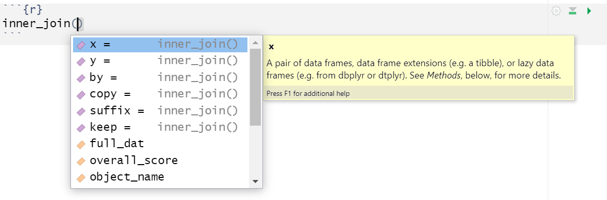

```{r echo = FALSE, message=FALSE, warning=FALSE}
library(tidyverse)

# Set the seed for reproducibility
set.seed(123)

# Define the number of participants
n_participants <- 600

# Define the variables
Gender <- c(rep('Woman', n_participants * 0.5),
            rep('Man', n_participants * 0.40),
            rep('Non-Binary', n_participants * 0.1))

Age <- sample(18:60, n_participants, replace = TRUE)

# Set conditions and mean Corsi scores
Condition <- c(rep('8 hours sleep', n_participants * 1/3),
               rep('4 hours sleep', n_participants * 1/3),
               rep('Sleep deprived', n_participants * 1/3))

Mean_Corsi_Score <- ifelse(Condition == '8 hours sleep', 6, ifelse(Condition == '4 hours sleep', 5, 4))

# Simulate Corsi scores around mean, considering a small correlation with age
Corsi_Score <- round(rnorm(n_participants, Mean_Corsi_Score + 0.01*(Age - mean(Age)), sd = 1))
Corsi_Score <- ifelse(Corsi_Score > 9, 9, ifelse(Corsi_Score < 0, 0, Corsi_Score))

# Create a data frame
data <- data.frame(Participant = 1:n_participants,
                   Gender = sample(Gender),
                   Age = Age,
                   Condition = Condition,
                   Corsi_Score = Corsi_Score)

# Define Demographic data
demographic_data <- data %>% 
  select(Participant, Gender, Age, Condition)

# Define Score data
score_data <- data %>% 
  select(Participant, Corsi_Score)

```

# Corsi Blocks 1

## Intended Learning Outcomes {#sec-ilo-corsi}

By the end of this chapter you should be able to:

* Explain what the Corsi Block Task is and what it measures
* Join two datasets together using `inner_join()`
* Create boxplots using `ggplot()`, `geom_boxplot()`, and `facet_wrap()`

## Walkthrough video {#sec-walkthrough-corsi}

There is a walkthrough video of this chapter available via [Zoom](https://uofglasgow.zoom.us/rec/share/PBmegQSlJPdjWlwoZ5qW6yYEjHpxLkt2bI1Jl3T_2GFEq41qtDmARzHpqe4PKUsK.HZhufe77H0Eq2M1L?startTime=1696859847000). We recommend first trying to work through each section of the book on your own and then watching the video if you get stuck, or if you would like more information. This will feel slower than just starting with the video, but you will learn more in the long-run. Please note that there may have been minor edits to the book since the video was recorded. Where there are differences, the book should always take precedence.

## Activity 1: The Corsi Block Task

For the next set of chapters we're going to use another classic experiment: Corsi Blocks. 

* First, take part in [this online version](https://www.psytoolkit.org/experiment-library/experiment_backward_corsi.html) of the Backwards Corsi Block task. It only takes a few minutes to complete. You need to be on a device with a mouse/touchscreen and speakers/headphones. 
* Second, read the [Wikipedia summary](https://en.wikipedia.org/wiki/Corsi_block-tapping_test) of the Corsi Block task and how and why it is used in psychological research.
* Finally, answer the following questions. Please note that your responses will not save in the browser - if you want to save them, make a note of them somewhere.

1. What does the Corsi block task measure?

`r mcq(c("Long-term memory", " Sensory memory", answer = "Spatial working memory", "Implicit memory"))`

`r hide("Explain this answer")`
The Corsi block task is designed to measure spatial working memory. The task requires the participant to reproduce a sequence of block-tapping in the same order (or in reverse order in some versions), which relies heavily on the spatial working memory.
`r unhide()` 

2. In a typical Corsi block task, what does a higher score indicate?

`r mcq(c("Poorer spatial memory", answer = "Better spatial memory", "Poorer attention span", "Shorter reaction time"))`

`r hide("Explain this answer")`
 In the Corsi block task, a higher score represents a greater capacity for spatial working memory, as it indicates that the participant was able to accurately replicate a longer sequence of block taps.
 `r unhide()` 

3. In a sleep-deprivation study using the Corsi block task, which group would you expect to have lower scores?

`r mcq(c("The group allowed to sleep for 8 hours", "The group allowed to sleep for 4 hours", answer = "The sleep-deprived group"))`

`r hide("Explain this answer")`
The sleep-deprived group is expected to perform worse on the Corsi block task as lack of sleep has been found to affect cognitive performance including spatial working memory.
`r unhide()` 

4. What would you expect a typical score to be on the Corsi Block task?

`r mcq(c("1-2", "3-4", answer = "5-6", "8-9"))`

`r hide("Explain this answer")`
The typical score on a Corsi Block Task is usually around 5 or 6. Scores between "8-9" would typically indicate an above-average performance on the task. Lower scores such as "1-2" or "3-4" would suggest difficulties with spatial working memory.
`r unhide()` 

## Activity 2: New project

* Log in to the to R sever and make a new project for the Corsi Block chapters (this week and next week):
* Click on the "New project" button;
* Then, click on the first option in the list "New Directory";
* Then, click "New Project";
* Then you are given the opportunity to name your project and select which folder it should be stored in. First in the "Directory name" box, type "Corsi Blocks";
* The subdirectory should already be set to Psych 1A but if not, click browse and navigate to it then click "Choose";
* Finally, click "Create project".

## Activity 3: Data files

Once you've done all this, it's time to download the files we need and then upload them to the server.

* First, download the <a href="data/corsi/corsi_data.zip" download>Corsi data zip file</a> to your computer and make sure you know which folder you saved it in.
* Then, on the server in the Files tab (bottom right), click `Upload > Choose file` then navigate to the folder on your computer where the zip file is saved, select it, click `Open`, then `OK`.

The zip file contains four files:

* `corsi_stub1.Rmd` and `corsi_stub2.Rmd`, the stub files you'll complete for this chapter and the next one. Open  `corsi_stub1.Rmd` by clicking on it in the Files tab and then edit the heading to add in your GUID and today's date.
* `demographic_data.csv` is a data file that contains each participant's anonymous ID, age, gender and which experimental condition they were in (8 hours sleep, 4 hours sleep, or sleep deprived). This data is in `r glossary("wide", "wide-form")`. There are 600 participants, so there are 600 rows of data.

```{r fig.cap= "Participant info data", echo=FALSE}
head(demographic_data)
```

* `score_data.csv` is a data file that contains each participants ID and their score on the Corsi block task from 1-9. 

Now, we need to load the tidyverse and the data files so that we can use them. 

* Add the following to code chunk 1 and run the code.

```{r eval = FALSE}
library(tidyverse)
demographic_data <- read_csv("demographic_data.csv")
score_data <- read_csv("score_data.csv")
```


## Activity 4: Check and summarise the data

As we did with the Stroop data, let's check the data and perform some summary statistics to make sure everything looks ok. First, we'll get the descriptive statistics we need about our sample to write up the study - total number of participants, number of each gender, and mean age and SD. 

* In code chunk 2 add the below code to calculate the demographic information

```{r}
# count the total number of participants
total_participants <- demographic_data %>%
  count()

# count the number of participants by each group of Gender
gender_count <- demographic_data %>%
  count(Gender)

# calculate mean age and standard deviation
age_stats <- demographic_data %>%
  summarise(mean_age = mean(Age),
            sd_age = sd(Age))
  

```

How many men are there in the sample? `r fitb(240)`

What is the mean age of the sample to 2 decimal places? `r fitb(38.16)`

We also want to check how many participants were in each experimental condition.

* In code chunk 3, write the code that counts the number of participants in each condition and save this in an object named `condition_count`. 
* Remember to try and figure it out yourself first, then use the hint, and only then look at the solution. This will take longer in the short-term but you'll learn more and faster in the long-term.

`r hide("Hint")`
```{r eval = FALSE}
object_name <- data %>%
  count(grouping_variable)
```
`r unhide()`

`r hide("Solution")`
```{r}
condition_count <- demographic_data %>%
  count(Condition)
```
`r unhide()`

How many participants are in each condition? `r fitb(200)`

## Activity 5: Summarise and visualise the scores

We're actually interested in how the scores for each sleep condition compare but before we do that, it's a good idea to check the scores as a whole.

* In code chunk 4, add the code to calculate the mean score and standard deviation and save this in an object named `overall_score`. The columns should be named `mean_score` and `sd_score` and you should use the data stored in `score_data` to start. You can look at the code that calculated the age mean and SD to help figure out how to do this.

`r hide("Hint")`
```{r eval = FALSE}
object_name <- score_data %>%
  summarise(column_name1 = mean(measure),
            column_name2 = sd(measure))
```
`r unhide()`

`r hide("Solution")`
```{r}
overall_score <- score_data %>%
  summarise(mean_score = mean(Corsi_Score),
            sd_score = sd(Corsi_Score))
```
`r unhide()`

We can also produce a histogram to visualise the distribution of the scores so let's explain a little more how about the plot code works.

ggplot() builds plots by combining layers. If you're used to making plots in Excel this might seem a bit odd at first, however, it means that you can customise each layer and R is capable of making very complex and beautiful figures ([this website](https://www.data-to-viz.com/) gives you a good sense of what's possible).

```{r img-layers, echo=FALSE, fig.cap="ggplot Layers from Field et al. (2012)"}

knitr::include_graphics("images/corsi/layers.png")

```

* The main function we use is `ggplot()` which is from the `r pkg("ggplot2")` package and is loaded as part of the `r pkg("tidyverse")`. `ggplot()` works on a system of layers.
* The first layer sets up what data the plot will use and the "aesthetic mapping" (`aes()`) which means which variables should be represented on each axis. We want to produce a histogram of the Corsi block scores so we tell `ggplot()` to put the variable `Corsi_Score` on the x-axis.
* The next layer tells `ggplot()` what type of plot (or "geom") to use and here we specify `geom_histogram()`. There are two arguments added to `geom_histogram()`: `binwidth` changes the size of the bars (try changing this value to 2 or 3 and see happens) whilst `colour` changes the colour of the line around the bars (try changing "black").
* `scale_x_continuous()` controls the x-axis. `name` is the x-axis label and `breaks` updates the number labels on the x-axis. In this case we ask us to give us the sequence (`seq`) of numbers from 1 to 9, which is quicker than writing them all out. 
* All the layer are connected with `+` and it's important that this comes at the end of the first line and not the start of the second line or it won't work.

* In code chunk 5, add the below code and run it to create the histogram

```{r}
ggplot(data = score_data, aes(x = Corsi_Score)) +
  geom_histogram(binwidth = 1, colour = "black") +
  scale_x_continuous(name = "Corsi block score",
                     breaks = seq(1:9))
```

::: {.info data-latex=""}
If you get an error that says `object X not found`, double check you have spelled the object and variable names exactly right and remember that R is case sensitive which means that you have to have the capital and lower case letters exactly right.
:::

## Activity 6: Joining the datasets

We want to compare the scores for each sleep condition, however, the column that says what condition a participant is in a different dataset (`demographic_data`) to the column that has their scores (`score_data`). To fix this, we can perform a `r glossary("join", "joins")`.There are lots of different types of joins you can do, but the one we want is an  `r glossary("inner join", "inner-join")` which returns all the rows in one table that have a match in the other table.

Before you run the code, think about what the final output is going to look like. `demographic_data` has 4 columns, `score_data` has 2 columns, but the column `Participant` is the same column. 

How many unique columns should there be if we join these two together? `r fitb(5)`

`r hide("Explain this answer")`
The joined dataset will have 5 columns, Participant, Gender, Age, Condition, and Corsi_Score.
`r unhide()`

* In code chunk 6, copy and paste the code code to join the two tables.
* `x` is the name of the first table you want to join. `y` is the name of the second table. You can only ever join two tables together at once.
* `by` is the name of the column the two tables have in common (i.e., the information that will be used to join them together). In this case, the column that is present in both datasets is `Participant`.

```{r}
full_dat <- inner_join(x = demographic_data,
                       y = score_data,
                       by = "Participant")
```

### Argument names

This gives us a good opportunity to explain argument names.

In the above examples, we have written out the argument names in our code (e.g., `x`, `y`, `by`), however, this is not strictly necessary. The following two lines of code would both produce the same result:

```{r argument-names, eval = FALSE}

full_dat <- inner_join(x = demographic_data,
                       y = score_data,
                       by = "Participant")

full_dat <- inner_join(demographic_data,
                       score_data,
                       "Participant")

```

Importantly, if you do not write out the argument names, R will use the default order of arguments, that is for `inner_join` it will assume that the first name you enter is `x`. the second is `y` and the number is `by`. 

If you write out the argument names then you can write the arguments in whatever order you like:

```{r argument-order, eval = FALSE}

full_dat <- inner_join(by = "Participant",
                       y = demographic_data,
                       x = score_data)
```

When you are first learning R, you may find it useful to write out the argument names as it can help you remember and understand what each part of the function is doing. However, as your skills progress you may find it quicker to omit the argument names and you will also see examples of code online that do not use argument names so it is important to be able to understand which argument each bit of code is referring to (or look up the help documentation to check).

In this course, we will always write out the argument names the first time we use each function, however, in subsequent uses they may be omitted.

### Tab auto-complete

One very useful feature of R Studio is the tab auto-complete for functions (see Figure \@ref(fig:img-autocomplete)). If you write the name of the function and then press the tab key, R Studio will show you the arguments that function takes along with a brief description. If you press enter on the argument name it will fill in the name for you, just like auto-complete on your phone. This is incredibly useful when you are first learning R and you should remember to use this feature frequently. 

```{r img-autocomplete, echo=FALSE, fig.cap="Tab auto-complete"}



```


## Activity 7: Analysis by groups

Now that we have both the condition data (`Condition`) and the participant's score (`Corsi_score`) in the same dataset, we can see how the scores compare by groups.

* In code chunk 7, use `group_by()` and `summarise()` to calculate the mean score and SD for each group and save this in an object named `group_scores`. The columns should be named `mean_score` and `sd_score`. Your starting dataset should be `full_dat`.
* You may want to look back at the code you used for the Stroop analysis to help you with this.
* Be careful with capital letters.

`r hide("Hide")`
```{r eval = FALSE}
object_name <- data %>%
  group_by(grouping_variable) %>%
  summarise(column_name1 = mean(measure),
            column_name2 = sd(measure))
```
`r unhide()`

`r hide("Solution")`
```{r}
group_scores <- full_dat %>%
  group_by(Condition) %>%
  summarise(mean_score = mean(Corsi_Score),
            sd_score = sd(Corsi_Score))
```
`r unhide()`

Which group has the lowest score? `r mcq(c("8 hours sleep", "4 hours sleep", answer = "Sleep deprived"))`

### Visualise the groups

Finally, we can also visualise the difference in score between groups.

* Add this code to code chunk 8 to create a boxplot of the scores in each group.

```{r}
ggplot(full_dat, aes(x = Condition, y = Corsi_Score)) +
  geom_boxplot() +
  scale_y_continuous(name = "Corsi block score",
                     breaks = seq(1:9))

```

We can also create histograms for each condition.

* `facet_wrap()` creates a separate plot for each group of the variable you give it. You can read the `~` (tilde) symbol as **by**, i.e., facet the plot by Condition.
* `nrow` specifies we want the faceted plots to be spread over three rows. This makes it easier to compare the distributions than if they were side-by-side (try changing this to 1 to see the difference).

```{r}
ggplot(full_dat, aes(x = Corsi_Score)) +
  geom_histogram(binwidth = 1) +
  facet_wrap(~Condition, nrow = 3) +
  scale_x_continuous(breaks = seq(1:9))
```

Based on the descriptive statistics and plot, is the hypothesis that sleep deprivation will negatively affect spatial working memory supported or rejected? `r mcq(c(answer = "Supported", "Rejected"))`

`r hide("Explain this answer")`
If the descriptive statistics and the plot of the data show a  difference in Corsi Block Task scores between sleep conditions with the sleep-deprived group performing worse, the hypothesis would be supported. Remember, in the context of experimental research, we can't definitively prove a hypothesis - we can only provide evidence that supports or fails to support it.
`r unhide()`

## Finished

Finally, try knitting the file to HTML and remember to  make a note of any mistakes you made and how you fixed them or any other useful information you learned. Then save your Markdown, and quit your session on the server. 


