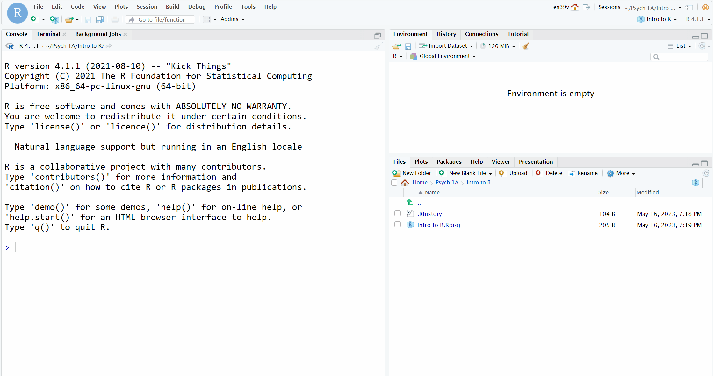

# Big five personality 1

## Intended Learning Outcomes {#sec-ilo-big5}

By the end of this chapter you should be able to:

* Explain what the Big Five model of personality is
* Create your own R Markdown documents with code chunks
* Explain the concept of forward and reverse coding

## Psych 1B

Welcome back to Psych 1B! Whilst much of the data skills work this semester will seem very familiar, now that you've got the basics of R, there will be a few minor changes to our approach to help scaffold you towards becoming an independent learner which will be really important at Level 2.

First, you'll notice that we have reduced the number of walkthrough videos. Rather than having walkthroughs for every chapter, they're limited to a couple of chapters that introduce a lot of new coding concepts. If you'd like additional help working through the chapters, remember that you can attend office hours or GTA sessions. You don't have to have a specific question, some students use the GTA times to complete their data skills work so if they come across a problem, they're already in a place where support is available.

Second, in Psych 1A we provided you with the Markdown stub files, this semester you'll create your own (and we'll recap how to do that in this chapter).

Third, there are still three data skills homeworks but they are all now summative and worth 5% of your grade compared to Psych 1A where the first one was formative. Check the Assessment Information Sheet on Moodle for more information.

And finally, in Psych 1A we strongly recommended that you should use the server rather install R on your own machine. Now that you're more familiar with the basics, if you'd like to install R and RStudio on your machine you can find instructions for how to do so in Appendix A and if you run into any problems, the GTAs can help you. The advantages to installing R on your machine are a) you're not reliant on the server (which does occasionally crash) b) you don't need to be connected to the internet to use R and c) it makes it much easier to check your homework files before you submit them. That all said, if you're comfortable using the server it's absolutely fine to keep doing so.

## Activity 1: Personality traits

For the next set of chapters we're going to use data from the most popular model of personality, the Big Five.

* First, take part in [this online version](https://projects.fivethirtyeight.com/personality-quiz/) of the Big-5. It only takes a few minutes to complete and it used the items from [Soto and John (2017)](https://www-sciencedirect-com.ezproxy.lib.gla.ac.uk/science/article/pii/S0092656616301325) which a short-form version of the Big Five Inventory 2 (BFI-2).  
* Second, read the [textbook chapter](https://openstax.org/books/psychology-2e/pages/11-7-trait-theorists) on personality trait theorists.
* Finally, answer the following questions. Please note that your responses will not save in the browser - if you want to save them, make a note of them somewhere.

<br>

1. The trait 'Agreeableness' in the Big Five personality model refers to:
`r longmcq(c("The tendency to be organized, careful, and disciplined", answer = "The tendency to be compassionate, cooperative, and warm towards others", "The tendency to be outgoing, energetic, and sociable", "The tendency to experience mood swings, anxiety, and irritability."))`

<br>

2. In the context of the Big Five Personality model, which trait might be associated with a person who is diligent, efficient, and follows a schedule?

`r longmcq(c("Neuroticism", answer = "Conscientiousness", "Extraversion", "Agreeableness"))`

<br>

3. Individuals who are often nervous, insecure, and easily upset, are considered to have high `r fitb("neuroticism", ignore_case = TRUE)` according to the Big Five Personality Model.

<br>

4. In the Big Five Personality Model, people who are outgoing, sociable, and assertive score high on the trait known as `r fitb(c("extraversion", "extroversion", ignore_case = TRUE))`

<br>

5. Which of these traits in the Big Five Personality model is most closely associated with creativity and a preference for novelty?
`r longmcq(c("Extraversion", "Conscientiousness", "Neuroticism", answer = "Openness to Experience"))`

`r hide("Explain these answers")`
1. The correct answer is "The tendency to be compassionate, cooperative, and warm towards others". Agreeableness as a personality trait characterizes individuals who are friendly, compassionate, and like working with others. They tend to be more cooperative while interacting with others.

2. The correct answer is "Conscientiousness". This trait is associated with people who are organized, responsible, and prefer planned rather than spontaneous behavior. High conscientiousness means a person is disciplined, efficient, and diligent.

3. Neuroticism is a personality trait in the Big Five Model. High neuroticism often means a person is likely to experience feelings such as anxiety, anger, or depression. These individuals are more likely to interpret ordinary situations as threatening and minor frustrations as hopelessly difficult.

4. Extraversion characterizes individuals who are outgoing, sociable, and often possess high group visibility. They like to talk, assert themselves, and draw attention to themselves.

5. The correct answer is "Openness to Experience". Individuals with high openness are often very creative, curious about their surroundings, and more aware of their feelings. They tend to think and act in individualistic and non-conforming ways and are likely to have a broad range of interests.

`r unhide()`

## Activity 2: New project {#sec-new-project-big5}

* Log in to the to R sever and make a new project for the Big-5 chapters (this week and next week).
* If you've decided to install R on your machine, create a new project by clicking `File -> New Project`. The rest of the process is the same as on the server.

## Activity 3: Data files {#sec-data-big5}

Once you've done all this, it's time to download the files we need and then upload them to the server.

* First, download the <a href="data/big5/big5_data.zip" download>Big 5 data zip file</a> to your computer and make sure you know which folder you saved it in.
* Then, on the server in the Files tab (bottom right), click `Upload > Choose file` then navigate to the folder on your computer where the zip file is saved, select it, click `Open`, then `OK`.
* If you're working on your own machine, you will need to unzip the files before you can use them. There is a short walkthrough via YouTube for how to do this on [Windows](https://www.youtube.com/watch?v=r9hpiyzOOTY) and [Mac](https://www.youtube.com/watch?v=PGp1daVIBcs). You need to unzip the files into your project folder. If you need help with this, come to office hours or a GTA session.

The zip file contains three files:

* `big5_data.csv` is a data file that contains each participant's response to each question on the full version of the Big Five Inventory-2. There are 60 items in total, and there are 12 items for each of the five personality traits. Each item has a response from 1  (disagree strongly) to 5 (agree strongly).
* `code_book.csv` is a data file that lists the name of each question as it was stored in the questionnaire survey software (e.g., `Q4_1`), which trait the item refers to (e.g., `extraversion`), and whether it is a `forward` or `reversed`` scored item (we'll come back to what this means in a moment).
* `scoring.csv` is a data file that indicates what score each participant response should get depending on whether it is a forward or reversed item.

## Activity 4: New R Markdown

As noted, this semester we're not going to provide stub files, instead you need to create your own RMarkdown files. If you'd like a full refresher on exactly how to do this, you can review [Chapter 1](https://psyteachr.github.io/data-skills-v2/sec-intro.html#activity-4-r-markdown) but here's the brief version:

* Click `File - New File - R Markdown`.
* Give the document the title "Big five 1" and put in your GUID as the author.
* Save the file by clicking `File - Save as`. It should be saved in your project directory alongside all the data files from Activity 3.
* The gif below is from the Intro chapter and shows how to do this with a slightly different file name.

```{r img-new-markdown, echo=FALSE, fig.cap="Opening a new R Markdown document"}



```

Next you need to add text and code chunks.

* Delete **everything** from line 8 onwards. On line 8, type "## Activity 5" and press enter to move the cursor down to line 9
* Click the  code chunk button at the top of your Markdown document (it's a green square with a C and a plus sign) then click `R` to insert a new R code chunk.  
* The gif below is from the Intro chapter and shows how to do this with slightly different text.

```{r img-new-chunk, echo=FALSE, fig.cap="Creating a new R chunk"}


```

To make your life easier you can also use keyboard shortcuts. The default shortcut for adding a new code chunk is `Cmd + Option + I` on a Mac or `Ctrl + Alt + I` on Windows. You should create a new code chunk **for each activity** or each analysis step (like there was in the stub files from 1A) and make sure there is a description of what the code is doing. This will make it easier to read your Markdown and find where any errors in the code are. **Do not put all of your code in one big chunk.**

## Activity 5: Loading data

Now we've got everything set up, in the code chunk you just created write and run the code that:

* Loads the `r pkg("tidyverse")`.
* Uses `read_csv()` to load `big5_data.csv` into an object named `big5`.
* Loads `scoring.csv` into an object named `scoring`.
* Loads `code_book.csv` into a object named `codebook`.

Whilst coding isn't about memorisation and we certainly don't expect you to be able to write more complicated code off by heart, you should be able to do this task from memory. If you can't, it may be that you've been relying too much on the hints and solutions. Remember that it will make things much easier in the long-run not to take shortcuts at the beginning. 

`r hide("Hint")`
```{r eval = FALSE}
library(package_name)
object_name <- read_csv("file_name.csv")
```
`r unhide()`

`r hide("Solution")`
```{r eval = FALSE}
library(tidyverse)
big5 <- read_csv("big5_data.csv")
scoring <- read_csv("scoring.csv")
codebook <- read_csv("code_book.csv")
```
` r unhide()`


```{r echo = FALSE, message = FALSE}
library(tidyverse)
big5 <- read_csv("data/big5/big5_data.csv")
scoring <- read_csv("data/big5/scoring.csv")
codebook <- read_csv("data/big5/code_book.csv")
```


## Activity 6: Forward & reverse scoring

Before we go any further, let's explain what we mean by forward and reverse scoring. One of the issues with conducting research using surveys is that if we don't design them carefully, our data may be affected by response bias. One type of response bias is **acquiescence bias**, which is the finding that people have a tendancy to agree with all statements. To try and minimise the impact of this, many questionnaires will **reverse-code** some of the questions so that a positive response means agreeing with one question but disagreeing with another.

* Below are five of the Big 5 items that relate to "Agreeableness". Type the number of one of the items where you think **agreeing** with the item would mean the participant displayed a higher level of agreeableness`r fitb(c("1", "3", "4"))` 
* Now type the number of one of the items where you think **disagreeing** with the item would mean the participant displayed a higher level of agreeableness `r fitb(c("2", "5"))` 


```{r echo = FALSE} 

table_1 <- tibble(
  Q_No = paste("Q", 1:5),
  Question = c(
"Is compassionate, has a soft heart",
"Feels little sympathy for others",
"Is respectful, treats others with respect",
"Is polite, courteous to others",
"Starts arguments with others")) 

knitr::kable(table_1)

```

For those items where agreeing with the item means higher agreeableness, participants receive a score of 1 if they answer "disagree strongly" and a score of 5 if they answer "agree strongly". This is called **forward scoring**. For those items where disagreeing with the item means a higher agreeableness score, participants receive a score of 1 if they answer "agree strongly" and 5 if they answer "disagree strongly". This is know as **reverse coding**.

By combining all three datasets, We can use the information in `scoring` and `codebook` to score all responses to the Big 5 and we'll do that in the next chapter. Before we get there though, we need to ensure that we fully understand the data we have and revisit the concept of wide and long-form data.

## Activity 7; Check the data

First, answer these questions about the structure of the datasets and the variables they contain. Remember that R is case-sensitive so you need to type these out exactly.

There's a few ways you could answer these questions - run `summary()` or `str()` on each object, click on them in the environment pane, or view the list of variables by clicking on the blue arrow next to the object name.

1. `scoring` and `codebook` have a variable in common. What is the name of this variable? `r fitb("direction")`
2. What is the name of the variable in `big5` that contains the Participant's ID? Remember that is case sensitive. `r fitb("ResponseId")`.
3. `big5` is in wide-form, which means that all the information about each participant is contained in a single row, so the more data you have, the wider the dataset will be. How many participants are in this dataset? `r fitb(5605)`
4. How many questions are there in total on the Big 5 questionnaire? You've been given this information in this chapter. `r fitb(60)`
5. What is the name of the first variable in `big5` that contains the response to a BFI item? `r fitb("Q4_1")`
6. What is the name of the last variable in `big5` that contains the response to a BFI item? `r fitb("Q4_60")`

`r hide("Explain these answers")`

1. They both have a column named "direction".
2. The column is named `ResponseId` which has very annoying capital letters but this is the default name that the Qualtrics survey software uses and you'll be using it for the group project so you might as well get used to it!
3. There are 5065 rows of data which means there are 5605 participants. You could have done this with code (`big5 %>% count()`), or by checking the output of `summary()` or `str()` but you could also just have looked in the environment pane and seen how many observations there were `5605 obs. of 61 variables`.
4. The BFI has 60 items and you were given this information in Activity 3.
5. The first items is named `Q4_1`.
6. The last item is named `Q4_60`. Again there's a few ways of doing this but running `str(big5)` or clicking the blue arrow next to the object name in the environment are probably the easiest.

`r unhide()`

## Activity 8: Long-form data

In order to be able to join all the data files together in a way that is helpful, we need to transform the `big5` dataset from wide-form to long-form. We've seen long-form data before in the [Stroop chapter](https://psyteachr.github.io/data-skills-v2/stroop.html#activity-3-data-files) but as a reminder, in wide-form data you have a single row for each participant whereas in long-form data, you have a row for each observation you have about that participant.

* There are 5605 participants and we have data from 60 questions for each of them. If the data were in long-form, how many rows should there be? (You will need a calculator for this, you can use the console in R) `r fitb(336300)`

`r hide("Explain this answer")`

There are 5605 participants and 60 observations each. In long-form, each participant should have 60 rows of data so 5605*60 = 336300.

`r unhide()`

In long-form, the `big5` dataset would look something like this:

```{r echo = FALSE}
big5 %>%
  pivot_longer(cols = 2:61, 
               names_to = "question_name", 
               values_to = "answer") %>%
  head(10)
```

Given that we want to be able to eventually join together `big5` with `scoring` and `codebook`, we want variables that represent the same data to have the same name.

* What should we name `question_name` so that it matches the same column in `codebook`? `r fitb("item")`
* What should we name `answer` so that it matches the same column in `scoring`? `answer`? `r fitb("response")`

`r hide("Explain this answer")`

`question_name` states which question/item the data refers to (these were previously the column names in the wide-form dataset). `codebook` also has a column with this information but but it is named `item` so it would be better decision to call it `item` so it matches.

Similarly, `answer` is the response the participant gave to that item. In `scoring`, this information is in a column named `response` so again we want them to match. 

`r unhide()`

This is the code that transform the data from wide-form to long-form using the function `pivot_longer()`. We're going to go through how to do this in the next chapter which you'll also work through in the lab. For now, see if you can figure out what each bit of the code is doing and try and write it out in words.

```{r}
big5_long <- big5 %>%
  pivot_longer(cols = Q4_1:Q4_60, 
               names_to = "item", 
               values_to = "response") 
```

`r hide("Explain this code in words")`

1. **big5_long <- big5 %>%**
This line is taking the data frame named `big5` and passing it to the next function using the pipe operator `%>%`. The `big5_long` object will store the result of the operations that follow.

2. **pivot_longer(cols = Q4_1:Q4_60,**
The `pivot_longer` function is used to transform the data from "wide" format to "long" format. In this case, the function is applied to the columns `Q4_1` through `Q4_60` of the `big5` data frame. The wide format has a column for each variable (in this case, 60 different items `Q4_1` through `Q4_60`), while the long format has a row for each variable-value pair.

3. **names_to = "item",**
The `names_to` argument specifies the name of a new column that will be created to store the column names from the original data frame (that is, the names of the items `Q4_1` through `Q4_60`). This new column will be named "item".

4. **values_to = "response")**
The `values_to` argument specifies the name of a new column that will store the values from the original data frame (that is, the responses to the items `Q4_1` through `Q4_60`). This new column will be named "response".

So, in summary, this script is taking the `big5` data frame and transforming it from a wide format to a long format, where the original column names are stored in a new column named "item", and their corresponding values are stored in a new column named "response". The transformed data frame is then stored in a new object called `big5_long`.
`r unhide()`

## Activity 9: Refresh your memory

Finally, so that your memory is refreshed ahead of Psych 1B, answer the following questions:

1. What does the select function in the tidyverse primarily do? `r mcq(c("Filter rows based on a condition", "Create new columns", answer = "Select specific columns", "Sort the data"))`

`r hide("Explain this answer")`
The `select` function is primarily used to choose and extract specific columns (variables) from a data frame or tibble. It allows you to subset your data by selecting only the columns you are interested in for further analysis, which can be very useful when dealing with large datasets.
`r unhide()` 

2. What is the main purpose of the filter function in the tidyverse? `r mcq(c("Create new columns", "Sort the data", answer = "Filter rows based on a condition", "Select specific columns"))`

`r hide("Explain this answer")`
The `filter` function is used to subset or filter rows from a dataset based on specific conditions or criteria. It allows you to retain only those rows that meet certain criteria, making it easier to focus on the subset of data relevant to your analysis.
`r unhide()` 

3. What does the mutate function in the tidyverse primarily do? `r mcq(c("Select specific columns", "Create new rows", answer = "Create new columns", "Sort the data"))`

`r hide("Explain this answer")`
The mutate function is used to add new columns (variables) to a data frame or tibble, often by applying some transformation or calculation to existing columns. It allows you to create new variables based on the values of other variables, which is useful for generating additional insights or features in your data.
`r unhide()`

4. How do you load an R package named "cowsay" into your R session? `r mcq(c(answer = "library(cowsay)", "install.packages('cowsay')", "load(cowsay)", "read_csv(cowsay)"))`

`r hide("Explain this answer")`

When a package is already installed on your system, you can use the `library()` function to load it into your R session. This makes the package's functions and features available for use in your R code. So, if "cowsay" is already installed, you can simply load it into your session with `library(cowsay)` to start using its functionality.
`r unhide()`


## Finished

Finally, try knitting the file to HTML and remember to  make a note of any mistakes you made and how you fixed them or any other useful information you learned. Then save your Markdown, and quit your session on the server if applicable. 
