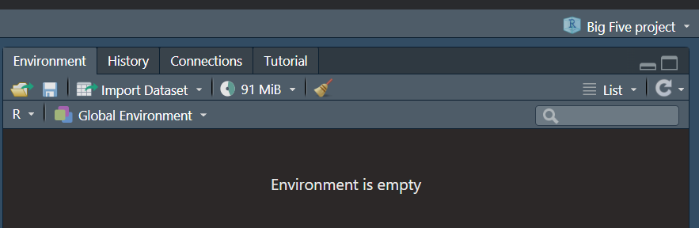
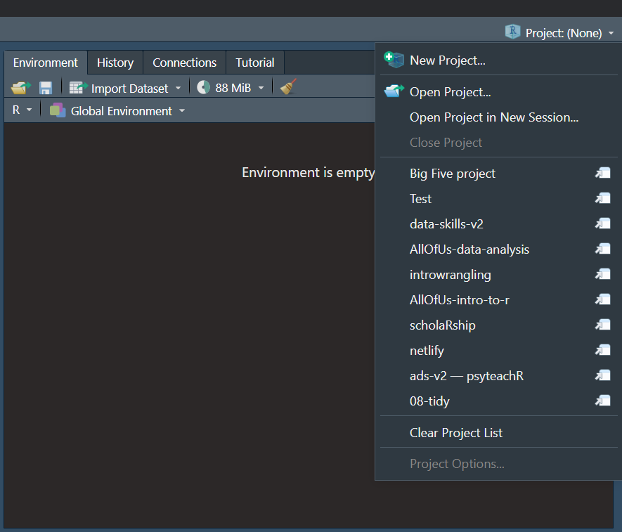
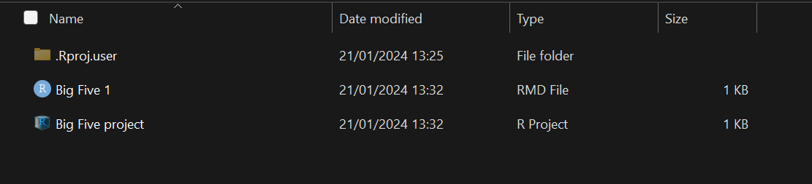

# Installing `R` {#installing-r}

Installing R and RStudio is usually straightforward. The sections below explain how and [there is a helpful YouTube video here](https://www.youtube.com/watch?v=lVKMsaWju8w){target="_blank"}.

## Installing Base R

[Install base R](https://cran.rstudio.com/){target="_blank"}. Choose the download link for your operating system (Linux, Mac OS X, or Windows).

If you have a Mac, install the latest release from the newest `R-x.x.x.pkg` link (or a legacy version if you have an older operating system). After you install R, you should also install [XQuartz](http://xquartz.macosforge.org/){target="_blank"} to be able to use some visualisation packages.

If you are installing the Windows version, choose the "[base](https://cran.rstudio.com/bin/windows/base/)" subdirectory and click on the download link at the top of the page. After you install R, you should also install [RTools](https://cran.rstudio.com/bin/windows/Rtools/){target="_blank"}; use the "recommended" version highlighted near the top of the list.

If you are using Linux, choose your specific operating system and follow the installation instructions.

## Installing RStudio

Go to [rstudio.com](https://www.rstudio.com/products/rstudio/download/#download){target="_blank"} and download the RStudio Desktop (Open Source License) version for your operating system under the list titled **Installers for Supported Platforms**.

## RStudio Settings

There are a few settings you should fix immediately after updating RStudio. Go to **`Global Options...`** under the **`Tools`** menu (&#8984;,), and in the General tab, uncheck the box that says **`Restore .RData into workspace at startup`**.  If you keep things around in your workspace, things will get messy, and unexpected things will happen. You should always start with a clear workspace. This also means that you never want to save your workspace when you exit, so set this to **`Never`**. The only thing you want to save are your scripts.

You may also want to change the appearance of your code. Different fonts and themes can sometimes help with visual difficulties or [dyslexia](https://datacarpentry.org/blog/2017/09/coding-and-dyslexia){target="_blank"}. 

```{r settings-general, eval = TRUE, echo=FALSE, fig.cap = "RStudio General and Appearance settings"}
knitr::include_graphics('images/rstudio_settings_general_appearance.png')
```

You may also want to change the settings in the Code tab. Foe example, some people prefer two spaces instead of tabs for their code and like to be able to see the `r glossary("whitespace")` characters. But these are all a matter of personal preference.

```{r settings-code, eval = TRUE, echo=FALSE, fig.cap = 'RStudio Code settings'}
knitr::include_graphics("images/rstudio_settings_code.png")
```


## Installing LaTeX

You can install the LaTeX typesetting system to produce PDF reports from RStudio. Without this additional installation, you will be able to produce reports in HTML but not PDF. This course will not require you to make PDFs. To generate PDF reports, you will additionally need to install `r pkg("tinytex")` [@R-tinytex] and run the following code:

```{r eval=FALSE}
tinytex::install_tinytex()
```


## Installing packages

Whilst Base R comes with built-in functions, you will also need to install any additional packages you want to use. 

You can install packages using the `install.packages()` function. **Only ever run this command in the console, never save it in a script or Markdown**. This is because if you save it in a script, everytime you run that script it will install the package again. At best, this will be a waste of time and at work, it might install a more recent version of the package that no longer works with your code.

```{r eval = FALSE}
install.packages("tidyverse")
```

When you run this code it will produce a bunch of text until it eventually installs. You're looking for something that says "package ‘tidyverse’ successfully unpacked and MD5 sums checked" which confirms that the installation has been successful. Once you've done this, you can then run `library(tidyverse)` as usual. You only need to install packages once but remember you need to load them each time you use them.

If you ever get an error message saying "No package called X", check you've spelled the name of the package right and if so, it might be that you need to install it using the same method. 

## Using R on your computer

### Opening RStudio

You have installed both R (the language) and RStudio (the software you use to work with the language). Always open RStudio - we'd recommend creating a shortcut to it so there's no confusion.

### Creating projects

You can use projects on your computer in the same way you can on the sever.

* Open RStudio
* Click `File` -> `New project` -> `New directory` -> `New project`
* Give the project a name - usually the name of the set of chapters you're working on.
* Click browse and select where you want to save your project. Similar to the server we would suggest creating a folder named "Psych 1B" where you store all of your projects.
* Click `Create project` and it will create the project. You can tell if you're working in a project by looking at the top right hand corner as it will display the project name. 

```{r eval = TRUE, echo=FALSE, fig.cap = 'Project name'}

```

* If you're not currently working in a project, it will display "Project (None)"

### Loading a project

There are two ways you can load a project you have previously created.

1. The easiest way is to open RStudio, then click on the drop-down arrow next to the project name in the top right corner which will display a list of the 10 most recent projects you've had open. Just click on the name of the one you want to work in and it will automatically switch to that project.

```{r eval = TRUE, echo=FALSE, fig.cap = 'Project list'}

```

2. If your project isn't in the project list, navigate to where you saved your project on your computer (this is where having an organised file structure will help) and then look for the project file. This will end in the extension `.Rproj` and is the type `R project`. Open this file and your project will open. If you've opened the right file, you'll see the name of the project in the top right hand corner.

**Be careful** not to open an Rmd file first. This will open the Rmd file but it won't open the project. This is important because the project controls the working directory and you may find that you can't load in the data files. Always open the project and then the Rmd file.

```{r eval = TRUE, echo=FALSE, fig.cap = 'Project folder'}

```

### Data files

On the server you've been used to having to upload data files. You'll notice that there is no "Upload" button and that's because you don't need to upload files, you just have them on your computer and this is one of the great benefits of installing R rather than using the server.

If you download a single data file, like a `.csv` file, just save it in your project folder and it will become available for use.

More commonly on this course, we ask you to download multiple files in a zip folder. 

* Download the zip folder to your computer. It doesn't actually matter where you save it to, as long as you know where it is saved.
* If you're on Windows, you will need to unzip the files. Right click on the zip folder, click `Extract all`, then click `Browse` and find your project folder, then click extract. This will unzip and copy the files into your project folder where you can use them.
* If you're on a Mac and using Safari as your browser, it has a very annoying default habit of unzipping files when you download them. We'd strongly recommend just not using Safari at all because it seems to cause a few issues with R and using Chrome or Firefox instead but if you are particularly attached to it, you have two options, [change the settings](https://apple.stackexchange.com/questions/961/how-to-stop-safari-from-unzipping-files-after-download) to stop it unzipping files so that you can follow the above instructions. Doing it automatically might seem easier but I rake the view that this tends to cause more trouble in the long-run as you don't learn about different kinds of files.

### Homework

The big benefit of installing R and RStudio on your computer is that when you're working on the homework files, you don't need to download from the server and then upload to Moodle, you just upload the one you've been working on. Additionally, because you now have R on your computer, you will be able to open the .Rmd file to check it's the right one which reduces the chances that you will submit a blank file.
