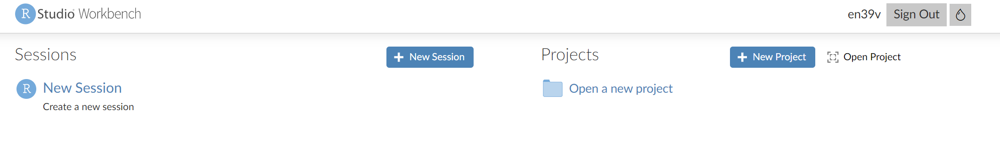
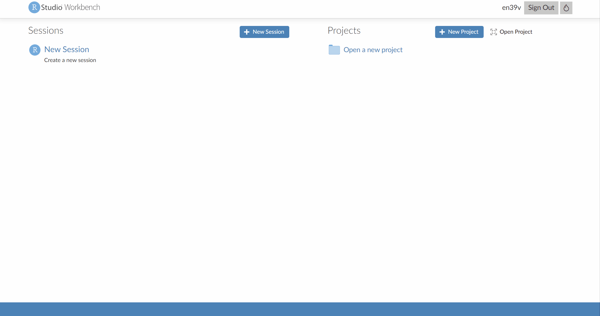
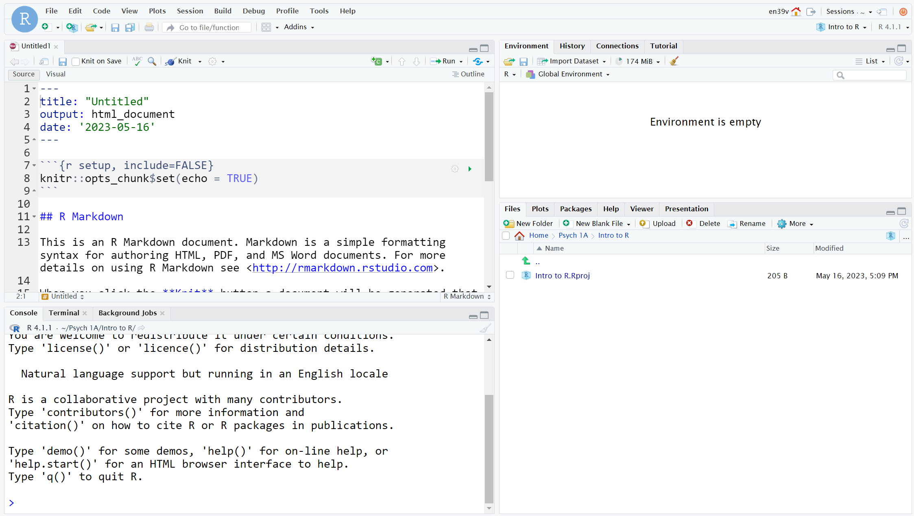

# Intro to R and RStudio {#sec-intro}

## Intended Learning Outcomes {#sec-ilo-intro}

By the end of this chapter you should be able to:

* Access R and RStudio through the server
* Create a new R Markdown document with code chunks
* Create objects by writing and running code in the console and in R Markdown

::: {.try data-latex=""}
If you're completely new to programming, you're unlikely to understand everything in the first few chapters the first time you work through it - and that's ok! Some of the beginning information we provide has a bit of a chicken-and-egg problem in that we need to give you it before you begin but until you've had some experience with R, it won't fully make sense. Take what you can from the chaptrs on the first attempt but also come back to them in a few weeks time and have another read through - you'll be surprised at how much you've learned in a short space of time. 
:::


## Walkthrough video {#sec-walkthrough-intro}

There is a walkthrough video of this chapter available via [Echo360.]() (INCOMING) We recommend first trying to work through each section of the book on your own and then watching the video if you get stuck, or if you would like more information. This will feel slower than just starting with the video, but you will learn more in the long-run. Please note that there may have been minor edits to the book since the video was recorded. Where there are differences, the book should always take precedence.

## R and RStudio {#sec-intro-r}

R is a programming language that you will write code in. RStudio is an Integrated Development Environment (<a class='glossary'>IDE<span class='def'></span></a>). Think of it as knowing English and using a plain text editor like NotePad to write a book versus using a word processor like Microsoft Word. You could do it, but it would be much harder without things like spell-checking and formatting and you wouldn't be able to use some of the advanced features that Word has developed. In a similar way, you can use R without R Studio but we wouldn't recommend it. RStudio serves as a text editor, file manager, spreadsheet viewer, and more.

* There's an [RStudio IDE Cheatsheet](https://raw.githubusercontent.com/rstudio/cheatsheets/main/rstudio-ide.pdf){download=""} you will find helpful to download and keep as a reference.

You can install R and RStudio on your own computer if you like, however, through your student account you have access to an online version you use through your internet browser which we'll refer to as the **R server**. This semester, we'd like everyone to use the R server as it helps in the beginning to have you all working on the same version. In the second semester, you'll be given the option to install R and RStudio on your computer. If you're comfortable with programming and you want to install R on your own computer now, that's OK, but just remember the instructions in this book will only refer to the R server. Whilst the code is the same, file management and use of projects is different.

For now, we'll concentrate on introducing you to RStudio's interface and getting it configured. Let's get started!

::: {.dangerous data-latex=""}
Whilst you can access the server through a browser and therefore it is technically possible to use it on a phone or tablet, we strongly discourage you from doing so. At minimum you will need a keyboard but in addition, all the instructions in this workbook will assume you are using a desktop computer or laptop and so you may find it more difficult to follow, particularly when it comes to file management. If you do not have a laptop, you can use any of the [University computers](https://www.gla.ac.uk/myglasgow/it/studentclusters/) and there is also a [laptop loan scheme](https://www.gla.ac.uk/myglasgow/registry/finance/funds/laptoploan/).
:::

## R server

First, log on to the R server. The link for the R server can be found at the top of the Data Skills section on the Psych 1A Moodle page. The server is only for UofG students which is why we can't share the link here as this is a public book. We'd suggest saving the link to the server as a bookmark. Login to the sever using your GUID and password that you use to login to all other UofG systems. 

When you login to the server for the first time, you'll see the landing page that has two sections: **Sessions** and **Projects**. 

<div class="figure" style="text-align: center">

<p class="caption">(\#fig:img-rserver-1)RStudio server landing page</p>
</div>

A "session" refers to a single period of use with R. During this session, you can load data, write code, and create visualizations. All of the objects that you create and data that you import into R exist within the environment of this session.

For example, if you create a variable in R, that variable is stored in memory for the duration of the session. If you end the session and then start a new one, that variable will no longer exist in your R environment unless you've saved your workspace or the object to a file.

A "project" is a specific working directory (or folder) designated to contain all the files relevant to a particular set of analyses or a specific research study. Projects are a way of organizing your work in RStudio that makes it easier to keep track of all the different files associated with a particular line of work.

We're going to use projects to help organise your data skills work for Psych 1A

## Activity 1: Create a new project {#new-project}

Do the following, in this order:

* Click on the "New project" button;
* Then, click on the first option in the list "New Directory"
* Then, click ""New Project"
* Then you are given the opportunity to name your project and select which folder it should be stored in. First in the "Directory name" box, type "Intro to R".
* Then, click "Browse" then "New folder" then in the popup box name the new folder "Psych 1A" and click "OK" then "Choose". This will store your new project called Psych 1A (and this folder is where you'll store all projects you create this semester).
* Finally, click "Create project".

<div class="figure" style="text-align: center">

<p class="caption">(\#fig:img-rserver-2)Creating a new project</p>
</div>

## RStudio panes

RStudio is arranged with four window <a class='glossary'>panes<span class='def'></span></a>. By default, the upper left pane is the **source pane**, where you view, write, and edit code from files and view data tables in a spreadsheet format. **When you first open a new project this pane won't display until you open a document or load in some data** -- don't worry, we'll get to that soon.

<div class="figure" style="text-align: center">

<p class="caption">(\#fig:fig-rstudio)The RStudio IDE</p>
</div>

The lower left pane is the **console pane**, where you can type in commands and view output messages. You can write code in the console to test it out. The code will run and can create objects in the environment, but the code itself won't be saved. You need to write your code into a script in the source pane to save it, which we'll cover later in this chapter. 

::: {.try data-latex=""}
Try using the console as a calculator - type `1 + 1` and press enter.
:::

The right panes have several different tabs that show you information about your code. The most used tab in the upper right pane is the **Environment** tab. The Environment tab lists some information about the <a class='glossary'>objects<span class='def'></span></a> that you have defined in your code. 

In the lower right pane, the most used tabs are the **Files** tab for directory structure, the **Plots** tab for plots, the **Packages** tab for managing add-on packages (we'll explain what these are in the next chapter), and the **Viewer** tab to display reports created by your scripts. You can change the location of panes and what tabs are shown under `Tools > Global Options... > Pane Layout`. When you open a new project, the Files tab will be set to your project working directory and will show a file with the file extension `.Rproj` which is the file that has all the information about your project. Don't delete this file!

::: {.try data-latex=""}
In the environment tab, click on "Home" and then navigate back to your "Intro to R" project folder by clicking on "Psych 1A" then "Intro to R".
::: 

## Activity 2: Settings {#sec-rstudio-settings}

Before we start writing code, we're going to change a few settings to make things easier for us in the long-run. 

### Themes and accessiblilty

You can customise how RStudio looks to make it work for you. 

* Click `Tools > Global Options > Appearance`. You can change the default font, font size, and general appearance of R Studio by applying a theme, including using dark mode. 

Play around with the settings and see what you prefer - you're going to spend a lot of time with R, it might as well look how you like it!

### Settings for Reproducibility {#sec-rstudio-repro}

One of the reasons you're going to learn R is so that any quantitative data analysis and research you do is **reproducible**. If your work is reproducible, it means that you (or someone else) can take your data and get the same result you got. This is easier to do with code because you have a written record of everything you did, compared to using point-and-click software where there is no record and you just have to remember what you did.

To help ensure your work is reproducible, there are a few settings you should change in RStudio. If you keep stuff around in your workspace, things can get messy and you can accidentially end up using the wrong dataset or object. You should always start with a clear workspace. This also means that you never want to save your workspace when you exit - the only thing you want to save are your scripts. 

* Go to `Tools > Global Options`
* In the General tab, uncheck the box that says `Restore .RData into workspace at startup`.  
* Additionally, set the "Save workspace to .RData on exit" to `Never`.


<div class="figure" style="text-align: center">

<p class="caption">(\#fig:fig-settings)RStudio settings</p>
</div>

## Activity 3: Writing code

Ok, let's write some code! We're going to open a script very shortly but first let's show you how to write code and create objects in the console.

### Objects {#sec-objects}

A large part of your coding will involve creating and manipulating objects. Objects contain stuff. That stuff can be numbers, words, or the result of operations and analyses. You assign content to an object using `<-`

Run the following code in the console, but change the values of `name`, `age` and `birthday` to your own details (`birthday` should be the date of your next birthday). Press enter after you type each line.


```r
name <- "Emily"
age <- 38
today <- Sys.Date()
birthday <- as.Date("2024-07-11")
```

You'll see that four objects now appear in the environment pane:

* `name` is <a class='glossary'>character<span class='def'></span></a> (text) data. In order for R to recognise it as text, it **must** be enclosed in double quotation marks `" "`.
* `age` is <a class='glossary'>numeric<span class='def'></span></a> data. In order for R to recognise this as a number, it **must not** be enclosed in quotation marks. Every year I have to update my age in this book and I am confronted with my own mortality drawing ever closer. 
* `today` stores the result of the function `Sys.Date()`. This function returns your computer system's date. Unlike `name` and `age`, which are hard-coded (i.e., they will always return the values you enter), the contents of the object `today` will change dynamically with the date. That is, if you run that function tomorrow, it will update the date to tomorrow's date.
* `birthday` is also a date but it's hard-coded as a specific date. It's wrapped within the `as.Date()` function that tells R to interpret the character string you provide as a date rather than text.

::: {.callout-note .try}
To print the contents of an object, type the object's name in the console and press enter. Try printing all four objects now.
:::

### Removing objects

To clear objects from the environment you can remove them individually:


```r
rm(name)
```

Or you can remove them all at once by clicking on the brush icon at the topof the environment pane.

<div class="figure" style="text-align: center">

<p class="caption">(\#fig:rm-brush)Removing objects</p>
</div>

## Activity 4: R Markdown

The problem with writing code in the console is that it doesn't save it anywhere, and the whole point of writing code is so that you can save it and use it again. We're going to write our code in a document format called **R Markdown** (abbreviated as Rmd).

R Markdown documents are a great way to create dynamic documents with embedded chunks of code and we'll use R Markdown to do all your data skills work including the homework. 

For more information about R Markdown feel free to have a look at their main webpage http://rmarkdown.rstudio.com. The key advantage of R Markdown is that it allows you to write code into a document, along with regular text, and then **knit** it using the package `knitr` to create your document as either a webpage (HTML), a PDF, or Word document (.docx). 

### Create a new R Markdown

To open a new R Markdown document click the 'New File' icon (it's a white document with a green plus sign just under the "File" menu) and then click 'R Markdown'. You will be prompted to give it a title, call it "Intro to R". Also, change the author name to your GUID as this will be good practice for the homework. Keep the output format as HTML.

Once you've opened a new document be sure to save it by clicking `File` -> `Save`. You should also name this file "Intro to R". If you've set the working directory correctly, you should now see this file appear in your file viewer pane.

<div class="figure" style="text-align: center">

<p class="caption">(\#fig:img-new-markdown)Opening a new R Markdown document</p>
</div>

::: {.info data-latex=""}
One of the great things about using projects in RStudio is that your files will automatically save into your project working directory by default. This makes it easy to keep everything organised so make sure you have followed the steps to set up your project carefully!
:::

### Creating code chunks

When you first open a new R Markdown document you will see a bunch of welcome text and code. This will appear every time you open a new R Markdown document.

Do the following steps in this order:  

* Delete **everything** from line 8 onwards  
* On line 8, type "About me" and press enter to move the cursor down to line 9
* Click the  code chunk button at the top of your Markdown document (it's a green square with a C and a plus sign) then click `R` to insert a new R code chunk.  

<div class="figure" style="text-align: center">

<p class="caption">(\#fig:img-new-chunk)Creating a new R chunk</p>
</div>

What you have created is a **code chunk**. In R Markdown, anything written in the white space is regarded as normal text, and anything written in a grey code chunk is assumed to be code. This makes it easy to combine both text and code in one document.

::: {.warning data-latex=""}
When you create a new code chunk you should notice that the grey box starts and ends with three back ticks ```. One common mistake is to accidentally delete these back ticks. Remember, code chunks are grey and text entry is white - if the colour of certain parts of your Markdown doesn't look right, check that you haven't deleted the back ticks.
:::

### Adding code

Now we're going to add in the code we used earlier to our R Markdown document so that we can save it. 

* In your code chunk write the below code (but again, replace the values of name/age/next birthday with your own details).   
* Remember that text values and dates need to be contained in quotation marks but numerical values do not. Missing and/or unnecessary quotation marks are a common cause of code not working - remember this!


```r
name <- "Emily" 
age <- 38
today <- Sys.Date()
birthday <- as.Date("2024-07-11")
```

### Running code {#sec-run-code}

When you're working in an R Markdown document, there are several ways to run your lines of code.

The best way to run a single line of code is to use a keyboard shortcut. Make sure that the cursor is in the line of code you want to run (it can be anywhere) and press `Ctrl + enter` or `Cmd + enter` if you're on a Mac. This will run the line of code and move your cursor to the next line.

* Run each line of code to create the objects using the above method.
* Then, clear all the objects from the environment either using `rm()` on each object or click the brush icon to get rid of them all at once.

Now, let's try running all the code in the chunk at once rather than one line at a time. You have two options:

* Put your cursor somewhere in the code chunk and press `Ctrl + shift + enter`
* Or, press the green "play" button at the top-right of the code chunk and this will run **all** lines of code in that chunk.

::: {.info data-latex=""}
Whilst you're working through this book, use the white space to add notes. For example, if you figure something out or you manage to fix an error, make a note of it in your Markdown document.
:::

## Activity 5: Inline code

An incredibly useful feature of R Markdown is that R can insert values into your writing using **inline code**. If you've ever had to copy and paste a value or text from one file to another, you'll know how easy it can be to make mistakes. Inline code avoids this. It's easier to show you what inline code does rather than to explain it so let's have a go.

* First, copy and paste this text exactly (do not change anything) to the **white space** underneath your code chunk.


```r
My name is `r name` and I am `r age` years old. It is `r birthday - today` days until my birthday.
```

* Now, we're going to "knit" our file. This simply means that we're going to compile our code into a document that is more presentable. To do this click `Knit` -> `Knit to HMTL`. R Markdown will create a new HTML document and it will automatically save this file in your project working directory. 

As if by magic, that slightly odd bit of text you copied and pasted now appears as a normal sentence with the values pulled in from the objects you created. 

**My name is Emily and I am 38 years old. It is 357 days until my birthday.**

We're not going to use this function very often in the rest of the course but hopefully you can see just how useful this would be when writing up a report with lots of numbers. R Markdown is an incredibly powerful and flexible format - this book was written using it! 

There are a few final things to note about knitting that will be useful for the homework:  

* R Markdown will only knit if your code works, otherwise it will throw an error. Knitting your file is therefore a good way of checking for the homework assignments whether you've written legal code!  
* The order of what's in your Markdown document matters. When the file knits, it starts at the beginning. This means that if you want to use any values in inline code, the code that creates these values must come before the inline code that calls upon it.
* You can choose to knit to a Word or PDF document rather than HTML. This can be useful for e.g., sharing the document with others, however, it may lose some functionality and it probably won't look as good so we'd recommend always knitting to HTML.
* R will automatically open the knitted file in the viewer, however, you can also navigate to the Files tab and open the HTML file in your web browser (e.g., Chrome or Firefox).  


## Activity 6: Saving and quitting the session

We're done with all the coding activities for this chapter and whilst it might be tempting to just ~~run away from R~~ close your browser window, ensuring you save and quit the session properly can save you a lot of time and problems in the long-run.

* First, make sure your R Markdown is saved. If there are any unsaved changes then the save icon will be in blue, if it's greyed out it means there are no unsaved changes. But just to be safe, always hit `Ctrl + s` or click `File - Save` which will save your file.
* Then, hit the "Quit the current R session" button in the top right corner.


<div class="figure" style="text-align: center">

<p class="caption">(\#fig:img-quit)Quitting your session</p>
</div>

You'll be taken back to the landing page and now you'll see your "Intro to R" project in the Project list. If you wanted to go back in and work with these files, you can just click on the project and it'll take you back to where you were.

<div class="figure" style="text-align: center">

<p class="caption">(\#fig:img-savedproject)Saved project list</p>
</div>


## Finished!

And you're done! On your very first time using R you've not only written functioning code but you've written a reproducible output! You could send someone else your R Markdown document and they would be able to produce exactly the same HTML document as you, just by pressing knit.

The key thing we want you to take away from this chapter is that R isn't scary. It might be very new to a lot of you, but we're going to take you through it step-by-step. You'll be amazed at how quickly you can start producing professional-looking data visualisations and analysis.


## Glossary {#sec-glossary-intro}

The glossary at the end of each chapter defines common jargon you might encounter while learning R. This specialised vocabulary can help you to communicate more efficiently and to search for solutions to problems. The terms below link to our [PsyTeachR glossary](https://psyteachr.github.io/glossary/), which contains further information and examples.

<table>
 <thead>
  <tr>
   <th style="text-align:left;"> term </th>
   <th style="text-align:left;"> definition </th>
  </tr>
 </thead>
<tbody>
  <tr>
   <td style="text-align:left;"> character </td>
   <td style="text-align:left;">  </td>
  </tr>
  <tr>
   <td style="text-align:left;"> IDE </td>
   <td style="text-align:left;">  </td>
  </tr>
  <tr>
   <td style="text-align:left;"> numeric </td>
   <td style="text-align:left;">  </td>
  </tr>
  <tr>
   <td style="text-align:left;"> object </td>
   <td style="text-align:left;">  </td>
  </tr>
  <tr>
   <td style="text-align:left;"> panes </td>
   <td style="text-align:left;">  </td>
  </tr>
</tbody>
</table>


