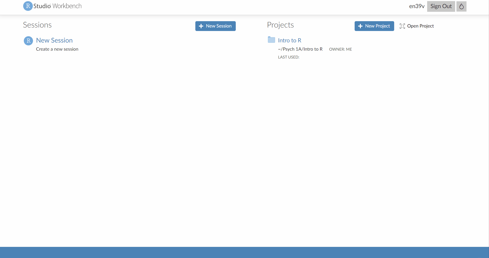
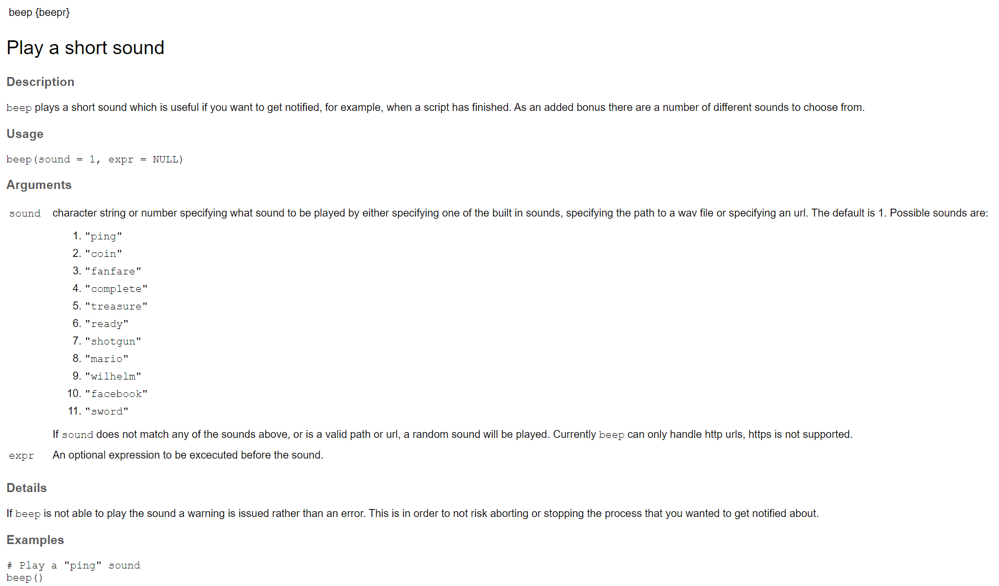
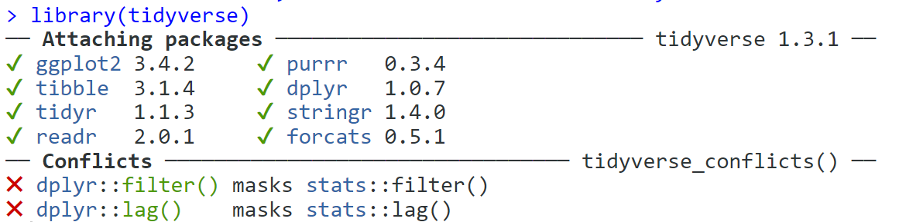
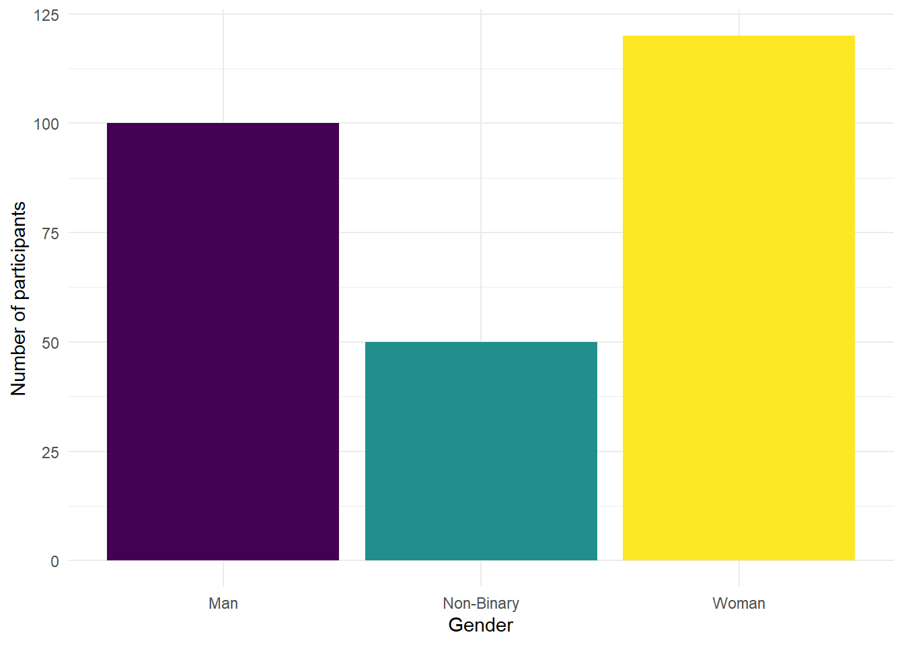

# Intro to Stroop effect {#stroop}


## Intended Learning Outcomes {#sec-ilo-stroop}

By the end of this chapter you should be able to:

* Explain what the Stroop effect is and how is it measured
* Load and use packages and functions in R
* Load and check data

## Walkthrough video {#sec-walkthrough-stroop}

There is a walkthrough video of this chapter available via [Echo360.]()) We recommend first trying to work through each section of the book on your own and then watching the video if you get stuck, or if you would like more information. This will feel slower than just starting with the video, but you will learn more in the long-run. Please note that there may have been minor edits to the book since the video was recorded. Where there are differences, the book should always take precedence.

## Activity 1: The Stroop Effect

In this chapter and the next chapter, we're going to develop your data skills by using data from one of the most famous experiments in psychology: The Stroop Effect.

* First, take part in [this online version](https://www.psytoolkit.org/experiment-library/experiment_stroop.html) of the Stroop test. It only takes a few minutes to complete. You need to be on a device with a keyboard. 
* Second, read the [Wikipedia summary](https://en.wikipedia.org/wiki/Stroop_effect) of the Stroop Effect and how it is used in psychological research.
* Finally, answer the following questions. Please note that your responses will not save in the browser - if you want to save them, make a note of them somewhere.

1. What does the Stroop Effect primarily measure?

<select class='webex-select'><option value='blank'></option><option value=''>Color perception</option><option value=''>Language comprehension</option><option value='answer'>Cognitive interference</option><option value=''>Reading speed</option></select>


<div class='webex-solution'><button>Explain this answer</button>

The Stroop Effect primarily measures cognitive interference, which occurs when the processing of a specific stimulus feature impedes the simultaneous processing of a second stimulus attribute.

</div>
 

2. What is one possible explanation for the Stroop Effect?

<select class='webex-select'><option value='blank'></option><option value=''>People are naturally slower at reading than identifying colors</option><option value='answer'>Reading is an automatic process that can interfere with color identification</option><option value=''>Color identification is an automatic process that can interfere with reading</option><option value=''>None of the above</option></select>


<div class='webex-solution'><button>Explain this answer</button>

The Stroop Effect is often explained by the theory of automaticity, which suggests that reading—the task of recognizing words—has become an automatic process for most individuals, and this automatic reading process interferes with the task of naming the color.

</div>
 

3. In a typical Stroop test, <input class='webex-solveme nospaces ignorecase' size='9' data-answer='["congruent"]'/> trials (where the color of the ink matches the word) are completed faster than <input class='webex-solveme nospaces ignorecase' size='11' data-answer='["incongruent"]'/> trials (where the color of the ink does not match the word).


<div class='webex-solution'><button>Explain this answer</button>

Answer: congruent, incongruent

In a typical Stroop test, there are two types of tasks - congruent and incongruent.

Congruent tasks are those where the color of the ink matches the word. For example, the word "BLUE" is printed in blue ink. In this case, the visual color and the semantic information (the meaning of the word) align or are "congruent."

Incongruent tasks, on the other hand, are those where the color of the ink does not match the word. For example, the word "BLUE" might be printed in red ink. Here, the visual color and the semantic information are in conflict or are "incongruent."

Participants in a Stroop test are typically asked to name the color of the ink, not the word. This is where the interference comes in. Reading words is such an automatic process for most literate adults that the participant's brain automatically reads the word before recognizing the color of the ink. This causes a delay in the response time for incongruent tasks, as the brain has to overcome the initial automatic response to read the word.

Therefore, congruent tasks are typically completed faster than incongruent tasks in a Stroop test. The difference in response times is the measure of the Stroop effect, which demonstrates the nature of cognitive interference and the automatic process of reading.

</div>


## Activity 2: New project

* Log in to the to R sever using the link that's on Moodle (and if you haven't already, bookmark the link to make your life easier!).

To help keep things organised, we'll make a new project for the Stroop experiment chapters (this week and next week). To make a new project, the steps are almost the same as what you did in the first chapter with the exception that you don't need to make the Psych 1A folder this time, you just need to find it:

* Click on the "New project" button;
* Then, click on the first option in the list "New Directory";
* Then, click "New Project";
* Then you are given the opportunity to name your project and select which folder it should be stored in. First in the "Directory name" box, type "Stroop Effect";
* The subdirectory should already be set to Psych 1A but if not, click browse and navigate to it then click "Choose";
* Finally, click "Create project".

<div class="figure" style="text-align: center">

<p class="caption">(\#fig:img-rserver-2)Creating a new project</p>
</div>

## Activity 2: Setting check

Now you need to download the data files we're going to use. Before you do, we need to check some settings on your browser because the biggest issue new students face with R is not learning to code, it's knowing where your files are.

* First, if you're not 100% sure, check your browser settings to make sure you know where files you download are going to go. If you're on Windows, there's a good chance the default will be the Downloads folder. However, this folder can sometimes end up a dumpster fire of files so it can be better to change your settings so that your browser asks you where to save each download to so that you have to consciously choose each time. [This website](https://www.computerhope.com/issues/ch002103.htm) explains how to check and change these settings for all different browsers.

We're going to ask you to download **zip files** which you will then upload to the server. A zip file is a folder that contains files that have been compressed to make the file size smaller (like vacuum packed food) and enables you to download multiple files at once.

* If you're on a Mac and using Safari as your browser, it has a very annoying default habit of unzipping files when you download them. It's trying to be useful but you  need the zipped file to upload to the server so it actually causes problems by doing this. We'd strongly recommend just not using Safari at all because it seems to cause a few issues with R and using Chrome or Firefox instead  but if you are particularly attached to it, [change the settings](https://apple.stackexchange.com/questions/961/how-to-stop-safari-from-unzipping-files-after-download) to stop it unzipping files.

## Activity 3: Data files

Once you've done all this, it's time to download the files we need and then upload them to the server.

* First, download the <a href="files/data/stroop/stroop_data.zip" download>Stroop data zip file</a> to your computer and make sure you know which folder you saved it in.
* Then, on the server in the Files tab (bottom right), click `Upload > Choose file` then navigate to the folder on your computer where the zip file is saved, select it, click `Open`, then `OK`.

The server will automatically unzip the files for you into your chosen folder and in this case, it's helpful as it means they're now ready to use.


The zip file contains four files:

* `stroop_stub1.Rmd` and `stroo_stub2.Rmd`: to help you out in the first semester, we'll provide pre-formatted Markdown files ("stub" files) that contain code chunks for each activity and spaces for you to take notes. Open the `stroop_sub1.Rmd` Rmd by clicking on it in the Files tab and then edit the heading to add in your GUID and today's date.
* `participant_data.csv` is a data file that contains each participant's anonymous ID, age, and gender. This data is in <a class='glossary' target='_blank' title='A data format where all of the observations about one subject are in the same row' href='https://psyteachr.github.io/glossary/w#wide'>wide-form</a> which means that all of the observations about one subject are in the same row. There are 270 participants, so there are 270 rows of data.


```r
head(ppt_info)
```

<div class="kable-table">

<table>
 <thead>
  <tr>
   <th style="text-align:right;"> participant_id </th>
   <th style="text-align:left;"> gender </th>
   <th style="text-align:right;"> age </th>
  </tr>
 </thead>
<tbody>
  <tr>
   <td style="text-align:right;"> 1 </td>
   <td style="text-align:left;"> Man </td>
   <td style="text-align:right;"> 20 </td>
  </tr>
  <tr>
   <td style="text-align:right;"> 2 </td>
   <td style="text-align:left;"> Man </td>
   <td style="text-align:right;"> 20 </td>
  </tr>
  <tr>
   <td style="text-align:right;"> 3 </td>
   <td style="text-align:left;"> Man </td>
   <td style="text-align:right;"> 27 </td>
  </tr>
  <tr>
   <td style="text-align:right;"> 4 </td>
   <td style="text-align:left;"> Man </td>
   <td style="text-align:right;"> 19 </td>
  </tr>
  <tr>
   <td style="text-align:right;"> 5 </td>
   <td style="text-align:left;"> Man </td>
   <td style="text-align:right;"> 23 </td>
  </tr>
  <tr>
   <td style="text-align:right;"> 6 </td>
   <td style="text-align:left;"> Man </td>
   <td style="text-align:right;"> 28 </td>
  </tr>
</tbody>
</table>

</div>


* `experiment_data.csv` is a data file that contains each participant's anonymous ID, and mean reaction time for all the congruent and incongruent trials they completed. This data is in <a class='glossary' target='_blank' title='A data format where each observation is on a separate row' href='https://psyteachr.github.io/glossary/l#long'>long-form</a> where each observation is on a separate row so for the Stroop experiment, each participant has two rows because there are two observations (one for congruent trials and one for incongruent trials). So there are 270 participants, but 540 rows of data (270 * 2).

You may be less familiar with this way of organising data, but for many functions in R your data must be stored this way. This semester, we'll provide you with the data in the format it needs to be in and next semester we'll show you how to transform it yourself.


```r
head(dat)
```

<div class="kable-table">

<table>
 <thead>
  <tr>
   <th style="text-align:right;"> participant_id </th>
   <th style="text-align:left;"> condition </th>
   <th style="text-align:right;"> reaction_time </th>
  </tr>
 </thead>
<tbody>
  <tr>
   <td style="text-align:right;"> 1 </td>
   <td style="text-align:left;"> congruent </td>
   <td style="text-align:right;"> 847.0311 </td>
  </tr>
  <tr>
   <td style="text-align:right;"> 1 </td>
   <td style="text-align:left;"> incongruent </td>
   <td style="text-align:right;"> 910.3084 </td>
  </tr>
  <tr>
   <td style="text-align:right;"> 2 </td>
   <td style="text-align:left;"> congruent </td>
   <td style="text-align:right;"> 748.1366 </td>
  </tr>
  <tr>
   <td style="text-align:right;"> 2 </td>
   <td style="text-align:left;"> incongruent </td>
   <td style="text-align:right;"> 967.4626 </td>
  </tr>
  <tr>
   <td style="text-align:right;"> 3 </td>
   <td style="text-align:left;"> congruent </td>
   <td style="text-align:right;"> 786.2370 </td>
  </tr>
  <tr>
   <td style="text-align:right;"> 3 </td>
   <td style="text-align:left;"> incongruent </td>
   <td style="text-align:right;"> 975.7407 </td>
  </tr>
</tbody>
</table>

</div>

Before we load in and work with the data files we need to explain a few more things about how R works.

## Packages and functions {#sec-packages}

When you install R you will have access to a range of <a class='glossary' target='_blank' title='A named section of code that can be reused.' href='https://psyteachr.github.io/glossary/f#function'>functions</a> including options for <a class='glossary' target='_blank' title='The process of preparing data for visualisation and statistical analysis.' href='https://psyteachr.github.io/glossary/d#data-wrangling'>data wrangling</a> and statistical analysis. The functions that are included in the default installation are typically referred to as <a class='glossary' target='_blank' title='The set of R functions that come with a basic installation of R, before you add external packages.' href='https://psyteachr.github.io/glossary/b#base-r'>base R</a> and you can think of them like the default apps that come pre-loaded on your phone. 

One of the great things about R, however, is that it is **user extensible**: anyone can create a new add-on that extends its functionality. There are currently thousands of <a class='glossary' target='_blank' title='A group of R functions.' href='https://psyteachr.github.io/glossary/p#package'>packages</a> that R users have created to solve many different kinds of problems, or just simply to have fun. For example, there are packages for data visualisation, machine learning, interactive dashboards, web scraping, and playing games such as Sudoku.

Add-on packages are not included with base R, but have to be downloaded and installed from an archive, in the same way that you would, for instance, download and install PokemonGo on your smartphone. The main repository where packages reside is called <a class='glossary' target='_blank' title='The Comprehensive R Archive Network: a network of ftp and web servers around the world that store identical, up-to-date, versions of code and documentation for R.' href='https://psyteachr.github.io/glossary/c#cran'>CRAN</a>, the Comprehensive R Archive Network.

There is an important distinction between **installing** a package and **loading** a package.

### Installing a package {#sec-install-package}

This is like installing an app on your phone: you only have to do it once and the app will remain installed until you remove it. For instance, if you want to use PokemonGo on your phone, you install it once from the App Store or Play Store; you don't have to re-install it each time you want to use it. Once you launch the app, it will run in the background until you close it or restart your phone. Likewise, when you install a package, the package will be available (but not *loaded*) every time you open up R.

::: {.warning data-latex=""}
The packages you need for this course are already installed on the server so we're not going to show you how to install packages this semester because if you reinstall them on the sever it can cause issues. If you have installed R on your own laptop you should be confident enough to look up how to do this yourself - if not, you can come to office hours (but also, we'd encourage you just to use the server as it will help you follow along with this workbook!).
:::

### Loading a package

This is done using the `library()` function. This is like **launching** an app on your phone: the functionality is only there when the app is launched and remains there until you close the app or restart. For example, when you run `library(beepr)` within a session, the functions in the package `beepr` will be made available for your R session. The next time you start R, you will need to run `library(beepr)` again if you want to access that package.

## Activity 4: Packages and function

As an example, let's load the <code class='package'>beepr</code> package which is already installed on the server. The <code class='package'>beepr</code> package is mostly just for fun - it makes R play a short noise - but it's useful to show you how packages work. To load a package, you use the function `library()` and include the name of the package you want to load in parentheses.

* In code chunk 1, type and run the below code to load the `beepr` package. If you can't remember how to run code, take a look back at Chapter\ \@ref(sec-run-code).


```r
library(beepr)
```

You'll see `library(beepr)` appear in the console. There's no warning messages or errors so it looks like it has loaded successfully.

### Using a function

Now you can use the function `beep()`. A <a class='glossary' target='_blank' title='A named section of code that can be reused.' href='https://psyteachr.github.io/glossary/f#function'>function</a> is a name that refers to some code you can reuse.

* In code chunk 2, write and run the below code to use the function `beep()` (make sure you have your sound on).


```r
beep()
```

After the function name, there is a pair of parentheses, which contain zero or more <a class='glossary' target='_blank' title='A variable that provides input to a function.' href='https://psyteachr.github.io/glossary/a#argument'>arguments</a>. These are options that you can set. In the example above, the `sound` argument has a <a class='glossary' target='_blank' title='A value that a function uses for an argument if it is skipped.' href='https://psyteachr.github.io/glossary/d#default-value'>default value</a> of `1`, which makes a "ping" sound. 

* In code chunk 2, add the below code to use a different sound and try changing the argument to an integer (whole number) between 1 and 11.


```r
beep(sound = 8)
```

### Function Help {#sec-function-help}

If you want more information about what a function does or how to use it, you can look at the help document. If a <a class='glossary' target='_blank' title='A named section of code that can be reused.' href='https://psyteachr.github.io/glossary/f#function'>function</a> is in <a class='glossary' target='_blank' title='The set of R functions that come with a basic installation of R, before you add external packages.' href='https://psyteachr.github.io/glossary/b#base-r'>base R</a> or a package you have loaded, you can type `?function_name` in the console to access the help file. At the top of the help it will give you the function and package name. 

If the package isn't loaded, use `?package_name::function_name`. When you aren't sure what package the function is in, use the shortcut `??function_name` which will give you a list of all possible options.

* In the **console**, type and run the code for the different help options below. The reason you run the help code in the console not a code chunk is that you generally don't want to save this code in your script.


```r
# get help with a package
?beepr

# get help with a function if the package it's from is already loaded
?beep

# get help with a function whether or not the package is loaded
?beepr::beep

# shows a list of potentially matching functions
??beep
```

<div class="small_right" style="width: 50%; max-width: 400px;"></div>

Function help is always organised in the same way. For example, look at the help for `?beepr::beep`. At the top, it tells you the name of the function and its package in curly brackets, then a short description of the function, followed by a longer description. The **Usage** section shows the function with all of its <a class='glossary' target='_blank' title='A variable that provides input to a function.' href='https://psyteachr.github.io/glossary/a#argument'>arguments</a>. If any of those arguments have default values, they will be shown like `function(arg = default)`. The **Arguments** section lists each argument with an explanation. There may be a **Details** section after this with even more detail about the functions. The **Examples** section is last, and shows examples that you can run in your console window to see how the function works.


::: {.callout-note .try style="clear: both;"}
Use the help documentation to find the answers to these questions:

* What is the first argument to the `mean` function? <select class='webex-select'><option value='blank'></option><option value=''>trim</option><option value=''>na.rm</option><option value=''>mean</option><option value='answer'>x</option></select>
* What package is `read_excel` in? <select class='webex-select'><option value='blank'></option><option value=''>readr</option><option value='answer'>readxl</option><option value=''>base</option><option value=''>stats</option></select>
:::

## Activity 5: Loading data

OK, let's get back to looking at our data. In order to load and work with our Stroop data, we need to load another very important package.

### Load the Tidyverse {#sec-tidyverse}

<code class='package'>tidyverse</code> is a meta-package that loads several packages we'll be using in almost every chapter in this book:

- <code class='package'>ggplot2</code>, for data visualisation
- <code class='package'>readr</code>, for data import
- <code class='package'>tibble</code>, for tables 
- <code class='package'>tidyr</code>, for data tidying
- <code class='package'>dplyr</code>, for data manipulation
- <code class='package'>stringr</code>, for <a class='glossary' target='_blank' title='A piece of text inside of quotes.' href='https://psyteachr.github.io/glossary/s#string'>strings</a>
- <code class='package'>forcats</code>, for <a class='glossary' target='_blank' title='A data type where a specific set of values are stored with labels; An explanatory variable manipulated by the experimenter' href='https://psyteachr.github.io/glossary/f#factor'>factors</a>
- <code class='package'>purrr</code>, for repeating things

To use <code class='package'>readr</code> to import the data, we need to load the <code class='package'>tidyverse</code>.

* In code chunk 3, write and run the code to load the <code class='package'>tidyverse</code>. When you run this code, you're going to get something that at first glance might look like an error but it's not, it's just telling you which packages it has loaded.


```r
library(tidyverse)
```

<div class="figure" style="text-align: center">

<p class="caption">(\#fig:img-tidyverse)Tidyverse message when successfully loaded</p>
</div>

### Read in the data {sec-read_csv}

Now we can read in the data. To do this we will use the function `read_csv()` that allows us to read in .csv files, which are a type of data file. There are also functions that allow you to read in .xlsx  (Excel) files and other formats, however in this course we will only use .csv files.

First, we will create an object called `dat` that contains the data in the `experiment_data.csv` file. Then, we will create an object called `ppt_info` that contains the data in the `participant_data.csv`.

* In code chunk 4, write and run the below code to load the data files.


```r
dat <- read_csv(file = "experiment_data.csv")
ppt_info <- read_csv(file = "participant_data.csv")
```

::: {.info data-latex="Help with errors"}
In order to load the file successfully, the name of the file needs to be in double quotation marks and it must have the file extension `.csv`. If you miss this out, you'll get the error message `...does not exist in current working directory`. To fix it, make sure you've spelled the name of the file right and included the file extension.

Additionally, if you get the message `could not find function "read_csv()"` it means that you have not loaded the <code class='package'>tidyverse</code> - a common error is to write the code but not run it! To fix it, run the code that loads the tidyverse. Another reason you might see this message is if you've made a typo in the name of the function, so check that you've spelled `read_csv` exactly right.
:::

## Activity 6: Check your data

You should now see that the objects `dat` and `ppt_info` have appeared in the environment pane. Whenever you read data into R you should always do an initial check to see that your data looks like how you expected. There are several ways you can do this, try them all out to see how the results differ.

* In the environment pane, click on `dat` and `ppt_info`. This will open the data to give you a spreadsheet-like view (although you can't edit it like in Excel).
* In the environment pane, click the small blue play button to the left of `dat` and `ppt_info`. This will show you the structure of the object information including the names of all the variables in that object and what type they are. 
* In code chunk 5, write and run `summary(ppt_info)` (and do the same for `dat`)
* In code chunk 5, write and run `str(ppt_info)` (and do the same for `dat`)

What is the **mean** age pf participants to 1 decimal place? <input class='webex-solveme nospaces' size='4' data-answer='["24.4"]'/>

What is the **mean** overall reaction time to 1 decimal place? <input class='webex-solveme nospaces' size='3' data-answer='["821"]'/>

## Activity 7: Visualise the data

As you're going to learn about more over this course, data visualisation is extremely important. Visualisations can be used to give you more information about your dataset, but they can also be used to mislead. 

We're going to look at how to write the code to produce simple visualisations in a few weeks, for now, we want to focus on how to read and interpret different kinds of graphs. Please feel free to play around with the code and change `TRUE` to `FALSE` and adjust the values and labels and see what happens but **do not worry about understanding this code for now**. Just copy and paste it. 

* Copy, paste and run the below code in code chunk 6 to produce a bar graph that shows the number of men, women, and non-binary participants in the dataset. 


```r
ggplot(ppt_info, # data we're using
       aes(x = gender, # variable we want to show as bars
                     fill = gender)) + # make bars different colours
  geom_bar(show.legend = FALSE) + # add bar plot & turn off redundant legend
  scale_x_discrete(name = "Gender") + # edit x-axis label
  scale_fill_viridis_d(option = "D") + # colour-blind friendly
  scale_y_continuous(name = "Number of participants")+ # edit y-axis label
  theme_minimal() # add a theme
```

<div class="figure" style="text-align: center">

<p class="caption">(\#fig:unnamed-chunk-6)Number of participants by gender</p>
</div>

Are there more men, women, or non-binary participants in the sample? <select class='webex-select'><option value='blank'></option><option value=''>More men</option><option value='answer'>More women</option><option value=''>More non-binary participants</option></select>

* Copy, paste, and run the below code  in code chunk 7 to create violin-boxplots of happiness scores for each income group.


```r
# make plot
ggplot(dat, # data we're using
       aes(x = condition, # grouping variable (IV)
                     y = reaction_time, # measurement (DV)
                     fill = condition)) + # make bars different colours
  geom_violin(show.legend = FALSE, # turn off redundant legend for colour
              alpha = .4) + # make violin a bit transparent
  geom_boxplot(width = .2, # adjust size of boxplot
               show.legend = FALSE, # turn off redundant legend for colour
               alpha = .7)+ # make boxplots a little transparent
  scale_x_discrete(name = "Condition", # edit x-axis labels
                   labels = c("Congruent", "Incongruent")) +
  scale_y_continuous(name = "Reaction time (ms)") + # edit y-axis labels
  theme_minimal() + # add a theme
  scale_fill_viridis_d(option = "E") # colour-blind friendly colours
```

<div class="figure" style="text-align: center">

<p class="caption">(\#fig:unnamed-chunk-7)Violin-boxplot of reaction times in each condition</p>
</div>

* The violin (the wavy line) shows density. Basically, the fatter the wavy shape, the more data points there are at that point. It's called a violin plot because it very often looks (kinda) like a violin. 
* The boxplot is the box in the middle. The black line shows the median score in each group. The median is calculated by arranging the scores in order from the smallest to the largest and then selecting the middle score.
* The other lines on the boxplot show the interquartile range. There is a really good explanation of [how to read a boxplot here](https://medium.com/dayem-siddiqui/understanding-and-interpreting-box-plots-d07aab9d1b6c). 

Which condition has the longest median reaction time? <select class='webex-select'><option value='blank'></option><option value=''>Congruent</option><option value='answer'>Incongruent</option></select>

## Finished

Finally, try knitting the file to HTML. And that's it, well done! It's absolutely ok if you don't understand 100% of what you're doing at this point, we're going to repeat everything you've done with different datasets so you will get lots of practice and we're going to build it up very slowly. Also remember that you can attend GTA sessions and office hours for help with data skills - you don't have to have specific questions, some students just like to use the GTA sessions as the time to work through the data skills book so that if they need help, they're already there.

Remember to  make a note of any mistakes you made and how you fixed them, any other useful information you learned, save your Markdown, and quit your session on the server. 
