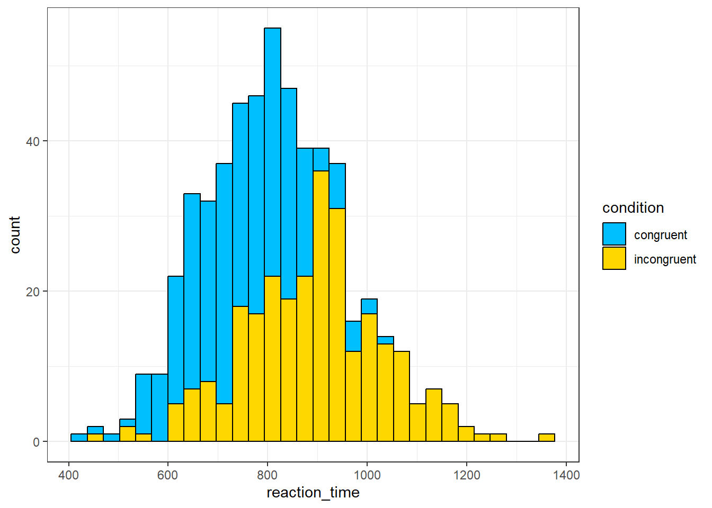
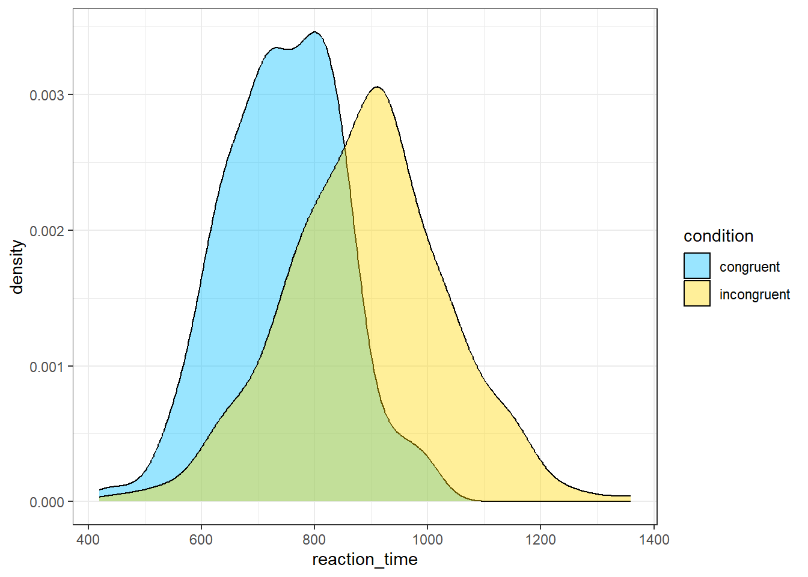

# Stroop 2


## Intended Learning Outcomes {#sec-ilo-stroop-analysis}

By the end of this chapter you should be able to:

* Calculate counts and descriptive statistics (mean, median, sd) by groups using `count()`, `group_by()` and `summarise()`
* Troubleshoot a couple of common errors

We'll work through this chapter as a group in the lab in week 3 so feel free to have a read through it in advance but you can do the actual work in the lab!

## Walkthrough video {#sec-walkthrough-stroop2}

There is a walkthrough video of this chapter available via [Echo360](https://echo360.org.uk/media/2e6090b7-9e89-431f-90c3-e1517792824a/public). We recommend first trying to work through each section of the book on your own and then watching the video if you get stuck, or if you would like more information. This will feel slower than just starting with the video, but you will learn more in the long-run. Please note that there may have been minor edits to the book since the video was recorded. Where there are differences, the book should always take precedence.

## Activity 1: Set-up

Login to the server and then:

* Open your Stroop Effect project;
* Open the `stroop_stub2.Rmd` Markdown file that we'll use for this chapter;
* Your environment should be clear but if there are objects in it, remove them by pressing the brush icon. Remember that to avoid issues, you always want to start R in a new session with a clean environment so make sure to quit at the end of each chapter and also check that you've got the settings right as described in Chapter\ \@ref(sec-rstudio-settings).

Refresh your memory, thinking back to what you know about the Stroop Effect, complete the hypothesis using the word "higher" or "lower".

* H1: Reaction times in the congruent condition will be significantly <input class='webex-solveme nospaces ignorecase' size='5' data-answer='["lower"]'/> than reaction times in the incongruent condition. 
* H0: There will be no significant difference between reaction times in the congruent and incongruent condition.

H1 is a <select class='webex-select'><option value='blank'></option><option value='answer'>Directional</option><option value=''>Non-directional</option></select> hypothesis.


<div class='webex-solution'><button>Explain these answers</button>


In the context of the Stroop effect, it is generally expected that reaction times will be faster (i.e., lower) in the congruent condition than in the incongruent condition. This is because, in the congruent condition, the color and the word match (e.g., the word "RED" displayed in red color), which doesn't require additional cognitive processing to resolve any conflict. In contrast, in the incongruent condition, the color and the word are different (e.g., the word "RED" displayed in blue color), which creates cognitive conflict that takes additional time to resolve.

A hypothesis is considered directional (or one-tailed) when it predicts the direction of the difference or relationship. In this case, H1 predicts that reaction times will be lower in the congruent condition than in the incongruent condition, so it is a directional hypothesis. A non-directional (or two-tailed) hypothesis, on the other hand, would only state that there is a difference in reaction times between the two conditions, without specifying which one is expected to be faster.


</div>


## Activity 2: Loading data and packages

Because we're working in a new session, we need to load the <code class='package'>tidyverse</code> package and then load in the data again.

Which function do you use to load in any package? <select class='webex-select'><option value='blank'></option><option value=''>summary()</option><option value='answer'>library()</option><option value=''>tidyverse</option><option value=''>read_csv()</option></select>


<div class='webex-solution'><button>Explain this answer</button>


* `summary()`: This is a generic function used to produce result summaries of the results of various model fitting functions.
* `library()`: This is the function used to load or attach add-on packages in R. For example, to load the tidyverse package, you would use the command library(tidyverse).
* `tidyverse`: This is an example of a package in R, not a function. The tidyverse package is a collection of R packages designed for data science.
* `read_csv()`: This is a function from the readr package (which is part of tidyverse) used to import data from .csv files into R.


</div>


Which function do you use to load in a .csv dataset? <select class='webex-select'><option value='blank'></option><option value='answer'>read_csv()</option><option value=''>str()</option><option value=''>readr</option><option value=''>tidyverse</option></select>


<div class='webex-solution'><button>Explain this answer</button>


* `read_csv()`: This function is part of the readr package (which is also part of the tidyverse suite of packages). You use it to read comma-separated values (csv) files into R. So, if you have a .csv file called "data.csv", you would load it into R with the command read_csv("data.csv").
* `str()`: The str() function is used to compactly display the internal structure of an R object, not to load in data.
* `readr`: This is the name of a package, not a function. The readr package provides functions for reading in different types of text data, including .csv files. The function from this package to read .csv files is read_csv().
* `tidyverse`: This is also a package (actually a collection of packages), not a function. The tidyverse collection includes the readr package, which contains the read_csv() function.


</div>


* In code chunk 1, write three lines of code that load the tidyverse, load the file `participant_data.csv` into an object named `ppt_info`, and then load the file `experiment_data.csv` into an object named `dat`. Try and see if you can do this from memory and use the hints before you look at the solution - you'll learn much quicker if you do it this way (even if you don't get it right) than just going straight to the solution.
* Once you've loaded the data files, click on them to view them and check everything looks as it should.
* If you get an error, trouble-shoot with your group and also check the notes in Chapter\ \@ref(sec-read-csv) on how to resolve it.


<div class='webex-solution'><button>Hint</button>


```r
library(package_name)
object_name <- read_csv(file = "file_name.csv")
```


</div>


<div class='webex-solution'><button>Solution</button>


```r
library(tidyverse)
dat <- read_csv(file = "experiment_data.csv")
ppt_info <- read_csv(file = "participant_data.csv")
```


</div>


## Activity 3: Participant information

Let's start doing some simple analysis on our dataset and as a first step, we'll get some descriptive information about our sample. We already know that there are 270 participants in our dataset, but we can check this using code and the function `count()` which comes from the <code class='package'>dplyr</code> package that is loaded as part of the <code class='package'>tidyverse</code>.

### Counting observations

`count()` simply counts the number of observations (rows) of the object you give it. First, we'll count the number of observations of the total dataset. It's important we use the `ppt_info` dataset to do this because this is in wide-form so 1 row = 1 participant. If we used `dat`, we might think we have double the number of participants we really do.

* The weird `%>%` symbol is known as the *pipe* and it's loaded in as part of the <code class='package'>tidyverse</code>. The formal definition is that the pipe takes an object and sends it to the next function but it's maybe easier to read it as **and then**. So the below code reads "Take the object `ppt_infO` **and then** count it.


```r
ppt_info %>%
  count()
```

<div class="kable-table">

|   n|
|---:|
| 270|

</div>

But we can also use `count()` to count the number of observations in each group. When writing up psychological research, it's common to report the gender split of your sample. To do this, we add `gender` to our `count()` function which will count the number of observations separately for each group in the variable `gender`:


```r
ppt_info %>%
  count(gender)
```

<div class="kable-table">

|gender     |   n|
|:----------|---:|
|Man        | 100|
|Non-Binary |  50|
|Woman      | 120|

</div>


::: {.info data-latex=""}
If you're watching the video, you may wonder why your output is appearing in a different place to Emily's. You can choose whether the output of your code appears within your Markdown document, or in the console. If you want to change this setting go to `Tools` - `Global options` - `RMarkdown` and then uncheck the box for `Show output inline for all R Markdown documents` if you want it to appear in the console. It makes no difference to your code which one you use, it's entirely preference. 
:::

### Calculating summary statistics

It's also common to report the mean and standard deviation of the age of your sample. Rather than using `count()`, we'll use the function `summarise()` which can be used to create summary statistics (e.g., mean, median, SD etc).

* `summarise()` will create a table with the summary statistics you have requested. 
* The bit to the left of the `=` sign is the name of the column it will create in the output table, you can call this whatever you want but make it informative and easy to read. Variable names cannot have spaces so it's common to separate words with an `_` underscore. In this case, we'll name the column `mean_age`.
* The bit to the right of the `=` sign is the calculation R will perform. In this case, we'll use the function `mean()` on the variable `age`.


```r
ppt_info %>%
  summarise(mean_age = mean(age))
```

<div class="kable-table">

| mean_age|
|--------:|
|  24.4037|

</div>

You can add multiple operations to a single call to `summarise()`, for example, we can add on the calculation of standard deviation:


```r
ppt_info %>%
  summarise(mean_age = mean(age),
            sd_age = sd(age))
```

<div class="kable-table">

| mean_age|   sd_age|
|--------:|--------:|
|  24.4037| 3.496677|

</div>

In R, there are many functions to calculate summary statistics. Here is a list of some of the most commonly used functions:

1. `mean(x)`: Calculates the arithmetic mean of a numeric vector `x`.
2. `median(x)`: Finds the median of `x`.
3. `max(x)`: Finds the maximum value in `x`.
4. `min(x)`: Finds the minimum value in `x`.
5. `range(x)`: Returns a column containing the minimum and maximum of all the given arguments.
6. `sum(x)`: Calculates the sum of all the values in `x`.
7. `sd(x)`: Calculates the standard deviation of `x`.
8. `var(x)`: Computes the variance of `x`.
9. `n()` Computes the number of observations, similar to `count()`

<br>

* Add in the code to the above that will also calculate the median age of participants and store it in a column named `median_age`.


<div class='webex-solution'><button>Solution</button>


```r
ppt_info %>%
  summarise(mean_age = mean(age),
            sd_age = sd(age),
            median_age = median(age))
```


</div>


### Summarising by groups

Finally, you can also compute summary statistics by groups, just like we did with `count()`. To do this we need to take a slightly different approach and use an additional function `group_by()`. `group_by()` will group a dataset and then whatever you do to that dataset next will be done separately for each group, so for example, if you group it by gender and then ask it to calculate mean age, it will calculate mean age separately for each gender.

A useful addition when you are calculating summary statistics by groups is to add in a call to `n()`. This function counts the number of observations in each group. This gives you the same info you got when you used `count()` but adding it to the table is a useful reminder of how many data points were used for each calculation. For example, if you calculated the mean score of two groups and one group had 1000 participants and the other had 5 participants, it would be good to be reminded that they're very different sizes.

* In code chunk 2, add the below code to calculate summary stats for age by group.


```r
ppt_info %>%
  group_by(gender) %>%
  summarise(mean_age = mean(age),
            sd_age = sd(age),
            median_age = median(age),
            group_size = n())
```

<div class="kable-table">

|gender     | mean_age|   sd_age| median_age| group_size|
|:----------|--------:|--------:|----------:|----------:|
|Man        | 24.25000| 3.382591|       24.0|        100|
|Non-Binary | 24.22000| 3.726847|       25.5|         50|
|Woman      | 24.60833| 3.510598|       25.0|        120|

</div>

Which gender has the highest mean age? <select class='webex-select'><option value='blank'></option><option value=''>Men</option><option value=''>Non-binary</option><option value='answer'>Women</option></select>

Which gender has the highest median age? <select class='webex-select'><option value='blank'></option><option value=''>Men</option><option value='answer'>Non-binary</option><option value=''>Women</option></select>

### Saving to objects

Before we move on, one last thing. So far the code you have written produces the output in the viewer, however, you will often want to save the output to an object so that you can use it again. To do this we use the same code as in previous chapters to assign output to an object.

* In code chunk 2, amend your final bit of code to save it to an object named `age_stats`. Look at how you created the objects `dat` and `ppt_info`.


<div class='webex-solution'><button>Hint</button>


```r
object_name <- code_to_save_to_object
```


</div>


<div class='webex-solution'><button>Solution</button>


```r
age_stats <- ppt_info %>%
  group_by(gender) %>%
  summarise(mean_age = mean(age),
            sd_age = sd(age),
            median_age = median(age),
            group_size = n())
```


</div>


## Activity 4: Experimental data

Let's now turn to the experimental data and reinforce the use of `count()` and `summarise()` with this different dataset. It's a good idea to perform checks on your data before analysis just to make sure everything is right. You can do this by doing things we've already done like eyeballing your data (literally, looking at it), or using `summary()` and `str()` but there's a few other things we can check.

In the long-form data set, we should have two rows for each participant, one for their congruent reaction time and one for their incongruent reaction time so this also means we should have the same number of congruent and incongruent observations.

* In code chunk 3, use `count()` to count the number of observations in each `condition`. Look at the code for counting the gender of participants and try and adapt it to the new data and variables. Discuss with your group and use the hint before you look at the solution.


<div class='webex-solution'><button>Hint</button>


```r
new_data %>%
  count(variable_to_count)
```


</div>


<div class='webex-solution'><button>Solution</button>


```r
dat %>%
  count(condition)
```


</div>


Are there the same number of observations for each condition? <select class='webex-select'><option value='blank'></option><option value='answer'>Yes</option><option value=''>No</option></select>

Next, we need to calculate the mean reaction times in each condition so that we can determine if our hypothesis is supported.

* In code chunk 3, add the code that calculates the mean reaction time and standard deviation for each condition and save it to an object named `condition_stats`. Again, look at the code for the participant information and the hint and discuss with your group before you look at the solution. You will find it helpful to check `dat` to see exactly how all the variable names are spelled. Your final table should have 3 columns (`condition`, `mean_rt`, and `sd_rt`) and 2 rows of data (one for each condition).


<div class='webex-solution'><button>Hint</button>


```r
object_name <- data_set %>%
  group_by(grouping_variable) %>%
  summarise(column_name = statistic(measurement),
            column_name2 = statistic(measurment))
```


</div>


<div class='webex-solution'><button>Solution</button>


```r
condition_stats <- dat %>%
  group_by(condition) %>%
  summarise(mean_rt = mean(reaction_time),
            sd_rt = sd(reaction_time))
```


</div>


View `condition_stats` by clicking on the object. Based on the mean reaction times, the hypothesis is <select class='webex-select'><option value='blank'></option><option value='answer'>supported</option><option value=''>rejected</option></select>


<div class='webex-solution'><button>Explain this answer</button>


Given that the mean reaction time for the congruent condition is lower than the mean for the incongruent condition, it seems that the initial hypothesis (H1: Reaction times in the congruent condition will be significantly lower than reaction times in the incongruent condition) is supported.


</div>


## Activity 5: Data visualisation

To finish up, let's make a few plots to visualise the data. Again, don't worry too much about understanding this code right now, we'll explain it in the next set of chapters. For now, read through the code and see if you can match up the code to what displays on the plot, and try changing the values of `width` to see what happens and answer the questions.

* In code chunk 4, add the below code to create a boxplot of the reaction times in each condition.


```r
ggplot(dat, aes(x = condition, y = reaction_time)) +
  geom_boxplot(width = .4)
```


Are there more outliers in the congruent or incongruent condition? <select class='webex-select'><option value='blank'></option><option value=''>congruent</option><option value='answer'>incongruent</option></select>


<div class='webex-solution'><button>Explain this answer</button>


On a boxplot, outliers are represented by the black dots beyond the end of the whiskers. There is one outlier in the congruent condition, and four in the incongruent condition.  

In a ggplot2 boxplot, an outlier is typically defined as an observation that falls below Q1 - 1.5IQR or above Q3 + 1.5IQR.

Q1: This is the first quartile, or the 25th percentile.
Q3: This is the third quartile, or the 75th percentile.
IQR: This stands for Interquartile Range, and it is calculated as Q3 - Q1. The IQR is a measure of statistical dispersion, and it represents the middle 50% of the data.

So, in a boxplot, the "box" represents the IQR and the line inside the box is the median (Q2). The "whiskers" typically extend to the smallest and largest observations within Q1 - 1.5IQR and Q3 + 1.5IQR, respectively. Any observations that fall outside of this range are considered outliers and are usually represented as points beyond the whiskers.


</div>


* In code chunk 5, add the below code to create a grouped histogram that shows the distribution of the reaction times with a different colour for each condition. You can change the colours if you like - use [this list](https://www.datanovia.com/en/blog/awesome-list-of-657-r-color-names/) of all the colour names you can use with `ggplot()`.


```r
ggplot(dat, aes(x = reaction_time, fill = condition)) +
  geom_histogram(colour = "black") +
  scale_fill_manual(values = c("deepskyblue", "gold"))
```

```
## `stat_bin()` using `bins = 30`. Pick better value with `binwidth`.
```



The most frequent value for reaction times in the congruent condition is about <select class='webex-select'><option value='blank'></option><option value='answer'>800 ms</option><option value=''>1000 ms</option></select>


<div class='webex-solution'><button>Explain this answer</button>


A histogram shows the distribution of responses. The x-axis is the value of the measurement, in this case reaction time in milliseconds, and the y-axis is a count, i.e., how many times that value occurs. The most frequent value is therefore the highest bar which for the congruent condition is around 800ms.


</div>


* In code chunk 6, add the below code to create a grouped density plot which is another way of visualising the distribution of a variable?


```r
ggplot(dat, aes(x = reaction_time, fill = condition)) +
  geom_density(alpha = .4) +
  scale_fill_manual(values = c("deepskyblue", "gold"))
```



Which plot is a better representation of the distribution? <select class='webex-select'><option value='blank'></option><option value=''>Histogram</option><option value=''>Density plot</option><option value='answer'>They both have their own strengths</option></select>


<div class='webex-solution'><button>Explain this answer</button>


Histograms and density plots are both graphical representations that show the distribution of a dataset, but they display the data in slightly different ways and each has its own strengths.

Histograms show the distribution of a variable by dividing the data into bins (each represented by a bar), and then plotting the number of observations that fall into each bin (the frequency). The height of each bar corresponds to the count of data points within the bin. Histograms are useful when you want to get a sense of the count (or frequency) distribution of your data, and especially where the data points fall in terms of discrete bins.

Density plots (also known as Kernel Density Plots) show the distribution of a variable by estimating a smooth "curve" (the density function) that fits the distribution. Density plots can be thought of as smoothed versions of histograms: they use a kernel function to create a smooth curve, and the area under the curve represents the total proportion of observations. They're useful when you want to visualize the shape of the data distribution, and they can be especially helpful for identifying multiple modes (peaks) in the data.

The choice between histograms and density plots often comes down to the specifics of your dataset and what you want to emphasize:

If you're interested in the exact distribution of frequencies across bins, a histogram might be the best choice.
If you're more interested in the overall shape of the data distribution, a density plot might be more appropriate.


</div>


## Activity 6: Debugging

A large part of coding is trying to figure why your code doesn't work and this is true whether you are a novice or an expert. As you progress through this course  you should keep a record of mistakes you make and how you fixed them. In each chapter we will provide a number of common mistakes to look out for but you will undoubtedly make (and fix!) new mistakes yourself.

* Have you loaded the correct packages for the functions you are trying to use? One very common mistake is to write the code to load the package, e.g., `library(tidyverse)` but then forget to run it.
* Have you made a typo? Remember `data` is not the same as `DATA` and `ggplot` is not the same as `ggPlot`.
* Is it definitely an error? Not all red text in R means an error - sometimes it is just giving you a message with information. 
* Have you used the **exact** same object names as we did in each activity? Remember, `name` is different to `Name`. In order to make sure you can follow along with this book, take extra care to ensure you use the same object names as we do.  
* Have you used quotation marks where needed?  
* Have you accidentally deleted any back ticks (```) from the beginning or end of code chunks?

### Debugging exercises

These exercises will produce errors. Try to solve the errors yourself, and then make a note of what the error message was and how you solved it - you might find it helpful to create a new file just for error solving notes. You will find that you make the same errors in R over and over again so whilst this might slow you down initially, it will greatly speed you up in the long-run. 

1. To create the errors, you'll need to ensure you're working from a clean environment and new session. First, click `Session` then `Restart R`.


2. Then run the following code which will clear all objects you have created:


```r
rm(list = ls())
```


3. Then run the below code:


```r
dat_exercise <- read_csv("participant_data.csv")
```

This will produce the error `could not find function "read_csv"`. Once you figure out how to fix this error, make a note of it.


<div class='webex-solution'><button>Solution</button>


When you restarted the session, you unloaded all the packages you previously had loaded. The function `read_csv()` is part of the `tidyverse` package which means that in order for the code to run, you need to run `library(tidyverse)` to reload the package **before** the code that loads the data so that you can use the function.


</div>
 

2. Next run the following code:


```r
library(tidyverse)
dat_exercise <- read_csv("participant_data")
```

This will produce the error `Error: 'participant_data' does not exist in current working directory`. Once you figure out how to fix this error, make a note of it.


<div class='webex-solution'><button>Solution</button>


When loading data, you need to provide the full file name, including the file extension. In this case, the error was caused by writing `participant_data` instead of `participant_data.csv`. As far as R is concerned, these are two completely different files and only one of them exists in the working directory.


</div>


## Finished

Remember to  make a note of any mistakes you made and how you fixed them, any other useful information you learned, save your Markdown, and quit your session on the server. 
