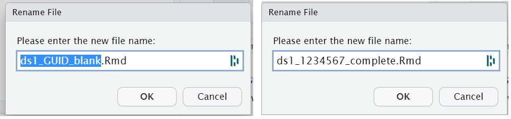

# Homework 1


## Intended Learning Outcomes {#sec-ilo-homework}

By the end of this chapter you should be able to:

* Understand how to complete the homework files for Psych 1A

In this chapter you'll find the instructions for how to complete the data skills homework. The first homework is formative which means that it does not count towards your grade, however, it's really important that you complete it so that you know what you're doing for the summative homeworks that do count towards your grade.

## New project and data files

First, we need to get the project and data files set-up.

* Navigate to the server and login;
* Create a new project named `Homework 1`;
* Navigate to the Psych 1A Moodle page > Data skills > Homework 1 and download the zip folder that contains the homework files
* Upload this zip file to your homework project
* Delete the zip file on your computer

::: {.dangerous data-latex=""}
The number one reason that students lose marks on the data skills homeworks is submitting the wrong file to Moodle. The reason this happens tends to be because a student has multiple copies of the same file, all with the same name, except some of them are blank and some of them are complete. The best way to avoid is by having good file management. Once you have uploaded the zip file to the server, delete it from your computer because you don't need it on your computer and it can only cause you problems. 
:::

The zip folder contains three files:

* `ds1_GUID_blank.Rmd` which is the Markdown document you will write your answers in. It already has all the code chunks and instructions you need.
* `ahi-cesd2023.csv` is data from a study that looked at happiness and depression scores. There are three variables `id`, the participant's ID, `ahiTotal`, their total happiness score from a questionnaire, and `cesdTotal` their total depression score from a questionnaire.
* `pinfo_2023.csv` has the information about each participant, their `id`, their `age`, and their `income`, which is one of three groups, `Below average`, `Average`, `Above average`.

## Completing the homework file

In order to get the marks **you must complete the homework using the .Rmd file we have provided**. Do not make your own. Use `ds1_GUID_blank.Rmd`. To understand why this is so important, let's explain how the homework will be marked.

The data skills homework is marked using **computer-assisted marking**. There is a code script that compares your answers to the solutions. If you provide the correct answer, you will get the marks for the question, if you don't provide an answer that matches, the code will initially award a mark of zero. A human (Emily), then manually reviews all the incorrect answers to ensure they are actually incorrect, which is why we call it computer-assisted rather than computer-automated.

The script uses two pieces of information to check whether your answers are correct.

* First, it looks for the **code chunk name**. You've already seen these before in the stub files you've used when they were named e.g., `chunk1`. In `ds1_GUID_blank.Rmd`you'll see they are named `question1`, `question2` etc. If you don't have a code chunk named e.g., `question1`, you won't get the mark for question 1, even if you've written the right answer in a code chunk with a different name.
* Second, almost every question will ask you to create an **object with a specific name**. The marking code will compare the object your code creates to the object the solution code creates to see if they match. It can only do this if the object names match *exactly*.

This might all sound quite complicated but it's not if you follow these simple rules:

* Use the file we give you, don't make your own
* Don't change the code chunk names
* Don't change the object names

## Types of questions

There are usually four types of questions in the homework files.

### Create an object

These questions will ask you to write code that performs a specific task and save it in a specific object name. For example:

Replace the NULL with code that calculates mean age and standard deviation for each income group as well as how many participants are in that group using the dataset `ppt_info`. Save this in an object named `age_stats`. The final table should have four columns and three rows. The columns should be named `income`, `mean_age`, `sd_age` and `n_group`.

You will be given a code chunk that looks like this:


```r
age_stats <- NULL
```

You should replace the NULL with the code that completes the task, for example:


```r
age_stats <- dat %>%
  group_by(income) %>%
  summarise(mean_age = mean(age),
            sd_age = sd_age,
            n_group = n())
```

To get the marks, everything about the object must match the solution, so check the number of columns and rows, and the names of the variables are how they are specified in the question.

### Provide a single number

Sometimes we will ask you to look at the output you have created and provide a single number. For example:

Look at `age_stats`. How many participants are in the largest income group? Replace the NULL with a single whole number. This number should not be in quotation marks.


```r
largest_group <- NULL
```

To answer this you would look at `age_stats` and see that the largest income group is Average with 136 participants so you would replace the NULL with 136 It's important that you don't put the number in quotation marks otherwise R will treat your answer as a character variable rather than a number and it won't match the solution.


```r
largest_group <- 136
```

### Multiple-choice

Finally, we will sometimes ask you a multiple choice question, usually based on interpreting the data or a plot. For example:

First, run the below code to create a boxplot of happiness scores for each condition.


```r
library(tidyverse)
read_csv("ahi-cesd2023.csv") %>%
  ggplot(aes(x = income, y = ahiTotal)) +
  geom_boxplot()
```

Based on this plot, which group has the lowest happiness scores?

1. Below Average
2. Average
3. Above average

Replace the NULL with your answer. Please just provide a single whole number and do not put this number in quotation marks.


```r
lowest_hap <- NULL
```

You would then replace look at the plot and replace the NULL with your answer, for example:


```r
lowest_hap <- 1
```

## Knitting your file

After every question you complete, you should knit your file. The file will only knit if you have written legal code and if you haven't done anything to mess up the formatting of the code chunks. Whilst it might seem laborious, if you knit your file after each question it will make it really easy to spot where something has gone wrong. If you wait until all questions are complete before you check the file, it'll be harder to pinpoint where the error is.

## Off you go

Ok, at this point you have enough information to complete the homework. Once you're done, come back to this chapter and we'll explain how to save and rename your file and upload it to Moodle. Remember that you can attend GTA sessions and office hours for help with the homework. 

## Saving and renaming your file

The instructions in this section might seem like overkill but the number 1 reason students lose marks really is submitting the wrong file, so if you follow the below it will make sure you avoid doing this.

* Once you have completed all questions, first, make sure your file is saved. You can do this by clicking the save icon or clicking `File - Save` or by hitting `Ctrl + s`.
* Next, rename the name of the Markdown file. The file name you were given was `ds1_GUID_blank.Rmd`. Have your Markdown open and then click `File - Rename` and change `GUID` to your GUID and change `blank` to `complete`. **Do not delete the file extension .Rmd**, it should look like the below.

<div class="figure" style="text-align: center">

<p class="caption">(\#fig:fig-settings)Renaming your file</p>
</div>

* If you have multiple copies of the homework file on the server or your computer for whatever reason, now is the time to go and clean them up. Delete all other copies except for your finished file that you've marked "complete". If you don't have any blank files, you can't submit a blank file!

## Downloading the file to your computer

In order to submit your file to Moodle, you will first need to download it to your computer. 

* In the Files tab, select the checkbox next to your complete homework file, then click `More` then `Export`. It will ask you what you want to call the file, just keep the file name the same, don't make any changes. Click `Download` and depending on your settings it will ask you where you want to save it on your computer.
* If you don't have R installed on your computer (which most of you don't), you can't open the file to check you've downloaded the right thing. This is why it's important to have good file management, nameyour files clearly, and only have one copy of the file you need. * All University computers have R installed which you could use to check your file if desired.
* If you try and open the .Rmd on your computer and you don't have R installed, it will open it in Word or NotePad and it will look very wrong and you'll panic so don't do this. If you're on a Mac, Safari also sometimes tries to be helpful and will automatically try and open the file even if you didn't ask, so again, we'd encourage you not to use Safari.

## Submitting to Moodle

Finally, navigate to Moodle and submit your completed .Rmd file. Moodle will only allow you to submit an .Rmd file so if you've done anything wrong with saving the file or saving the wrong file, it won't let you upload it. If this happens, go to a GTA session or office hours for help. You can overwrite your submission up until the deadline if you need to change your file for whatever reason, just be aware that if you edit the file after the deadline, you'll recieve late penalties.

The length of this chapter has made the homework sound much more complicated than it is but it's important to have all the info. If you ever have an issue with completing or submitting the homework in the future, remember to come back and review this page.

Congrats on submitting the first assignment for Psych 1A!
