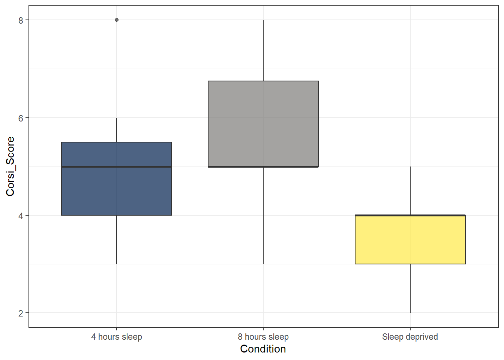
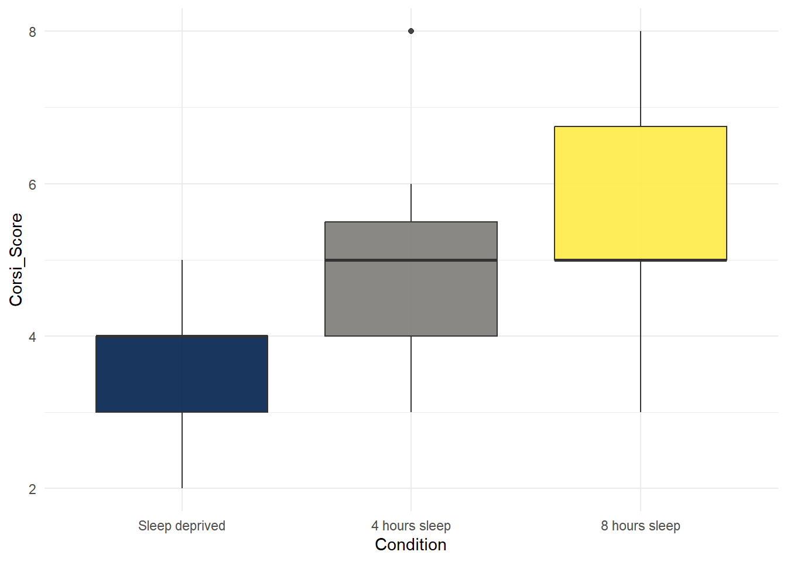

# Corsi Blocks 2


## Intended Learning Outcomes {#sec-ilo-corsi-analysis}

By the end of this chapter you should be able to:

* Select variables using `select()`
* Filter observations by multiple criteria using `filter()`
* Change the colour of plots look by customising `ggplot()`
* Reorder categorical variables using `factor()`

## Walkthrough video {#sec-walkthrough-corsi-analysis}

There is a walkthrough video of this chapter available via [Zoom.](https://uofglasgow.zoom.us/rec/share/oI2i03QSs7CJIDamAUBE7lmwylvT96MjKKF4rqTU3436ig5G-Ca_GlPFDT66jHPj._lHIx0tfVPW_uCiW) We recommend first trying to work through each section of the book on your own and then watching the video if you get stuck, or if you would like more information. This will feel slower than just starting with the video, but you will learn more in the long-run. Please note that there may have been minor edits to the book since the video was recorded. Where there are differences, the book should always take precedence.

## Activity 1: Set-up

Login to the server and then:

* Open your Corsi Block project;
* Open the `corsi_stub2.Rmd` Markdown file that we'll use for this chapter;
* Your environment should be clear but if there are objects in it, remove them by pressing the brush icon. 

## Activity 2: Loading the data

In code chunk 1, write and run the code that:

* Loads the <code class='package'>tidyverse</code>
* Loads `demographic_data.csv` into an object named `demographic_data` using the function `read_csv()`
* Loads `score_data.csv` into an object named `score_data` using the function `read_csv()`
* Joins the two datasets together using `inner_join()` by their common column (`Participant`) and saves it in an object named `full_dat`

The final step might be a bit tricky to do from memory as you've only done it once but try and do the others without looking at the hint first.


<div class='webex-solution'><button>Hint</button>


```r
library(package_name)
object_name1 <- read_csv("file_name1.csv")
object_name2 <- read_csv("file_name1.csv")
object_name3 <- inner_join(x = table1, y = table2, by = "common_columns")
```


</div>


<div class='webex-solution'><button>Solution</button>


```r
library(tidyverse)
demographic_data <- read_csv("demographic_data.csv")
score_data <- read_csv("score_data.csv")
full_dat <- inner_join(x = demographic_data, 
                       y = score_data, 
                       by = "Participant")
```


</div>


## Activity 3: Selecting variables

Often you will have more variables (columns) than you need. For the analysis we're interested in, we really only need three columns, `Participant`, `Condition`, and `Corsi_Score`.

You can create a new dataset with just the columns you want using the `select()` function. You can either specify the columns you want to keep:


```r
full_dat %>%
  select(Participant, Condition, Corsi_Score)
```

Or you could specify which columns you want to drop using `-variable`:


```r
full_dat %>%
  select(-Gender, -Age)
```

Which method you use will depend on how many variables you have, sometimes it's quicker to specify that ones you want, sometimes it's quicker to specify the ones you don't want. Additionally, the columns in the object you create will be arranged in the order you state them so you can also use `select()` to rearrange the order of your columns.

* In code chunk 2, use `select()` to create a new object named `analysis_data` that just contains the columns `Participant`, `Condition`, `Age`, and `Corsi_Score` in that order. Your starting dataset should be `full_dat`.


<div class='webex-solution'><button>Hint</button>


```r
object_name <- dataset %>%
  select(column1, column2, column3)
```

</div>


<div class='webex-solution'><button>Solution</button>


```r
analysis_data <- full_dat %>%
  select(Participant, Condition, Age, Corsi_Score)
```

</div>


## Activity 4: Filtering observations

Whilst `select()` is used to pick and choose columns, `filter()` is used to pick which rows of data you want to keep based on one or more criteria. 

`filter()` is very powerful and can be used in a number of ways. For example, you can use it to select rows where one of the variables equals an exact value. If this value is text, it should be in quotation marks (e.g., `"man"`) but if it's a number it doesn't need to be. You do have to use the double equal sign in both though:


```r
# only keep data from men
full_dat %>%
  filter(Gender == "Man")

# only keep data from ppts who are exactly 18
full_dat %>%
  filter(Age == 18)
```

You can also use it to keep a range of values. For numerical values, you can do this by specifying criteria like more than or less than. 


```r
# only keep data from ppts whose Age is more than 18
full_dat %>%
  filter(Age > 18)

# only keep data from ppts whose Age is more than or equal to 18
full_dat %>%
  filter(Age >= 18)
```

You can also specify a range of values using some slightly weird notation `%in%` which will keep any row where the value equals one of the ones you specify. Whenever you have to enter multiple values to a single argument, you need to wrap them in `c()` which stands for **combine**. A common error is to forget to use `c()` when you've got multiple values - make a note of this!


```r
# keep ppts whose Age equals 18, 25, or 30
full_dat %>%
  filter(Age %in% c(18,25,30))

# keep pppts whose Gender equals man or woman
full_dat %>%
  filter(Gender %in% c("Man", "Woman"))
```

Finally, you can also combine multiple criteria using `&` (AND) or `|` (OR):


```r
# keep data from men over 30
full_dat %>%
  filter(Age > 30 & Gender == "Man")

# keep data from men over 30 or non-binary under 25
full_dat %>%
  filter(Age > 30 & Gender == "Man" |
           Age < 25 & Gender == "Non-Binary")
```

::: {.info data-latex=""}
The `|` symbol can be a little hard to find on the keyboard. Normally you can type it by pressing `Shift + \` . The key will likely show a symbol of a bar split in two which is slightly confusing. 
:::

Previous research (e.g., [Hester at el., 2004](https://www.hesterlab.org/wp-content/uploads/publications/JINS-2004-Hester.pdf)) has found that age can affect performance on the Corsi block task.

* In code chunk 3, use `filter()` to create a new object named `age_control` that just has data from participants whose age is 20 or older but 30 or younger. Your starting dataset should be `analysis_data`


<div class='webex-solution'><button>Hint</button>


```r
object_name <- dataset %>%
  filter(variable >= 20 & variable <= 30)
```

</div>


<div class='webex-solution'><button>Solution</button>


```r
age_control <- analysis_data %>%
  filter(Age >= 20 & Age <= 30)
```

</div>


How many participants are left in the sample after filtering for age? <input class='webex-solveme nospaces' size='3' data-answer='["168"]'/>

## Activity 5: Summarise

Now we have reduced the dataset down to just the variables and observations we're interested in, let's compute the descriptive statistics and visualise this reduced sample.

* In code chunk 4, calculate the mean score (`Corsi_Score`) and standard deviation for each group (`Condition`) using the data set `age_control`. Save it in an object named `group_stats` and call the column names `mean_score` and `sd_score`. You will need to use `group_by()` and `summarise()` to do this.
* You've done this a couple of times before now, try doing it from memory and talk it through with your group before you look at the hint or solution.


<div class='webex-solution'><button>Hint</button>


```r
object_name <- dataset %>%
  group_by(grouping_variable) %>%
  summarise(column_name = mean(measurement),
            column_name = sd(measurement))
```

</div>


<div class='webex-solution'><button>Solution</button>


```r
group_stats <- age_control %>%
  group_by(Condition) %>%
  summarise(mean_score = mean(Corsi_Score),
            sd_score = sd(Corsi_Score))
```

</div>


## Activity 6: Visualise

We also want to create a boxplot of the scores in each group.

* In code chunk 5, write and run the code that creates a boxplot of the `Corsi_Scores` for each `Condition`. 
* Use `age_control` as your dataset.
* The grouping variable should be mapped to the `x` axis and the measurement should be mapped to the `y` axis.
* You've done this before, use the search function in the book to find an example.


<div class='webex-solution'><button>Hint</button>


```r
ggplot(data, aes(x = grouping_variable, y = measurement)) +
  geom_boxplot()
```

</div>


<div class='webex-solution'><button>Solution</button>


```r
ggplot(age_control, aes(x = Condition, y = Corsi_Score)) +
  geom_boxplot()
```


</div>


Is the hypothesis that sleep deprivation will negatively affect spatial working memory supported in the 20-30 age group? <select class='webex-select'><option value='blank'></option><option value='answer'>Supported</option><option value=''>Rejected</option></select>

## Activity 7: Make it look nice

### Adding colour

`ggplot()` gives you a huge amount of control over how your plots look. First, we can add colour by adding `fill` to the mapping. `fill` also takes the value `Condition` because we want a different colour for each level of condition.


```r
ggplot(age_control, aes(x = Condition, 
                        y = Corsi_Score, 
                        fill = Condition)) +
  geom_boxplot() 
```


By default, any time you add in colour as a variable, `ggplot()` will produce a legend guide to tell you what the colours means. Sometimes this is necessary because you can't read the plot without knowing what the colours mean, but in this case, we already know what the colours mean because it's on the x-axis so all this legend is doing is taking up space. We can remove it by adding a layer and a call to `guides()`.


```r
ggplot(age_control, aes(x = Condition, 
                        y = Corsi_Score, 
                        fill = Condition)) +
  geom_boxplot() +
  guides(fill = "none")
```


For reasons that are unclear, the default colours in `ggplot()` are extremely unhelpful to most colour-blind people so it's best to change them from the default. Thankfully there are built-in colour scales we can use, here, let's try the `viridis` scale by adding on a layer of `scale_fill_viridis_d()`. 

* The viridis palette has 8 options, in code chunk 6, add the below code and try changing `option` from any letter from A to H and see which one your favourite is.
* Sometimes when you add in colour, it can make the black lines harder to read. One approach to this problem is to reduce the transparency of the colour fill by using the argument `alpha` which will take a value of 0 (completely transparent) to 1 (fully opaque). Try changing this value to see which value works best (sometimes it is trial-and-error):


```r
ggplot(age_control, aes(x = Condition, 
                        y = Corsi_Score, 
                        fill = Condition)) +
  geom_boxplot(alpha = 0.7) +
  guides(fill = "none") +
  scale_fill_viridis_d(option = "E")
```



### Reordering factors

There are many different types of data but two important concepts are discrete and continuous variables.

**Discrete variables** are variables that can only take on specific values or categories. These values are often counted and are typically whole numbers or categories. In our dataset, condition is an example of a discrete variable.

In contrast, **continuous variables** are those that can take on any value within a specific range or interval. These variables can be measured at different levels of precision and can include fractions or decimals. In our dataset, age is an example of a continuous variable.

What type of variable is `corsi_score`? <select class='webex-select'><option value='blank'></option><option value=''>continuous</option><option value='answer'>discrete</option></select>


<div class='webex-solution'><button>Explain this answer</button>


A lot of the time, whether a variable is discrete or continuous is easy enough to spot by whether the data is text (probably discrete) or numeric (probably continuous), however, this isn't always the case. Whilst the corsi score is a number, it can only take on a specific and relatively set of values (the whole numbers 1-9). In other cases you might have a category coded as numbers (e.g., gender coded as 1, 2, 3)

</div>


In R, **factors** are a type of variable that represents categorical data with distinct levels or categories. It is similar to a discrete variable because both involve distinct values or categories. By default, R will order any factors alpha-numerically. Sometimes this is what you want but sometimes you'd prefer a different order, for example if we make a bar chart of the counts of how many participants of each gender there are it will look like this:


```r
ggplot(demographic_data, aes(x = Gender)) +
  geom_bar() 
```


But you may prefer to reorder the factor levels using `mutate()` and `factor()`. The function `mutate()` is used to create new variables or over-write existing ones and we're going to use it a lot.

Because we're overwriting the variables in an existing object rather than creating new ones, this code can seem a bit confusing but you can read it as "start with the dataset demographic data and then, overwrite the column Gender with Gender as a reordered factor and arrange the levels in the order woman, man, non-binary and save it all in the original object". Because we're passing multiple values to `levels` we to use `c()` to combine them all.


```r
demographic_data <- demographic_data %>%
  mutate(Gender = factor(Gender, 
                         levels = c("Woman", "Man", "Non-Binary")))
```

If you run the plot code again, you'll see it has updated the order:


```r
ggplot(demographic_data, aes(x = Gender)) +
  geom_bar() 
```


* In code chunk 7, use `mutate()` and `factor` to reorder the variable `Condition` in the dataset `age_control` so that the bars are in the order "Sleep deprived",  "4 hours sleep", "8 hours sleep" and then run the box plot code again.


<div class='webex-solution'><button>Hint</button>


```r
dataset <- dataset %>%
  mutate(variable_to_reorder = factor(variable_to_reorder, 
                                      levels = c("condition1",  "condition2", "condition3")))
```


</div>


<div class='webex-solution'><button>Solution</button>


```r
# relevel the factor
age_control <- age_control %>%
  mutate(Condition = factor(Condition, 
                            levels = c("Sleep deprived",  "4 hours sleep", "8 hours sleep")))

# 
ggplot(age_control, aes(x = Condition, 
                        y = Corsi_Score, 
                        fill = Condition)) +
  geom_boxplot(alpha = 0.9) +
  guides(fill = "none") +
  scale_fill_viridis_d(option = "E") +
  theme_minimal()
```




</div>


## Finished

Finally, try knitting the file to HTML and remember to  make a note of any mistakes you made and how you fixed them or any other useful information you learned. Then save your Markdown, and quit your session on the server. 
