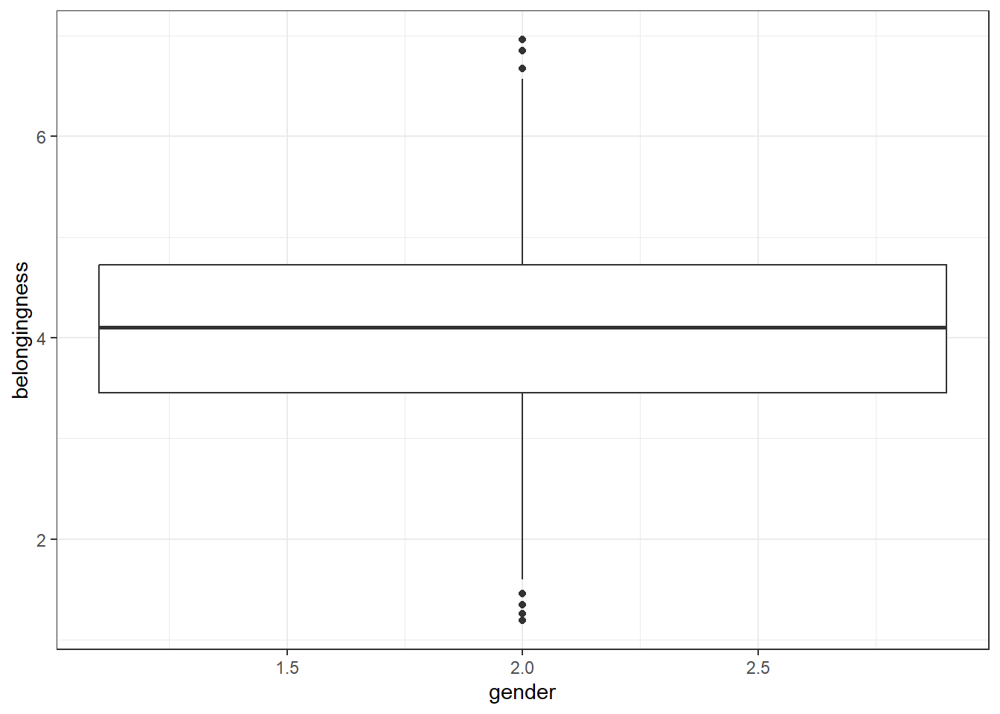
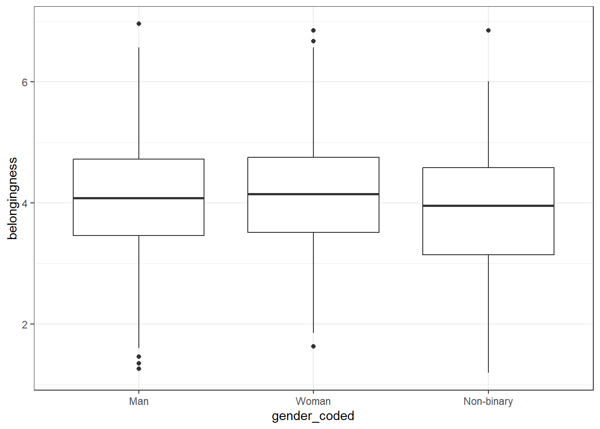
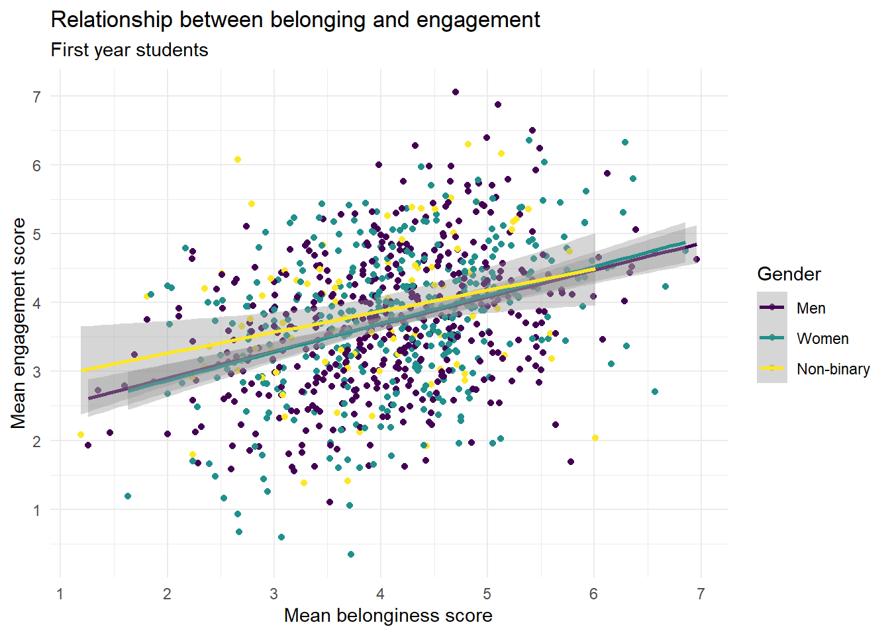

# Belonging 1


## Intended Learning Outcomes {#sec-ilo-belonging}

By the end of this chapter you should be able to:

* Explain what Belonging is and how it is measured
* Convert variables to factors using `mutate()`and `factor()` 
* Create scatterplots and grouped scatterplots using `ggplot()`, `geom_smooth()` and `geom_point()`

## Walkthrough video {#sec-walkthrough-belong}

There is a walkthrough video of this chapter available via [Zoom](https://uofglasgow.zoom.us/rec/play/qzbkW69-0eV2FylTX7JrQt9T9zgYJn20V1lw_eHpuodZJomoV2SNIiHw5m1Q4EgEdNupQQykjcJP458-.OWX2O8dtfuK2boCV?canPlayFromShare=true&from=share_recording_detail&continueMode=true&componentName=rec-play&originRequestUrl=https%3A%2F%2Fuofglasgow.zoom.us%2Frec%2Fshare%2FTC4Z5Boz9ilK28Z5Q4VzRTJO17DEzH8zBR0ZsLvwjeSgVSs7GHfAFOjS7-UcsU1i.Ngg2j1yD5uwFmZ4p) We recommend first trying to work through each section of the book on your own and then watching the video if you get stuck, or if you would like more information. This will feel slower than just starting with the video, but you will learn more in the long-run. Please note that there may have been minor edits to the book since the video was recorded. Where there are differences, the book should always take precedence.

## Activity 1: Belonging, engagement, and self-confidence

For the next set of chapters we're going to use data from a questionnaire that measures an important psychological construct, and one that is key to your success at university: belonging. 

* First, take part in [this online version](https://www.psytoolkit.org/cgi-bin/3.4.4/survey?s=Vj3mg) of the questionnaire. It only takes a few minutes to complete.  
* Second, read the [overview](https://www.psytoolkit.org/survey-library/bes.html) of the scale you just completed, including what the scores mean.
* Third, read the introduction and discussion of the paper ["A sense of belonging at university: student retention, motivation and enjoyment"](https://go.exlibris.link/cV2NR1GR). You can read the method and the results if you're interested although we haven't yet learned about the statistics they use. Note that this paper uses a slightly different scale than the one you did above. 
* Finally, answer the following questions. Please note that your responses will not save in the browser - if you want to save them, make a note of them somewhere.

<br>

1. Which of the following best describes the concept of belongingness in the context of university students? 

<div class='webex-radiogroup' id='radio_SOEFIODXIH'><label><input type="radio" autocomplete="off" name="radio_SOEFIODXIH" value="answer"></input> <span>The degree to which students feel accepted, valued, and included in their university community</span></label><label><input type="radio" autocomplete="off" name="radio_SOEFIODXIH" value=""></input> <span>The students&apos; ability to adhere to university policies and rules</span></label><label><input type="radio" autocomplete="off" name="radio_SOEFIODXIH" value=""></input> <span>The physical presence of students on campus</span></label><label><input type="radio" autocomplete="off" name="radio_SOEFIODXIH" value=""></input> <span>The level of students&apos; academic achievement</span></label></div>


<div class='webex-solution'><button>Explain this answer</button>

The concept of belongingness in the context of university students is best described as "The degree to which students feel accepted, valued, and included in their university community". This is because belongingness refers to the sense of being part of a community and feeling valued and accepted within that community. In a university setting, this includes feeling a part of the student body, feeling valued by faculty and peers, and feeling included in university activities and discussions.

</div>


<br>

2. According to research, why is fostering a sense of belonging crucial for first-year university students? 

<div class='webex-radiogroup' id='radio_GRJLKFKISS'><label><input type="radio" autocomplete="off" name="radio_GRJLKFKISS" value="answer"></input> <span>It can enhance their academic engagement and reduce dropout rates</span></label><label><input type="radio" autocomplete="off" name="radio_GRJLKFKISS" value=""></input> <span>It is a requirement for university accreditation</span></label><label><input type="radio" autocomplete="off" name="radio_GRJLKFKISS" value=""></input> <span>It improves the reputation of the university</span></label><label><input type="radio" autocomplete="off" name="radio_GRJLKFKISS" value=""></input> <span>It has no particular importance</span></label></div>


<div class='webex-solution'><button>Explain this answer</button>

Fostering a sense of belonging is crucial for first-year university students because "It can enhance their academic engagement and reduce dropout rates". Research has shown that when students feel a sense of belonging at their university, they are more likely to be engaged with their studies and less likely to drop out. This is likely due to feeling more motivated and supported, and being more likely to seek help when needed.

</div>


3. According to the paper by Pedler et al., which group of students had lower belonging scores? 

<select class='webex-select'><option value='blank'></option><option value=''>Final year students</option><option value=''>Students who join clubs & societies</option><option value='answer'>First generation students</option><option value=''>Students who enjoy the course</option></select>


<div class='webex-solution'><button>Explain this answer</button>

According to the paper by Pedler et al., first generation students (and those with just one parent who had attended university) had lower belonging scores. First generation students often face unique challenges that can affect their sense of belonging, such as lack of family understanding or support, financial difficulties, and feeling out of place among their peers.

</div>


4. If you wanted to try and increase your sense of belonging at university, what might help?

<select class='webex-select'><option value='blank'></option><option value=''>Joining a club or society</option><option value=''>Taking part in a study group</option><option value=''>Attending a social or extra-curricular event</option><option value='answer'>Any or all of the above</option></select>


<div class='webex-solution'><button>Explain this answer</button>

Sense of belonging at a university often comes from a combination of academic and social integration. Joining a club or society, participating in a study group, or attending a social or extra-curricular event can all contribute to the sense of belongingness by connecting individuals with others who have similar interests, challenges, or goals. These activities provide opportunities for interaction, mutual understanding, shared experiences, and the formation of supportive relationships. These connections can enhance a student's identification with and commitment to the university, thereby strengthening their sense of belonging. Additionally, being part of a group or a community can also provide emotional support and reduce feelings of isolation, both of which can further enhance a sense of belonging.

I KNOW THIS CHAPTER ISN'T SUBTLE. 

</div>


## Activity 2: New project {#sec-new-project-belong}

* Log in to the to R sever and make a new project for the Belonging chapters (this week and next week):

## Activity 3: Data files {#sec-data-belong}

Once you've done all this, it's time to download the files we need and then upload them to the server.

* First, download the <a href="data/belong/belonging_data.zip" download>Belonging data zip file</a> to your computer and make sure you know which folder you saved it in.
* Then, on the server in the Files tab (bottom right), click `Upload > Choose file` then navigate to the folder on your computer where the zip file is saved, select it, click `Open`, then `OK`.

The zip file contains four files:

* `belong_stub1.Rmd` and `belong_stub2.Rmd`, the stub files you'll complete for this chapter and the next one. Open  `belong_stub1.Rmd` by clicking on it in the Files tab and then edit the heading to add in your GUID and today's date.
* `demographic_data.csv` is a data file that contains each participant's anonymous ID, age, gender and level of study. Gender has been coded numerically where woman = 1, man = 2, and non-binary = 3.
* `questionnaire_data` is a data file that contains each participant's ID, level of study, and their score on three components of the belonging scale (belonging, engagement, self-confidence). 

Now, we need to load the tidyverse and the data files so that we can use them. 

* In code chunk 1, add the code that loads the tidyverse and then imports `demographic_data.csv` into an object named `demographic_data` and `questionnaire_data.csv` into a object named `questionnaire_data` using `read_csv()`.


<div class='webex-solution'><button>Solution</button>


```r
library(tidyverse)
demographic_data <- read_csv("demographic_data.csv")
questionnaire_data <- read_csv("questionnaire_data.csv")
```


</div>


## Activity 3: Check the data

As usual, once you've imported the data the first thing you should do is check it.

* Click on each object and view them in the viewing pane
* Then run `summary()` on each object in the console and answer the following questions:

How are men coded in the variable gender? <input class='webex-solveme nospaces' size='1' data-answer='["2"]'/>  
Which sub-scale has the highest mean score? <select class='webex-select'><option value='blank'></option><option value='answer'>belongingess</option><option value=''>engagement</option><option value=''>self_confidence</option></select>  
How old is the oldest participant in years? <input class='webex-solveme nospaces' size='2' data-answer='["25"]'/>  
Which variables are included in both datasets? <select class='webex-select'><option value='blank'></option><option value='answer'>participant</option><option value=''>gender</option><option value=''>participant & age</option><option value='answer'>participant & level</option><option value=''>belongingess</option><option value=''>enagagement</option><option value=''>self-confidence</option></select>  

## Activity 4: Join the datasets

As we've done before, we want to join the two datasets together. However, because there are multiple columns that each dataset has in common, the code needs adapted.

We need to list both `participant` and `level` in the `by` argument so that R knows that these columns are the same data in both objects. Because there's multiple values being passed to a single argument, we use the combine function `c()` - if you don't use `c()`, it will only take the first variable into account and will create problems (try it and see what happens).

* In code chunk 2, add and run the below code to join the datasets.Try removing the `c()` to see what happens to the table.


```r
full_data <- inner_join(x = demographic_data, # table 1
                        y = questionnaire_data, # table 2
                        by = c("participant", "level")) # all common columns
```

## Activity 5: Data types

Look carefully at the `summary()` output for `demographic_data`. Can you see a problem with `gender`?


```
##   participant         gender         age           level          
##  Min.   :   1.0   Min.   :1.0   Min.   :17.00   Length:1000       
##  1st Qu.: 250.8   1st Qu.:1.0   1st Qu.:19.00   Class :character  
##  Median : 500.5   Median :2.0   Median :21.00   Mode  :character  
##  Mean   : 500.5   Mean   :1.7   Mean   :21.16                     
##  3rd Qu.: 750.2   3rd Qu.:2.0   3rd Qu.:23.00                     
##  Max.   :1000.0   Max.   :3.0   Max.   :25.00
```

Because `gender` is coded numerically, R has assumed that the data in this column is numeric so it has calculated statistics as if it were a number but it's entirely meaningless (what does a mean gender of 1.7 mean?). 

::: {.info data-latex=""}

There are several different <a class='glossary'>data types<span class='def'></span></a> in R and when you load data in, R will do it's best to guess which one each variable is:

* integer (whole numbers like 1L, -10L, 3000L)
* double (numbers like -0.223, 10.324, 1e4)
* character (letters or words like "I love R")
* factor (a specific set of values are stored with labels using categorical variables like gender or experimental condition)
* logical (TRUE or FALSE)
* complex (numbers with real and imaginary parts like 2i)

Integers and doubles are both numeric.

::: 

### Recoding factors

If you try and use the data that's in `gender` as it is, it can cause some problems. For example, if you tried to plot a boxplot of the scores by gender, you'd get this mess because as far as R is concerned, you haven't given it a grouping variable, you've given it two continuous variables


```r
ggplot(full_data, aes(x = gender, y = belongingness)) +
  geom_boxplot()
```

```
## Warning: Continuous x aesthetic
## ℹ did you forget `aes(group = ...)`?
```



Instead, we need to convert that data to a factor, using the `mutate()` and `factor()` functions. We could overwrite the existing `gender` variable or we could add a new variable - let's add a new one.

* `levels` specifies the original values in the variable, in the order you want to present them (think about how they'd look on a graph from left to right). We can use this to reorganise our variable so that "Man" will be presented first by stating the order as `2,1,3`.
* `labels` then specifies the labels you want to use instead of the original values and these **must be in the same order as the levels**. R will do exactly what you tell it to so if you accidentally tell it to give a label of "Man" to number 1, you'll end up getting your gender scores the wrong way round. This is one of the reasons why it can be safer to create a second variable when recoding so that you can more easily check that the values line up with what they're supposed to be. 
* Add and run the below code to code chunk 3. 


```r
full_data <- full_data %>%
  mutate(gender_coded = factor(gender, 
                        levels = c(2,1, 3),
                        labels = c("Man", "Woman", "Non-binary")))
```

* Next, redo the boxplot we tried above but use the new variable `gender_coded` rather than the original variable `gender`.


<div class='webex-solution'><button>Solution</button>


```r
ggplot(full_data, aes(x = gender_coded, y = belongingness)) +
  geom_boxplot()
```



</div>


## Activity 6: Demographic info

As usual, let's get some demographic info about our participants. In code chunk 4:

* Calculate the number of participants of each gender
* Calculate the number of participants in each level of study
* Calculate the gender split in each level of study


<div class='webex-solution'><button>Hint</button>


```r
data %>%
  count(group)
```


</div>


<div class='webex-solution'><button>Solution</button>


```r
full_data %>%
  count(gender_coded)

full_data %>%
  count(level)

full_data %>%
  count(level, gender_coded)
```

<div class="kable-table">

|gender_coded |   n|
|:------------|---:|
|Man          | 500|
|Woman        | 400|
|Non-binary   | 100|

</div><div class="kable-table">

|level       |   n|
|:-----------|---:|
|First year  | 920|
|Second year |  80|

</div><div class="kable-table">

|level       |gender_coded |   n|
|:-----------|:------------|---:|
|First year  |Man          | 457|
|First year  |Woman        | 373|
|First year  |Non-binary   |  90|
|Second year |Man          |  43|
|Second year |Woman        |  27|
|Second year |Non-binary   |  10|

</div>


</div>


## Activity 7: Filter and select

Our analysis will focus on gender differences in belonging for first year students and as we can see from the demographic counts, we have some second year students in our sample that we need to get rid of.

* In code chunk 5, create an object named `first_year_data` that only contains the data from first year students. Your starting dataset should be `full_data`.


<div class='webex-solution'><button>Hint</button>


```r
object_name <- dataset %>%
  filter(variable = "value")
```


</div>


<div class='webex-solution'><button>Solution</button>


```r
first_year_data <- full_data %>%
  filter(level == "First year")
```


</div>


We can also drop the numeric gender column and level as we don't need them anymore. This also gives us a good opportuntiy to show a useful feature of `select()` which is that you can rename variables as well as reordering them.

* Add this code to code chunk 5. It will reorder the dataset, drop the original `gender` column and `level`, and rename `gender_coded` as `gender` to make it simpler to type. 
* The `:` notation means that it will select all columns from `belonginess` to `self-confidence` so we don't have to type them all out.


```r
first_year_data <- first_year_data %>%
  select(participant, 
         "gender" = gender_coded,
         age,
         belongingness:self_confidence) 
```

Finally, see if you can string both the `filter()` and `select()` code together using pipes (`%>%`) in one code chunk. You should start with `full_data` and save it all in an object named `first_year_data`.


<div class='webex-solution'><button>Hint</button>


```r
first_year_data <- starting_dataset %>%
  first_function %>%
  second_function
```


</div>


<div class='webex-solution'><button>Solution</button>


```r
first_year_data <- full_data %>%
  filter(level == "First year")%>%
  select(participant, 
         "gender" = gender_coded,
         age,
         belongingness:self_confidence) 
```


</div>


## Activity 8: Plots

For the final activity, let's make some plots and show you some additional options for how to make them look nice.

### Scatterplots

To visualise two continuous variables we can use a scatterplot by calling `geom_point()`. To use `geom_point()` you need to specify an `x` and a `y` variable.


```r
ggplot(first_year_data, aes(x = belongingness, y = engagement)) +
  geom_point()
```


To add a line of best fit, add a layer that calls `geom_smooth()` (instinctively you might expect to need `geom_line()`, this does something very different and will make your plot look mad, try it). You can specify different methods of drawing the line, for now, we'll choose `method = "lm"` which stands for "linear model" which basically means draw a straight line.


```r
ggplot(first_year_data, aes(x = belongingness, y = engagement)) +
  geom_point() +
  geom_smooth(method = "lm")
```

```
## `geom_smooth()` using formula = 'y ~ x'
```


As belonging scores increase, engagement scores <select class='webex-select'><option value='blank'></option><option value='answer'>increase</option><option value=''>decrease</option></select>. This is an example of a <select class='webex-select'><option value='blank'></option><option value='answer'>positive</option><option value=''>negative</option></select> correlation.


<div class='webex-solution'><button>Expain this answer</button>


In a scatterplot, a positive correlation is visually represented by an upward trend of the data points. This means that as one variable (belongingness, in this case) increases, the other variable (engagement, in this case) also tends to increase. A stronger positive correlation would show the data points clustering closely around a line that slopes upwards from left to right. In contrast, a negative correlation would be represented by a downward trend, meaning that as one variable increases, the other tends to decrease. The data points would cluster around a line sloping downwards from left to right.


</div>


### Grouped scatterplots

We can also add in a grouping variable to our scatterplot code which will draw different coloured geoms (in this case points and lines) for each level of the grouping variable. 

* `color` changes the outline (or the border) colour of the geom. It works with geoms like points, lines, and polygons (like the outlines of bars in a bar plot or histogram).
* `fill` changes the interior colour of the geom. It works with 'filled' geoms like bars, boxplots, or the interior of polygons.
* To use colour-blind friendly colours, you add on `scale_colour_viridis_d()` - `colour` because it's mapped to `colour` and `d` because it's a discrete variable (gender is categorical).


```r
ggplot(first_year_data, aes(x = belongingness, 
                            y = engagement,
                            colour = gender)) +
  geom_point() +
  geom_smooth(method = "lm") +
  scale_colour_viridis_d(option = "D")
```

```
## `geom_smooth()` using formula = 'y ~ x'
```


### Adding a theme

In addition to adding colour, you can also apply a theme to the entire plot which will apply a preset aesthetic style.

* The below code adds on `theme_minimal()` but try removing this line and then typing `theme_` to see all the options that are available with the auto-complete. Try a few and see which one your favourite is.


```r
ggplot(first_year_data, aes(x = belongingness, 
                            y = engagement,
                            colour = gender)) +
  geom_point() +
  geom_smooth(method = "lm") +
  scale_colour_viridis_d(option = "D") +
  theme_minimal()
```

### Editing axis labels and breaks

There's a couple of ways that you can edit axis labels and breaks. If you just want to edit the overall axis labels, the easiest way is to use the `labs()` function:


```r
ggplot(first_year_data, aes(x = belongingness, 
                            y = engagement,
                            colour = gender)) +
  geom_point() +
  geom_smooth(method = "lm") +
  scale_colour_viridis_d(option = "D") +
  theme_minimal() +
  labs(x = "Mean belonginess score",
       y = "Mean engagement score",
       colour = "Gender",
       title = "Relationship between belonging and engagement",
       subtitle = "First year students")
```

```
## `geom_smooth()` using formula = 'y ~ x'
```


However, if you want to make more fine-grained changes you may need to use the `scale_` functions.

* We don't need to add on another scale function for colour, we can just use the one that's alreedy there and add in the arguments `name` and `labels`.
* `breaks` changes the breaks of the axis, i.e., the numbers that are presented. We ask it for a sequence (`seq`) of all the numbers from ` to 7.


```r
ggplot(first_year_data, aes(x = belongingness, 
                            y = engagement,
                            colour = gender)) +
  geom_point() +
  geom_smooth(method = "lm") +
  scale_colour_viridis_d(name = "Gender",
                         labels = c("Men", "Women", "Non-binary"),
                         option = "D") +
  theme_minimal() +
  scale_x_continuous(name = "Mean belonginess score",
                     breaks = seq(1:7)) +
  scale_y_continuous(name = "Mean engagement score",
                     breaks = seq(1:7)) +
  labs(title = "Relationship between belonging and engagement",
       subtitle = "First year students")
```

```
## `geom_smooth()` using formula = 'y ~ x'
```



### Make your own

In the above example we made a scatterplot to visualise the relationship between belonging and engagement but there are two other relationships we can look at.

* In code chunk 6, create scatterplots to visualise the relationship between belonginess and self-confidence, and between engagment and self-confidence. Be careful to change all the axis labels as necessary.


<div class='webex-solution'><button>Solution</button>


```r
# belonging and self-confidence
ggplot(first_year_data, aes(x = belongingness, 
                            y = self_confidence,
                            colour = gender)) +
  geom_point() +
  geom_smooth(method = "lm") +
  scale_colour_viridis_d(name = "Gender",
                         labels = c("Men", "Women", "Non-binary"),
                         option = "D") +
  theme_minimal() +
  scale_x_continuous(name = "Mean belonginess score",
                     breaks = seq(1:7)) +
  scale_y_continuous(name = "Mean self-confidence score",
                     breaks = seq(1:7)) +
  labs(title = "Relationship between belonging and self-confidence",
       subtitle = "First year students")
```

```
## `geom_smooth()` using formula = 'y ~ x'
```


```r
# engagement and self-confidence
ggplot(first_year_data, aes(x = engagement, 
                            y = self_confidence,
                            colour = gender)) +
  geom_point() +
  geom_smooth(method = "lm") +
  scale_colour_viridis_d(name = "Gender",
                         labels = c("Men", "Women", "Non-binary"),
                         option = "D") +
  theme_minimal() +
  scale_x_continuous(name = "Mean engagement score",
                     breaks = seq(1:7)) +
  scale_y_continuous(name = "Mean self-confidence score",
                     breaks = seq(1:7)) +
  labs(title = "Relationship between engagement and self-confidence",
       subtitle = "First year students")
```

```
## `geom_smooth()` using formula = 'y ~ x'
```


</div>


Which relationship appears to be the strongest? <select class='webex-select'><option value='blank'></option><option value=''>Belonging and engagement</option><option value=''>Belonging and self-confidence</option><option value='answer'>Engagment and self-confidence</option></select>


<div class='webex-solution'><button>Explain this answer</button>

In the context of scatterplots, the strength of the relationship between two variables is typically represented by how closely the points follow a clear trend (either linear or nonlinear). A tighter clustering of points along a line suggests a stronger relationship.

In this case, the scatterplot for "Engagement and Self-confidence" would show the tightest clustering of points along a line or curve, indicating a strong correlation between these two variables. This could be because the more engaged students are in their learning activities, the more confident they feel about their ability to succeed in these tasks.

In contrast, the scatterplots for "Belonging and Engagement" and "Belonging and Self-confidence" show a less tight clustering of points, indicating a weaker relationship (although it's still pretty strong). The points in these scatterplots would be more spread out and not as closely aligned with a trend line or curve.

It's important to note that correlation doesn't imply causation, and these are just observed associations in the data. Further research would be necessary to understand the causal relationships between these variables.


<div class='webex-solution'><button>Solution</button>


## Finished

Finally, try knitting the file to HTML and remember to  make a note of any mistakes you made and how you fixed them or any other useful information you learned. Then save your Markdown, and quit your session on the server. 
