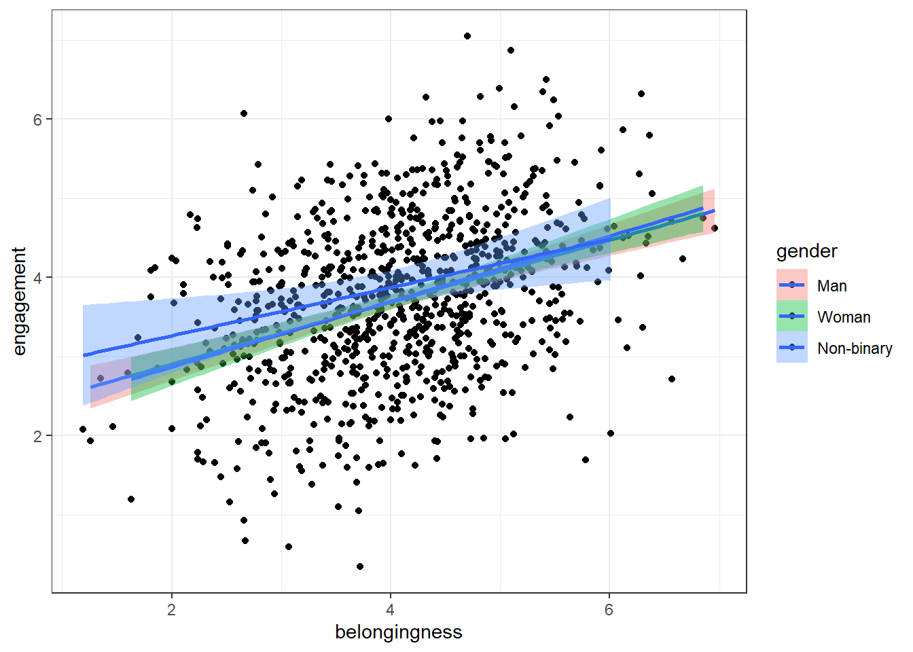

# Belonging 2


## Intended Learning Outcomes {#sec-ilo-belong-analysis}

By the end of this chapter you should be able to:

* Debug your code by identifying and fixing a variety of errors

## Walkthrough video {#sec-walkthrough-belong-error}

There is a walkthrough video of this chapter available via [Zoom](https://uofglasgow.zoom.us/rec/share/oYotzgWPcIBsAQ_1lO19HowohST0Fvxtcl_kjJrkwGhh0l2SkL7gY-jscKG8KIup.F96yEJOmLW-pCUvV). We recommend first trying to work through each section of the book on your own and then watching the video if you get stuck, or if you would like more information. This will feel slower than just starting with the video, but you will learn more in the long-run. Please note that there may have been minor edits to the book since the video was recorded. Where there are differences, the book should always take precedence.

## Error mode

For the final chapter of this semester, we're going to try something a bit different. Instead of asking you to write code, we're going to give you code that either won't run and will throw an error, or it will run, but it won't quite do what it's supposed to do. Your job is to debug your code by finding and fixing the errors.

We will give you hints but we won't be giving any solutions. To figure out the answer to each activity you should:

* Read the error messages
* Check the output of any code that runs very carefully, including looking at variable names
* Use the search function in this book to look up how to use functions
* Talk to your group and try and figure it out together
* Google the error messages
* Try changing stuff and see what happens

Don't use ChatGPT or other AI tools for this chapter because you won't learn anything, you need to be the one that figures out the error. Once you've figured it out, make notes on what the error was and how you fixed it because there's actually a relatively small set of errors you'll make again and again so it will help you debug future code.

## Activity 1: Setup

**If you completed Belonging 1 before 3rd November, go and download the <a href="data/belong/demographic_data.csv" download>demographic_data.csv</a> and <a href="data/belong/questionnaire_data.csv" download>questionnaire_data.csv</a> again and upload to server as there was an extra column in them which will make the error mode harder**

Login to the server and open `belong_stub2.Rmd`. To create the errors, you'll need to ensure you're working from a clean environment and new session. If you followed the instructions in Chapter 1, this should happen automatically but just in case, follow the below steps which will clear all objects and unload any packages you have loaded:

1. Click `Session` then `Restart R`.


2. Then run the following code which will clear all objects you have created:


```r
rm(list = ls())
```

Then, read this article on the [Top 10 Errors in R and How to Fix Them](https://statsandr.com/blog/top-10-errors-in-r/)

## Activity 2: Load packages and data

With this code, we want to use the function `read_csv()` from the `tidyverse` package to load the data into two objects `demographic_data` and `questionnaire_data`. This code will produce an error and won't run.


```r
demographic_data <- read_csv("demographic_data.csv")
questionnaire_data <- read_csv("questionnaire_data.csv")
```


<div class='webex-solution'><button>Hint</button>


In order to use a function, you must load the package it is in first


</div>


## Activity 3: Join the datasets

With this code, we want to join the two objects `demographic_data` and `questionnaire_data` together and save them in an object named `full_dat`. `full_dat` should have 1000 rows and 7 variables. This code will run, but it won't produce what you want. 


```r
full_dat <- inner_join(x = demographic_data,
                       y = questionnaire_data, 
                       by = "participant", "level")
```


<div class='webex-solution'><button>Hint</button>


If you want to pass multiple values to an argument, you need to `c`ombine them otherwise R will only parse the first value. In the case of `inner_join()`, if R doesn't know that columns are the same in both objects it will create two versions of the column (and distinguish them with`.x` and `.y`).


</div>


## Activity 4: Filter

Next, we want to filter the questionnaire data to only include first-year students:


```r
first_year <- full_dat %>%
  filter(level = "First year")
```


<div class='webex-solution'><button>Hint</button>


This is one of those rare times when reading the error message will give you a clear explanation of what the problem is and how to fix it.


</div>


## Activity 5: Mutate and recode

Then, we want to recode gender as a factor and count the number of participants in each gender group. This code will run, but it will introduce an error into your data.


```r
first_year <- first_year %>%
  mutate(gender_coded = factor(gender, levels = c(1,2,3),
                         labels = c("Man", "Woman", "Non-binary")))

first_year %>%
  count(gender_coded)
```


<div class='webex-solution'><button>Hint</button>


Look at the order of the levels and labels and think about what 1, 2, and 3 are supposed to represent. 


</div>


## Activity 6: Select

This code should use the function `select()` to select the columns `participant`, `gender_coded`, `age`, the three questionnaire score columns, and also rename `gender_coded` as `gender`. 


```r
first_year <- first_year %>%
  selct(Participant, 
         "gender" = gender_coded,
         age,
         belongingness:self_confidence) 

first_year %>%
  count(gender_coded)
```


<div class='webex-solution'><button>Hint</button>


Typos (either mispelled word or incorrect use of capital letters) are the most common cause of code not working. There are two of them in this code.


</div>


## Activity 7: Summarise

This code should use `group_by()` and `summarise()` to calculate the mean scores on each belonging sub-scale by gender and save it in an object named `scores_gender`. The final table should have 4 columns (gender, belong, engagement, and confidence) and three rows (one for each gender). This code will run, but it won't produce what it is supposed to.


```r
scores_gender <- first_year %>%
  group_by(participant, gender) %>%
  summarise(belong = mean(belongingness),
            engagement = mean(engagement),
            confidence = mean(self_confidence))
```


<div class='webex-solution'><button>Hint</button>


If you're trying to calculate summary statistics by group, you only need to add the variables you want to create stats for to `group_by()`. If you get more rows of data than you want, you've probably got too many variables in `group_by()`, if you've got too few rows of data, you've probably not got all the variables you need.


</div>


## Activity 8: Boxplots

Now we want to make a boxplot that shows belonging scores by gender using `ggplot()`. This code will either give you an error of `incomplete expression` or it may not throw an error, but it also won't fully run and you'll need to put your cursor in the console and press escape to get out of it. 


```r
ggplot(first_year, aes(x = gender, y = belongingness) +
  geom_violin() +
  geom_boxplot(width = .2) 
```


<div class='webex-solution'><button>Hint</button>


Every `(` needs a `)`.


</div>


## Activity 9: Scatterplot

Finally, we want to make a grouped scatterplot that shows the relationship between belonging scores and engagement scores by gender. There should be different coloured data points for each gender and different coloured lines and the colours should use the colour-blind friendly viridis palette.

This code will run and produce a scatterplot, but it isn't what we want. 


```r
ggplot(first_year, aes(x = belongingness, y = engagement, fill = gender)) +
  geom_point() +
  geom_smooth(method = "lm") +
  scale_colour_viridis_d(option = "D")
```

```
## `geom_smooth()` using formula = 'y ~ x'
```




<div class='webex-solution'><button>Hint</button>

 
`fill` sets the color inside the points. Using `fill` with dots and lines might not make much of a difference because they don't have an area to fill. What other argument can you use to change the `colour`?


</div>


## Finished

And you're done, not only with this chapter but for the data skills workbook for Psych 1A! You've come incredibly far in a short space of time. It doesn't matter if you don't understand absolutely all of the code we've covered so far and there's no expectation that you would be able to do any of it completely from memory at this point. What matters is that your skills are developing and you're making progress in the right direction.


