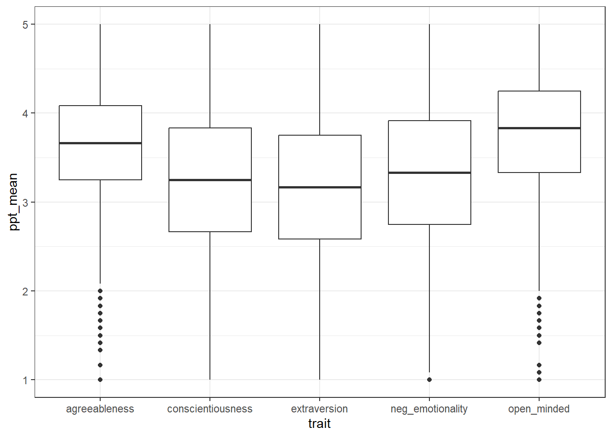
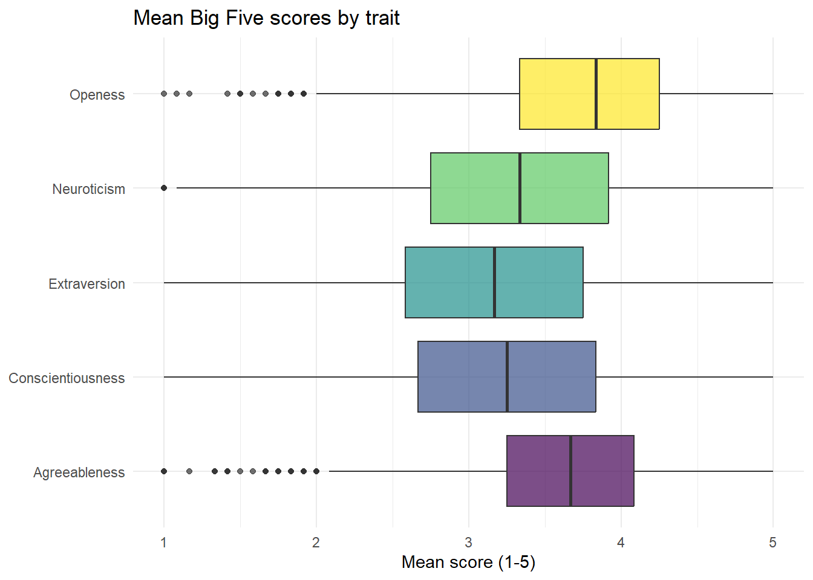
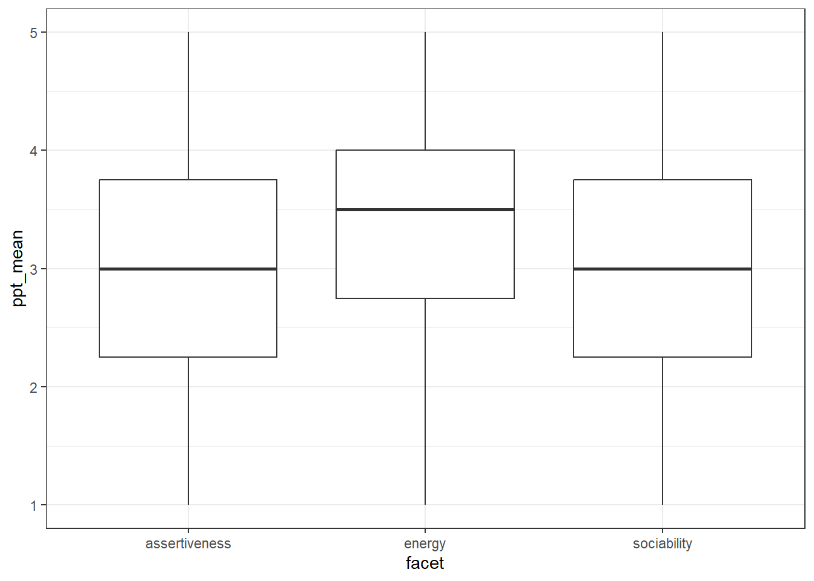

# Big five personality 2


## Intended Learning Outcomes {#sec-ilo-big5-2}

By the end of this chapter you should be able to:

* Be able to reshape data from wide-form to long-form using `pivot_longer()`
* Be able to summarise data for different groupings using `group_by()` and `summarise()`


## Walkthrough video {#sec-walkthrough-big5}

There is a walkthrough video of this chapter available via [Zoom](https://uofglasgow.zoom.us/rec/share/ZuwzzJ6ONY_HllcnvtM20AWUCi8sYdfa7yeliywBY70xBkzDywjBoKHksbay68uy.By054w4-f-s1UjrG?startTime=1705058397000). We recommend first trying to work through each section of the book on your own and then watching the video if you get stuck, or if you would like more information. This will feel slower than just starting with the video, but you will learn more in the long-run. Please note that there may have been minor edits to the book since the video was recorded. Where there are differences, the book should always take precedence.

## Activity 1: Set-up {#sec-setup-big5}

Login to the server and then:

* Open your Big Five project;
* Create a new Markdown document named "Big Five 2". Delete the default text and then create a new code chunk.
* Your environment should be clear but if there are objects in it, remove them by pressing the brush icon. 

## Activity 2: Loading the data

In code chunk 1, write and run the code that:

* Loads the <code class='package'>tidyverse</code>.
* Uses `read_csv()` to load `big5_data.csv` into an object named `big5`.
* Loads `scoring.csv` into an object named `scoring`.
* Loads `code_book.csv` into a object named `codebook`.


<div class='webex-solution'><button>Hint</button>


```r
library(package_name)
object_name <- read_csv("file_name.csv")
```

</div>


<div class='webex-solution'><button>Solution</button>


```r
library(tidyverse)
big5 <- read_csv("big5_data.csv")
scoring <- read_csv("scoring.csv")
codebook <- read_csv("code_book.csv")
```
` r unhide()`

## Activity 3: Wide-form and long-form data

As noted in the last chapter, our Big Five data is currently in wide-form, with one row for each particpant that contains all the data for that one person. The below table shows a preview of the first 10 columns for the first five participants.

<div class="kable-table">

|ResponseId        | Q4_1| Q4_2| Q4_3| Q4_4| Q4_5| Q4_6| Q4_7| Q4_8| Q4_9|
|:-----------------|----:|----:|----:|----:|----:|----:|----:|----:|----:|
|R_3O9fzdsGn9tEeOm |    5|    4|    1|    1|    5|    3|    5|    1|    2|
|R_12z0hyaE0u5KaRG |    4|    4|    5|    1|    5|    3|    5|    5|    1|
|R_2VmvNkJQ6RpY3PV |    3|    5|    4|    2|    2|    4|    4|    4|    2|
|R_eboWF1vMzPIVPi1 |    4|    2|    5|    1|    2|    5|    2|    5|    2|
|R_1jBz09Q5pO9alkq |    4|    5|    1|    2|    1|    3|    4|    4|    1|
|R_pui4ZWuxPsJ7vUt |    2|    5|    5|    2|    1|    3|    5|    1|    2|

</div>

To join our dataset with the information we have in `codebook` and `scoring`, we need to transform this to long-form data, where there are multiple rows of data for each participant - one for each observation. 

There are 60 questions in the Big Five personality test, so we have 60 observations for each participant. How many rows of data will we have **for each participant** if we transform the dataset to long-form? <input class='webex-solveme nospaces' size='2' data-answer='["60"]'/>


<div class='webex-solution'><button>Explain this answer</button>

This might seem like a trick question, it's not, it's just trying to reinforce that you will have as many rows as you have bits of data for each participant. Therefore in this case, we have 60 observations, so we'll have 60 rows of data for each person.

</div>


The function we use for this is `pivot_longer()` and we briefly described it and showed how to use it in the last chapter but let's see if you can figure it out step-by-step. Create a new code chunk and then try and adapt the below code to pivot the data.

1. `object_name` should be the name of the new object you will create. In this case, we want to call our object `big5_long`.

2. `data` is the name of the starting dataset, the wide-form dataset you want to transform. This is the object that has all the Big Five data in it.

3. `cols` are all the columns (variables) that you want to pivot to long-form. There will be a separate row of data for each of these columns. To specify the columns we want to pivot you can use the notation `first_column:last_column`. We want to pivot all of the columns that contain the answers to the questionnaire items.

4. `names_to`  specifies the name of a new column that will be created to store the column names from the original data frame (that is, the names of the items `Q4_1` through `Q4_60`). Because we want to join our new long-form dataset with our other datasets, this name should be the same name as the variable name that is used in the other datasets. Go and have a look at `codebook` and find out what the column name is called that has the questionnaire items in.

5. `values_to`  specifies the name of a new column that will store the values from the original data frame (that is, the responses to the items `Q4_1` through `Q4_60`). As above, we want this name to match the names in the other objects. Go and look at `scoring` and find out what the column name is called that has the response data in.


```r
object_name <- data %>%
  pivot_longer(cols = first_column:last_column, 
               names_to = "column_name", 
               values_to = "column_name") 
```


<div class='webex-solution'><button>Solution</button>


```r
big5_long <- big5 %>%
  pivot_longer(cols = Q4_1:Q4_60, 
               names_to = "item", 
               values_to = "response") 
```


## Activity 4: `inner_join()`

Now that we have the data in long-form, we can join it with the other datasets. Remember that you can only join two tables together at once, so we need to do multiple joins.

First, let's join the new `big5_long` with `codebook` - create a new code chunk to do this in. The column that they both have in common is `item` so this is the variable we specify to join `by()`. This code shows a slightly different way of writing out join code. Instead of using `x` and `y`, you start with the dataset, then use the pipe `%>%` and then just give the second table as an argument to `inner_join()`

This can be read as "start with big5_long and then join it to codebook using the variable `item` to match the columns".


```r
join1 <- big5_long %>%
  inner_join(codebook, 
             by = "item")
```

If you look at `join1` you can see that this object now has all the original columns of `big5_long`, but it also has all the information contained in `codebook`:

<div class="kable-table">

|ResponseId        |item | response|trait             |facet           |direction |
|:-----------------|:----|--------:|:-----------------|:---------------|:---------|
|R_3O9fzdsGn9tEeOm |Q4_1 |        5|extraversion      |sociability     |forward   |
|R_3O9fzdsGn9tEeOm |Q4_2 |        4|agreeableness     |compassion      |forward   |
|R_3O9fzdsGn9tEeOm |Q4_3 |        1|conscientiousness |organisation    |reversed  |
|R_3O9fzdsGn9tEeOm |Q4_4 |        1|neg_emotionality  |anxiety         |reversed  |
|R_3O9fzdsGn9tEeOm |Q4_5 |        5|open_minded       |aes_sensitivity |reversed  |
|R_3O9fzdsGn9tEeOm |Q4_6 |        3|extraversion      |assertiveness   |forward   |

</div>

We also want to add in the information that is in `scoring`.  First, look at the variables in `join1` and `scoring`. If you join these together, how many variables will be in the resulting dataset?<input class='webex-solveme nospaces' size='1' data-answer='["7"]'/>


<div class='webex-solution'><button>Explain this answer</button>


There are 6 variables in `join1`, `ResponseId`, `item`, `response`, `trait`, `facet`, and `direction`. 

`scoring` has 3 variables, `direction`, `response`, and `score`.

When you join the two, the new dataset will have all of the unique columns. `join1` already has `direction` and `response` so the only addition will be `score` taking the number of columns from 6 to 7.


</div>


* Create a new object named `join2` that starts with `join1` and then joins it to `scoring` by the two columns they have in common. Remember that if you need to specify multiple variables, you need to use `c()`.


<div class='webex-solution'><button>Hint</button>


```r
join2 <- starting_data%>%
  inner_join(object_to_join, by = c("common_column1", "common_column2"))`
```

</div>


<div class='webex-solution'><button>Solution</button>


```r
join2 <- join1%>%
  inner_join(scoring, by = c("response", "direction"))
```

</div>


## Actvity 5: Pipe it

The above two joins are a really good example of where pipes come in very useful. We don't need `join1`, it's just partial step on the way to `join2` and the problem is that the more objects we create and have in our environment, the more likely we are to accidentally use the wrong one.

* Create a new code chunk and then write the code to create an object named `full_dat` that starts with `big5_long`, and then joins it to `codebook`, and then joins it to `scoring` using the pipe `%>%`.


<div class='webex-solution'><button>Hint</button>


```r
object_name <- starting_data %>%
  inner_join1() %>%
  inner_join2()
```

</div>


<div class='webex-solution'><button>Solution</button>


```r
full_dat <- big5_long%>%
  inner_join(codebook, by = "item") %>%
  inner_join(scoring, by = c("response", "direction"))
```

</div>


## Activity 6: Describe and visualise

Now we have everything we need all in one place.

First, let's look at the mean scores for each trait (openness, conscientiousness, extraversion, agreeableness, neuroticism). The score for each trait for each participant is calculated by taking the average of their responses to 12 items.

`full_dat` contains the raw scores to each item, so a first step, we want to create a new object that calculates the mean score for each participant (`ResponseId`) for each `trait`. We can do this by using functions we have used before: `group_by()` and `summarise()`. Because we want scores by two variables (each participant and each trait), `group_by()` has two variables passed to it:


```r
trait_scores <- full_dat%>%
  group_by(ResponseId, trait) %>%
  summarise(ppt_mean = mean(score),
            ppt_sd = sd(score),
            n = n()) 
```

We can see that `trait_scores` has the average score on each trait for each participant:

<div class="kable-table">

|ResponseId        |trait             | ppt_mean|    ppt_sd|  n|
|:-----------------|:-----------------|--------:|---------:|--:|
|R_00WKbbVigS4o2nD |agreeableness     | 3.916667| 1.0836247| 12|
|R_00WKbbVigS4o2nD |conscientiousness | 3.333333| 1.0730867| 12|
|R_00WKbbVigS4o2nD |extraversion      | 2.500000| 1.9306146| 12|
|R_00WKbbVigS4o2nD |neg_emotionality  | 3.666667| 1.3026779| 12|
|R_00WKbbVigS4o2nD |open_minded       | 4.833333| 0.5773503| 12|

</div>

In the above table, which trait does this participant have the lowest score on? <select class='webex-select'><option value='blank'></option><option value=''>agreeableness</option><option value=''>conscientiousness</option><option value='answer'>extraversion</option><option value=''>neg_emotionality</option><option value=''>open_minded</option></select>


<div class='webex-solution'><button>Explain this answer</button>


This participant's average extraversion score was 2.5 which is lower than the scores on the other traits.

</div>


Now, make a boxplot of the scores for each trait. See if you can do this from memory:

* Use the function `ggplot()`
* The first line sets up the `data` and the aesthetic mapping (`aes()`)
* `x` should be the `trait`
* `y` should be the `mean_score`
* The geom should be `geom_boxplot()`
* You can adjust the `width` and `fill` of the bars if you want, although it's not necessary.


<div class='webex-solution'><button>Basic solution</button>


```r
ggplot(data = trait_scores, aes(x = trait, y = ppt_mean)) +
  geom_boxplot()
```



</div>


<div class='webex-solution'><button>Fancy solution</button>


This code introduces a lot of visual tweaks - try deleting each line of code or changing the values to figure out what each bit does.


```r
ggplot(data = trait_scores, aes(x = trait, y = ppt_mean, fill = trait)) +
  geom_boxplot(alpha = .7) +
  guides(fill = "none") +
  theme_minimal() +
  coord_flip() +
  labs(title = "Mean Big Five scores by trait",
       x = NULL,
       y = "Mean score (1-5)") +
  scale_x_discrete(labels = c("Agreeableness", 
                              "Conscientiousness",
                              "Extraversion",
                              "Neuroticism",
                              "Openess")) +
  scale_fill_viridis_d(option = "D")
```



</div>


Which trait has the lowest median score? <select class='webex-select'><option value='blank'></option><option value=''>agreeablness</option><option value=''>conscientiousness</option><option value='answer'>extraversion</option><option value=''>neuroticism</option><option value=''>openness</option></select>

Which trait has the highest median score? <select class='webex-select'><option value='blank'></option><option value=''>agreeablness</option><option value=''>conscientiousness</option><option value=''>extraversion</option><option value=''>neuroticism</option><option value='answer'>openness</option></select>

You can also create a table of the mean scores for each trait, collapsing across participant by removing `ResponseId` from `group_by()`:


```r
trait_means <- trait_scores %>%
  group_by(trait) %>%
  summarise(trait_mean = mean(ppt_mean),
            trait_sd = sd(ppt_mean),
            n = n()) 
```

<div class="kable-table">

|trait             | trait_mean|  trait_sd|    n|
|:-----------------|----------:|---------:|----:|
|agreeableness     |   3.666459| 0.6165711| 5605|
|conscientiousness |   3.253494| 0.7608749| 5605|
|extraversion      |   3.134121| 0.7838352| 5605|
|neg_emotionality  |   3.301784| 0.8500805| 5605|
|open_minded       |   3.775379| 0.6470955| 5605|

</div>


## Activity 7: Add a filter

Each personality trait is made up of a number of different facets. For example, of the 12 extraversion items, three measure sociability, three measure assertiveness, and three measure energy. The information about which item measures each facet was originally contained in `codebook` and is in the variable `facet`.

* Create a new code chunk and then create an object named `extra_data` that just contains the extraversion items. You will need to start with the object `full_dat` and use `filter()` to do this.


<div class='webex-solution'><button>Hint</button>


```r
object_name <- starting_data %>%
  filter(trait == "value")
```

</div>


<div class='webex-solution'><button>Solution</button>


```r
extra_data <- full_dat %>%
  filter(trait == "extraversion")
```

</div>


Then create an object named `facet_scores` and calculate the mean facet scores for each participant using `extra_data`. You can adapt the `group_by` and `summarise` code you used above, just change the data and variable names.


<div class='webex-solution'><button>Solution</button>


```r
facet_scores <- extra_data %>%
  group_by(ResponseId, facet)%>%
  summarise(ppt_mean = mean(score),
            ppt_sd = sd(score),
            n = n()) 
```

```
## `summarise()` has grouped output by 'ResponseId'. You can override using the
## `.groups` argument.
```

</div>


Next, make a boxplot for each facet - again you can adapt the code you used in the previous example. The basic version should look like this:




Finally, create a table that has the mean facet scores for each facet of extraversion. This object should be named `facet_means` and have four columns `facet`, `facet_mean`, `facet_sd`, and `n`.


<div class='webex-solution'><button>Solution</button>


```r
facet_means <- facet_scores %>%
  group_by(facet) %>%
  summarise(facet_mean = mean(ppt_mean),
            facet_sd = sd(ppt_mean),
            n = n()) 
```

</div>


The resulting table should look like this:


```r
facet_means
```

<div class="kable-table">

|facet         | facet_mean|  facet_sd|    n|
|:-------------|----------:|---------:|----:|
|assertiveness |   3.014451| 0.9399298| 5605|
|energy        |   3.399777| 0.8608341| 5605|
|sociability   |   2.988136| 1.0608567| 5605|

</div>


## Finished

Finally, try knitting the file to HTML and remember to  make a note of any mistakes you made and how you fixed them or any other useful information you learned. Then save your Markdown, and quit your session on the server. 
