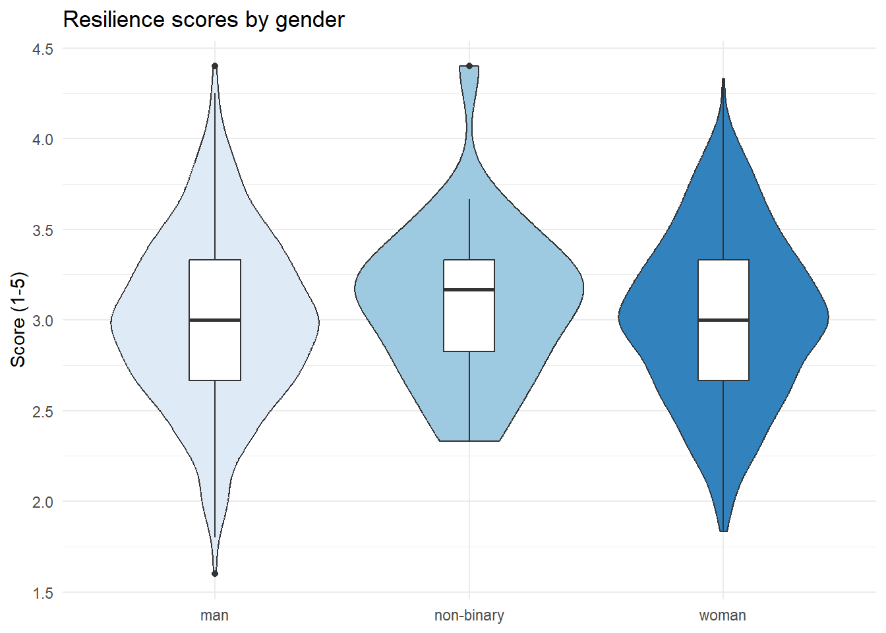
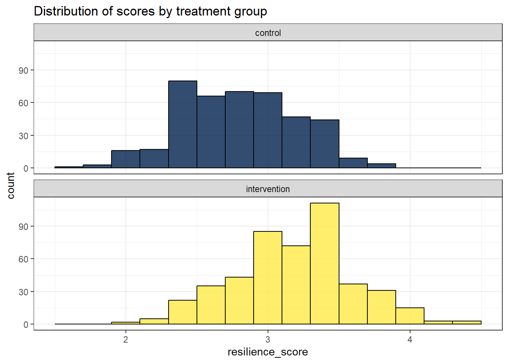
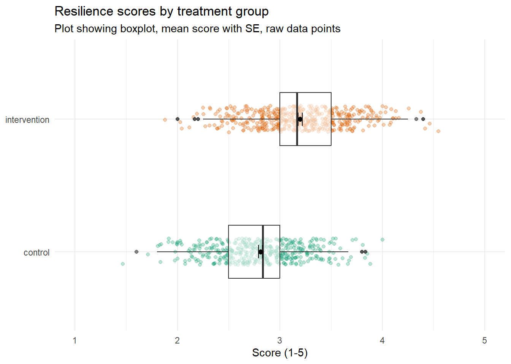

# Resilience 1

## Intended Learning Outcomes {#sec-ilo-resil1}

By the end of this chapter you should be able to:

* Explain what resilience is
* Convert variables to different data types using `as.factor()` and `as.character()`
* Beging to problem solve how to reshape data to long-form


## Activity 1: Resilience

For the next set of chapters we're going to use data from a measurement of resilience.

* First, take part in [this online version](https://www.psytoolkit.org/cgi-bin/3.4.4/survey?s=LOYSJ) of the Brief Resilience Coping Scale by Sinclair and Wallston (2004).
* Second, read the [Wikipedia entry](https://en.wikipedia.org/wiki/Psychological_resilience#) on resilience. It's quite long so you don't have to read the entire thing (although feel free if you're interested), the main sections to focus on are Overview, Process, and Developing and Sustaining Resilience.
* Finally, answer the following questions. Please note that your responses will not save in the browser - if you want to save them, make a note of them somewhere.


1. Which of these is a strategy suggested to enhance resilience? <select class='webex-select'><option value='blank'></option><option value='answer'>Cognitive-behavioral techniques</option><option value=''>Avoidance of stress</option><option value=''>Emotional suppression</option><option value=''>Increased dependency</option></select>

2. Psychological resilience is mainly characterized as a: <select class='webex-select'><option value='blank'></option><option value=''>Permanent trait</option><option value=''>Singular event</option><option value='answer'>Process</option><option value=''>Fixed state</option></select>

3. Resilient individuals do not experience any increase in stress in response to stressors. <select class='webex-select'><option value='blank'></option><option value=''>True</option><option value='answer'>False</option></select>

4. Social support systems are considered external factors influencing a person's level of resilience. <select class='webex-select'><option value='blank'></option><option value='answer'>True</option><option value=''>False</option></select>

5. The presence of stress in life is necessary for the practice and development of resilience. <select class='webex-select'><option value='blank'></option><option value='answer'>True</option><option value=''>False</option></select>


<div class='webex-solution'><button>Explain these answers</button>


1. Cognitive-behavioral techniques are suggested for enhancing resilience because they involve actively changing thought patterns and behaviors to foster a more adaptive response to stress.

2. Psychological resilience is termed a "Process" because it is seen as a dynamic set of interactions between a person and their environment, which can be developed over time.

3. The statement is "False" because resilient individuals do experience stress; however, they generally manage to return to baseline stress levels more effectively than less resilient individuals.

4. "True", social support systems are external factors that contribute to a person's resilience by providing emotional and practical resources during times of stress.

5. "True", the presence of stress provides individuals with opportunities to practice resilience, although the optimal level of stress for this purpose varies among individuals.


</div>


## Activity 2: New project {#sec-new-project-resil}

* Log in to the to R sever and make a new project for the Resilience chapters (this week and next week).
* If you've decided to install R on your machine, create a new project by clicking `File -> New Project`. The rest of the process is the same as on the server.
* Create a new Markdown document named "Resilience 1". Delete the default text and then create a new code chunk.
* Your environment should be clear but if there are objects in it, remove them by pressing the brush icon. 

## Activity 3: Data files {#sec-data-resil}

Once you've done all this, it's time to download the files we need and then upload them to the server.

* First, download the <a href="data/resilience/resilience_data.zip" download>Resilience data zip file</a> to your computer and make sure you know which folder you saved it in.
* Then, on the server in the Files tab (bottom right), click `Upload > Choose file` then navigate to the folder on your computer where the zip file is saved, select it, click `Open`, then `OK`.
* If you're working on your own machine, you will need to unzip the files before you can use them. There is a short walkthrough via YouTube for how to do this on [Windows](https://www.youtube.com/watch?v=r9hpiyzOOTY) and [Mac](https://www.youtube.com/watch?v=PGp1daVIBcs). You need to unzip the files into your project folder. If you need help with this, come to office hours or a GTA session.

The data we're working with is simulated data for an experiment where people have completed a resilience questionnaire and also take part in treatment condition. They either are in the control group where they are asked to do a colouring book every night, or they're in an intervention group where they're asked to complete CBT exercises every night. There are 890 participants in total.

The zip file contains three files:

* `demographic_data` contains the participant ID, age, gender, and treatment condition (1 = control, 2 = intervention).
* `questionnaire_data` contains the participant ID and then their responses to each question on the Brief Resilience Scale.
* `scoring.csv` contains the scoring information for the questionnaire as some of the items are reverse-scored (also known as backward scoring).

Is `demographic_data` in wide-form or long-form? <select class='webex-select'><option value='blank'></option><option value='answer'>wide-form</option><option value=''>long-form</option></select>
Is `questionnaire_data` in wide-form or long-form? <select class='webex-select'><option value='blank'></option><option value='answer'>wide-form</option><option value=''>long-form</option></select>


<div class='webex-solution'><button>Explain these answers</button>


They're both in wide-form at the moment because each dataset has a single row for each participant, with multiple columns for each bit of information.


</div>


## Activity 4: Loading the data

In code chunk 1, write and run the code that:

* Loads the <code class='package'>tidyverse</code>.
* Uses `read_csv()` to load `demographic_data.csv` into an object named `demo_data`.
* Loads `questionnaire_data.csv` into an object named `q_data`.
* Loads `scoring.csv` into an object named `scoring`


<div class='webex-solution'><button>Hint</button>


```r
library(package_name)
object_name <- read_csv("file_name.csv")
```

</div>


<div class='webex-solution'><button>Solution</button>


```r
library(tidyverse)
demo_data <- read_csv("demographic_data.csv")
q_data <- read_csv("questionnaire_data.csv")
scoring <- read_csv("scoring.csv")
```
` r unhide()`

## Activity 5: Check the data

As always, your first step should be to check the data. Run `summary()` and `str()` on both `demo_data` and `q_data` and answer the following questions:

* What type of data is `gender` stored as? <select class='webex-select'><option value='blank'></option><option value='answer'>character</option><option value=''>numeric</option><option value=''>factor</option></select>
* What type of data is `treatment` stored as? <select class='webex-select'><option value='blank'></option><option value=''>character</option><option value='answer'>numeric</option><option value=''>factor</option></select>
* What type of data is `participant_ID` stored as? <select class='webex-select'><option value='blank'></option><option value=''>character</option><option value='answer'>numeric</option><option value=''>factor</option></select>
* How many missing data points does `bounce_back_quickly` have (these are coded as `NA`)? <input class='webex-solveme nospaces' size='2' data-answer='["44"]'/> 
* How many missing data points does `age` have? <input class='webex-solveme nospaces' size='1' data-answer='["8"]'/>

## Activity 6: Convert data types

A useful next step with data processing is to fix any data types as it can prevent problems further down the line. We've done this before but we'll extend it a little now and show you other functions to convert.

First, let's do a conversion you've already done - we'll use `factor()` to convert `treatment` to a factor and update the labels. We'll store this in a new object named `demo_cleaned` but we will just overwrite the existing variable treatment rather than creating a new one.


```r
demo_cleaned <- demo_data %>%
  mutate(treatment = factor(treatment, # the variable you're converting
                            levels = c(1,2), # original values
                            labels = c("control", "intervention"))) # new labels
```

If you now run `summary(demo_cleaned)`, you'll see that `treatment` is now coded as a factor and it helpfully tells us how many participants are in each group.

`gender` is also a categorical variable that we might want to include in our analysis but it requires a slightly different, and simpler, approach because the values are already stored as text, R just doesn't yet know that these represent discrete categories. Instead of using `factor()` and updating the `levels` and `labels`, we can just use `as.factor()`, which just overwrites whatever is in that column as a factor.


```r
demo_cleaned <- demo_data %>%
  mutate(treatment = factor(treatment, 
                            levels = c(1,2), 
                            labels = c("control", "intervention")),
         gender = as.factor(gender)) # simpler version when no need to update labels
```

There are also similar functions for other data types. Although it won't really cause us any problems, we can convert `participant_ID`. It's currently stored as a numeric variable (because the IDs are just numbers) but really it's a character variable (it's just the same as a name).


```r
demo_cleaned <- demo_data %>%
  mutate(treatment = factor(treatment, 
                            levels = c(1,2), 
                            labels = c("control", "intervention")),
         gender = as.factor(gender),
         participant_ID = as.character(participant_ID)) # convert to character
```

* Now create an object named `q_cleaned` that cleans the `q_data` object by converting `participant_ID` to a character variable.


<div class='webex-solution'><button>Solution</button>


```r
q_cleaned <- q_data %>%
  mutate(participant_ID = as.character(participant_ID))
```

</div>


## Activity 7: Join and reshape the data

We can now do out first join and join together the demographic and questionnaire data so we've got a single wide-form dataset. In this code we create an object named `dat_wide` that joins together `demo_cleaned` and `q_cleaned`.


```r
dat_wide <- inner_join(x = demo_cleaned, y = q_cleaned, by = "participant_ID") 
```

Once we've done that, we need to reshape it into long-form using `pivot_longer()`. See if you can remember how to do this using just the hints. Reshaping data is probably the hardest conceptual leap you've taken since first learning to code and it only gets easier if you try and think through the problem yourself.

* Name the object you're going to create `dat_long`
* Start with the dataset `join1`
* Use `pivot_longer()`
* The first column you want to pivot is named `bounce_back_quickly` and the last column is named `long_time_over_setbacks`.
* You want to send the names of the columns to a variable called `item`
* You want to send the values to a variable called `response`


<div class='webex-solution'><button>Hint</button>


```r
object_name <- starting_data %>%
  pivot_longer(cols = first_var:last_var, 
               names_to = "name", 
               values_to = "value")
```


</div>


<div class='webex-solution'><button>Solution</button>


```r
dat_long <- dat_wide %>%
  pivot_longer(cols = bounce_back_quickly:long_time_over_setbacks, 
               names_to = "item", 
               values_to = "response")
```


</div>


Finally, now that we've got it all in long-form, we can join on `scoring`.

* Write the code to create an object named `dat` that joins `dat_long` to `scoring` by their common columns.


<div class='webex-solution'><button>Hint</button>


```r
dat <- inner_join(x = object1, y = object2, by = c("commoncol1", "commoncol2"))
```

</div>


<div class='webex-solution'><button>Solution</button>


```r
dat <- inner_join(x = dat_long, y = scoring, by = c("item", "response"))
```

</div>


## Activity 8: Summarise and visualise

Now we've got everything together we can calculate the mean scores for each participant and plot some initial findings. First, we'll create an object that calculates the mean score for each participant.

* Because we also want this dataset to include the demographic variables, we have to list these in `group_by()`.
* There's some missing data (we'll come back to this in the next chapter), so you need to add on `na.rm = TRUE` to get it to calculate the means.
* When you use `group_by()`, it's always safest to include `ungroup()` at the end at it prevents future operations you do on that dataset accidentally being grouped by variables you didn't intend.


```r
dat_scores <- dat %>%
  group_by(participant_ID, age, gender, treatment) %>%
  summarise(resilience_score = mean(score, na.rm = TRUE)) %>%
  ungroup()
```

```
## `summarise()` has grouped output by 'participant_ID', 'age', 'gender'. You can
## override using the `.groups` argument.
```

Now that we've got the mean scores, we can look at group differences.For example, scores for different genders:


```r
dat_scores %>%
  group_by(gender) %>%
  summarise(group_score = mean(resilience_score, na.rm = TRUE))
```

<div class="kable-table">

|gender     | group_score|
|:----------|-----------:|
|man        |    3.000816|
|non-binary |    3.098810|
|woman      |    3.017898|

</div>

Or for the treatment conditions:


```r
dat_scores %>%
  group_by(treatment) %>%
  summarise(group_score = mean(resilience_score, na.rm = TRUE))
```

<div class="kable-table">

|treatment    | group_score|
|:------------|-----------:|
|control      |    2.810133|
|intervention |    3.197737|

</div>

Finally, make plot the data however you want. Here's a few options you could try.

A violin-boxplot.



A faceted histogram.



A boxplot with raw data points, and the mean with error bars representing standard error.

I haven't come close to teaching you how to make this one but if you want to stretch yourself, see if you can figure it out and send me (Emily) a DM with your code. I would start with the boxplot, then try and flip it, then add in the data raw data points and the axis labels. The colours and the mean + SE will cause you the most trouble. Happy Googling :)



## Finished

Finally, try knitting the file to HTML and remember to  make a note of any mistakes you made and how you fixed them or any other useful information you learned. Then save your Markdown, and quit your session on the server if applicable. 
